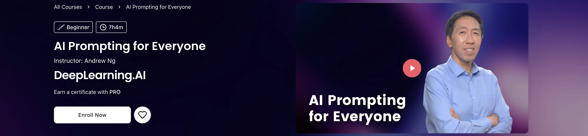

# AI Prompting for Everyone

  
  
  

《AI Prompting for Everyone》是 DeepLearning.AI 推出的一门面向大众的生成式 AI 提示词课程，由 Andrew Ng（吴恩达）主讲。课程定位为入门级，不要求编程或技术背景，重点不是教授固定的“提示词模板”，而是帮助学习者理解现代大模型应该如何被有效使用，并逐步形成更成熟的 AI 使用习惯。课程围绕当前主流 AI 工具的真实能力展开，适用于 ChatGPT、Claude、Gemini 等多种大模型产品，目标是让学习者从“会问问题”进一步提升到能够借助 AI 完成信息检索、思考辅助、内容创作和应用构建。

课程内容涵盖信息获取、AI 辅助思考、多模态应用与简单应用构建等方向，介绍如何根据任务选择模型自身知识、联网搜索或深度研究，如何通过上下文、反馈与批判性提问提升输出质量，以及如何借助 AI 进行图片理解与生成、数据分析和基础应用开发。整体上，这门课程更强调对模型能力边界、信息可靠性和实际工作方式的理解，而不是单纯记忆 Prompt 技巧。

本项目用于整理和归纳该课程的个人学习资料，方便后续复习与查阅。内容以课程学习过程中的知识点梳理和学习记录为主，旨在将分散的课程内容整理成结构更清晰、便于长期维护的学习笔记。

## 快速导航

| 模块 | 主题 | 入口 |
|---|---|---|
| 1 | Finding Information | [`notes/01-finding-information/`](./notes/01-finding-information/README.md) |
| 2 | AI as a Thought Partner | [`notes/02-ai-as-thought-partner/`](./notes/02-ai-as-thought-partner/README.md) |
| 3 | Working with Multimedia & Code | [`notes/03-working-with-multimedia-code/`](./notes/03-working-with-multimedia-code/README.md) |

> [!NOTE]
> 本仓库是 **AI Prompting for Everyone** 课程的结构化学习笔记：每个模块含分章笔记 + 图示，配套衍生整理的 [Prompt 模板库](./prompts/README.md)与[自测题](./practice/README.md)，总览与进度见 [`notes/README.md`](./notes/README.md)。

## 怎么用

从感兴趣的模块 `README.md` 进入，按 `01 → 02 → ... → recap` 顺序阅读；配套的 **Prompt 模板**（[`prompts/`](./prompts/README.md)）建议直接复制到常用的 AI 里跑一遍。想先快速了解全貌，可先读每个模块的 `recap.md`。

## 许可

> [!IMPORTANT]
> 课程版权归 DeepLearning.AI / Andrew Ng 所有，封面图来自[课程官网](https://www.deeplearning.ai/courses/ai-prompting-for-everyone)。本仓库笔记、模板、自测题与流程图按 [CC BY-NC 4.0](./LICENSE) 发布——可自由学习使用（请署名、勿商用）；课件 PDF 仅作个人学习用途，请勿二次分发。
