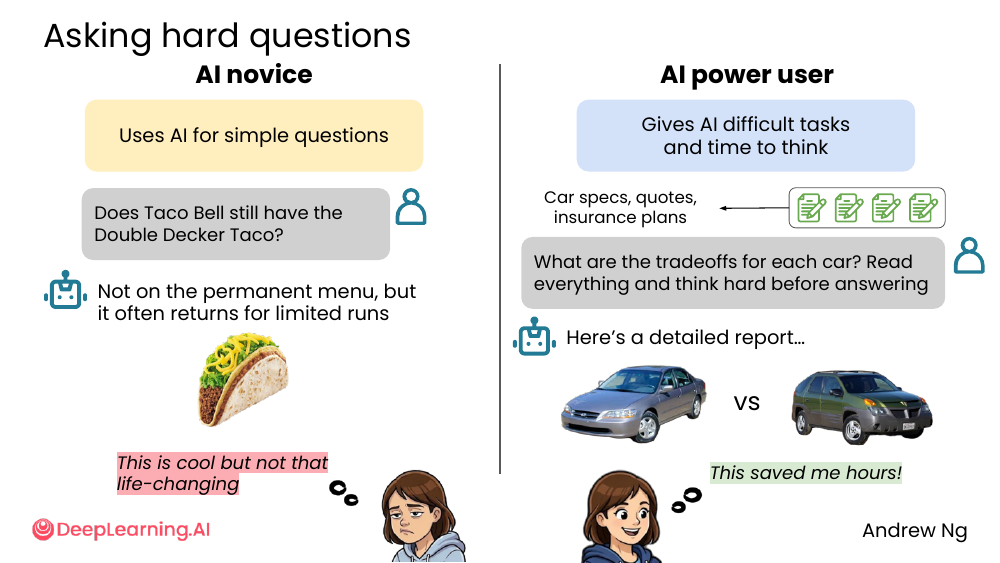
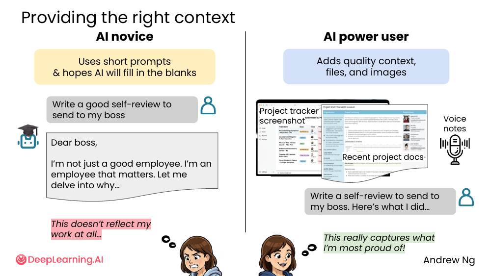
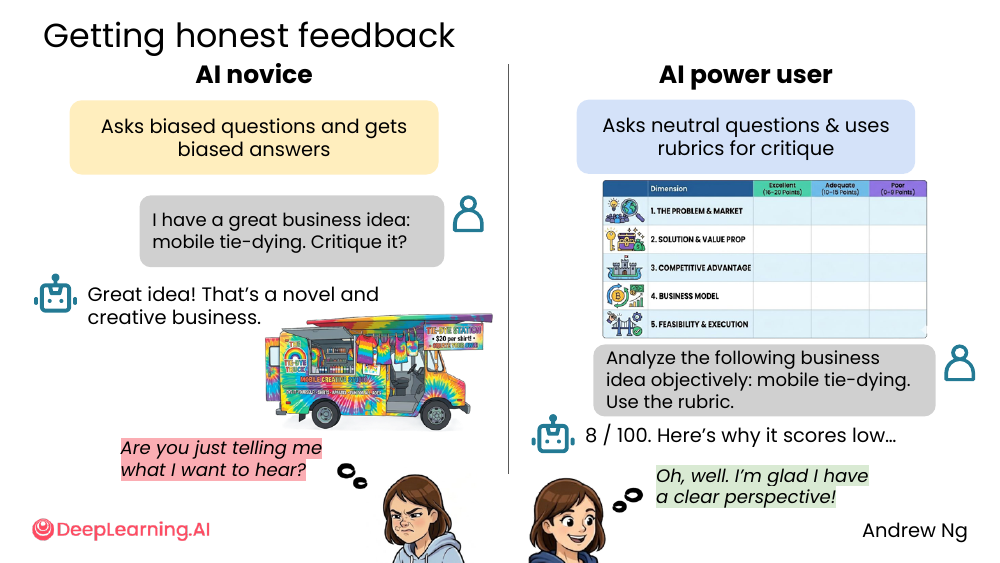
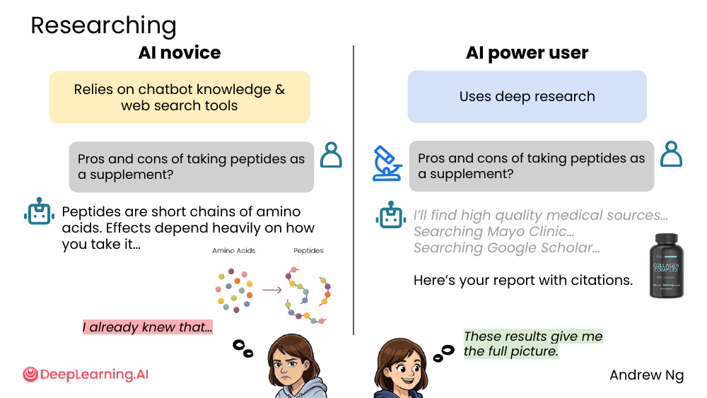
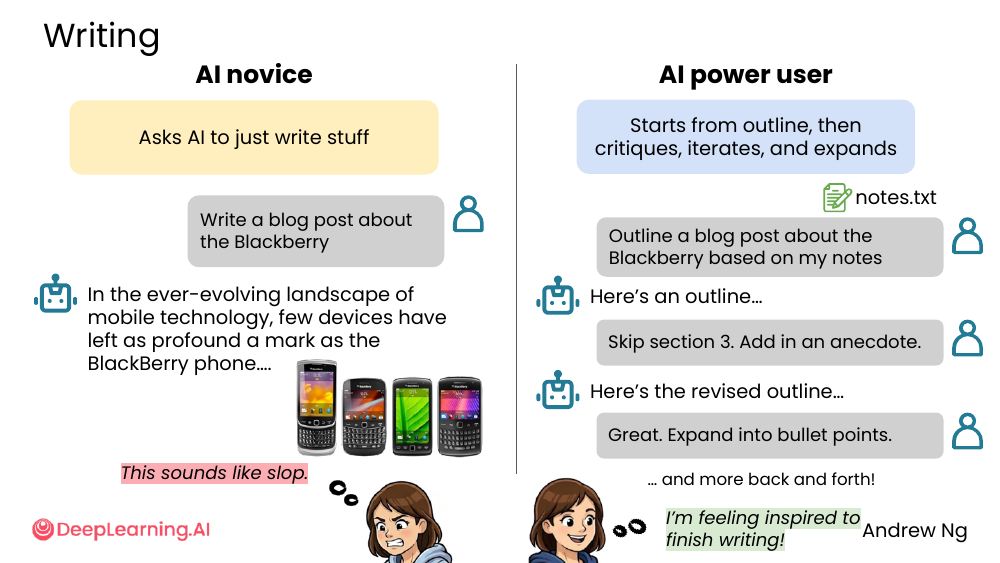
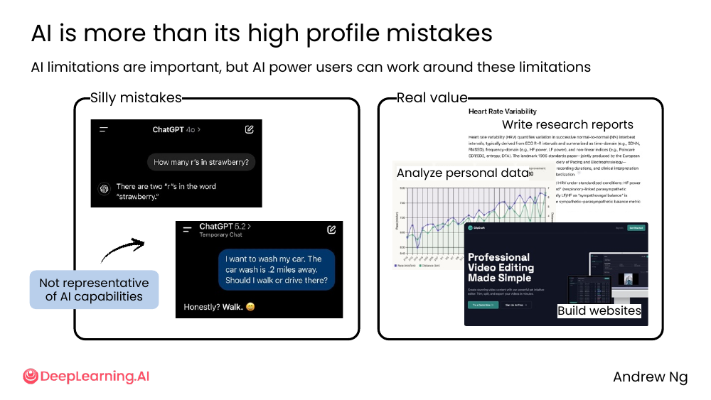

# 01. The AI novice and the AI power user

> **一句话核心**：同一款 AI 模型，**提问方式不同**，价值差距可以是从「cool but not life-changing」到「saved me hours」级别的差异。

## 📌 关键概念

- **AI novice**（AI 新手）把 AI 当聊天机器人，问简单问题，期望它「猜」出自己想要什么。
- **AI power user**（AI 重度用户）会：给难的任务、提供丰富上下文、要中立反馈、用深度研究、把 AI 当协作写手而非代笔。
- AI 的「silly mistakes」容易上新闻，但 AI 真正的价值（写研究报告、分析个人数据、建网站）被严重低估。

## 🖼 5 个对比场景

吴恩达用 5 个生活化的对比，把 novice 和 power user 拉开：

### 1️⃣ 问难的问题 vs 问简单的问题



- **Novice**：「Does Taco Bell still have the Double Decker Taco?」—— 单一事实问题，AI 直接答。
- **Power user**：「What are the tradeoffs for each car? Read everything and think hard before answering」—— 喂 4 份文件、要求综合权衡、允许 AI 慢思考。

💡 **关键差异**：把"是不是"换成"权衡"。把单问题换成多文件综合题。

### 2️⃣ 短 prompt vs 充分上下文



- **Novice**：「Write a good self-review to send to my boss」→ 输出浮夸空话。
- **Power user**：把项目截图、近期文档、语音笔记都丢进去，再写「Write a self-review... Here's what I did」→ 输出反映真实工作。

💡 **关键差异**：上下文 = 截图 + 文件 + 你脑子里的口述。光写"好的自评"AI 不知道什么叫"好"。

### 3️⃣ 诱导式问题 vs 中立问题 + 评分标准



- **Novice**：「I have a great business idea: mobile tie-dying. Critique it?」—— 问题里带"great"，AI 当然夸。
- **Power user**：准备一份 5 个维度（市场、方案、竞争力、商业模式、可行性）的评分表，然后问「Analyze the following business idea objectively: mobile tie-dying. Use the rubric.」→ 8/100。

💡 **关键差异**：想让 AI 批评你，不要在 prompt 里夸自己。给出**客观 rubric**（评分标准），让 AI 没法"看你脸色"。

### 4️⃣ chatbot 闲聊 vs Deep research



- **Novice**：「Pros and cons of taking peptides as a supplement?」→ 答"是氨基酸链，效果因服用方式而异"——你自己 Google 也能找到。
- **Power user**：同样的问题，但**显式触发深度研究**→ AI 去搜 Mayo Clinic、Google Scholar → 出一份带引用的报告。

💡 **关键差异**：医疗/法律/财务等问题，**别只问 chatbot**，让它去查权威信源。

### 5️⃣ "帮我写" vs "先列大纲再迭代"



- **Novice**：「Write a blog post about the Blackberry」→ 一上来就生成一坨"In the ever-evolving landscape..."的 AI slop。
- **Power user**：
  1. 先「Outline a blog post about the Blackberry based on my notes」
  2. 再「Skip section 3. Add in an anecdote.」
  3. 拿到修订版后再「Expand into bullet points.」
  4. 多轮来回 → 一篇真正属于自己的文章。

💡 **关键差异**：写作任务的黄金法则是 **outline → critique → expand**。**不要让 AI 一口气写完**。

## 🚀 AI 真正能做的事（不是 headline mistakes）



> "AI limitations are important, but AI power users can work around these limitations."

媒体报道里的「strawberry 里 r 的个数」「走 2 英里还是开车」这种 silly mistake **不代表 AI 的能力上限**。Power user 用 AI 做的事：

- 写研究报告（write research reports）
- 分析个人数据（analyze personal data）
- 建网站（build websites）

## 🎁 成为 power user 的好处


- ⏱ **节省时间 / 改善生活**
- 🛠 **做出很酷的东西**
- 📈 **掌握一项抢手技能**

无论你现在处于什么位置（wherever you are!），这些课都能帮你成为 AI power user。

## 🛠 我能马上用的 prompt 模板

```text
模板 1: 问难的问题
───────────────────
[把上下文文件粘贴进来]
Compare these [N] options across [维度 1, 维度 2, 维度 3].
Think hard before answering. Show me a comparison table.

模板 2: 自评 / 写作类
───────────────────
[粘贴过去的工作记录、笔记、链接]
Write a self-review based on what I actually did. Avoid generic phrases
like "I'm a hard worker" or "I go above and beyond".

模板 3: 要诚实反馈
───────────────────
[把你的方案 / 想法 描述清楚]
Critique the following idea objectively. Use this rubric:
  - Problem & market (0-20)
  - Solution & value prop (0-20)
  - Competitive advantage (0-20)
  - Business model (0-20)
  - Feasibility & execution (0-20)
Be specific. Don't hedge.

模板 4: 写作协作（不要一步到位）
───────────────────
Step 1: Outline a blog post about [topic] based on these notes:
        [粘贴 notes.txt]
Step 2: (review outline) Skip section [X]. Add an anecdote about [Y].
Step 3: Expand the revised outline into bullet points.
Step 4: Turn the bullets into prose.
```

## ⚠️ 常见误区

- ❌ **"AI 给我的答案很无聊，那 AI 就这样"** — 多半是 prompt 太短或太诱导。
- ❌ **"AI 总爱拍马屁"** — 你的 prompt 里如果带"great / awesome / 帮我支持一下 X"，AI 当然顺着说。
- ❌ **"让 AI 写一篇完整文章"** — 99% 的情况你会得到 AI slop。先 outline、再扩展。

---

> 下一节 [02. Pretrained knowledge](./02-pretrained-knowledge.md) — 知道 AI 肚子里装的到底是什么。
