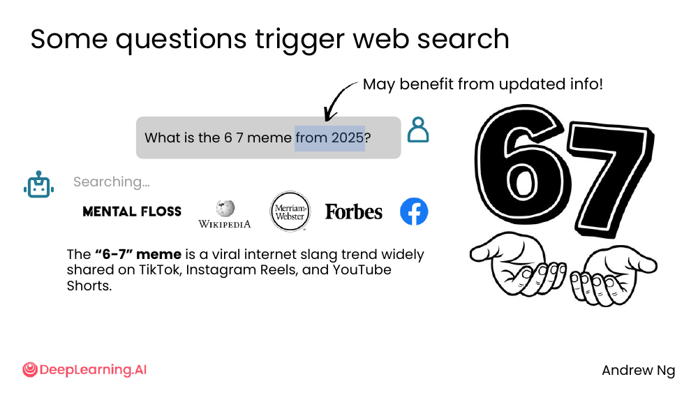
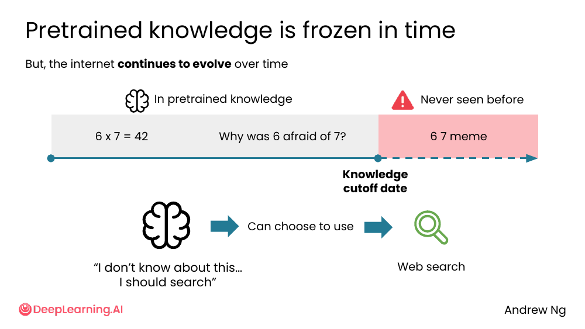
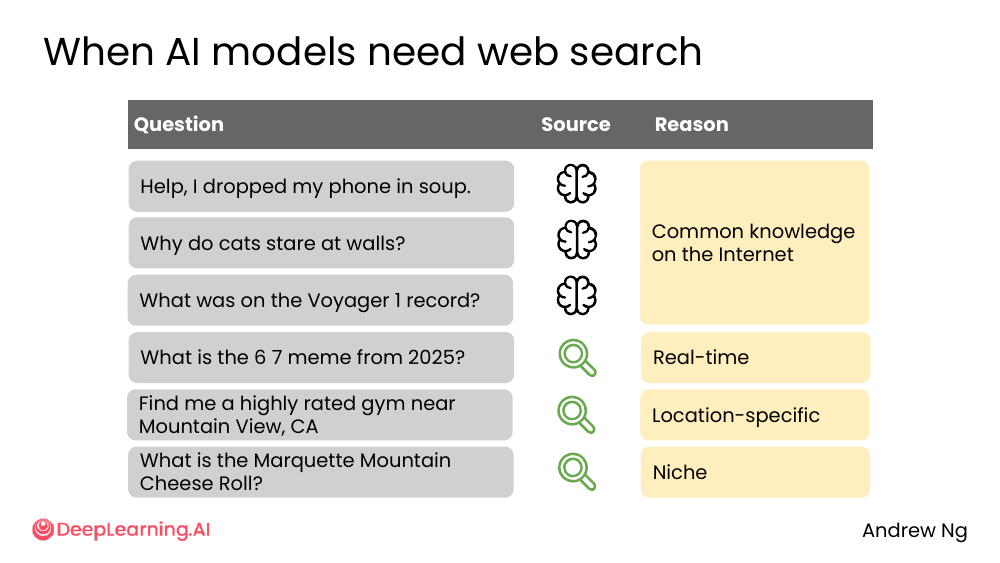
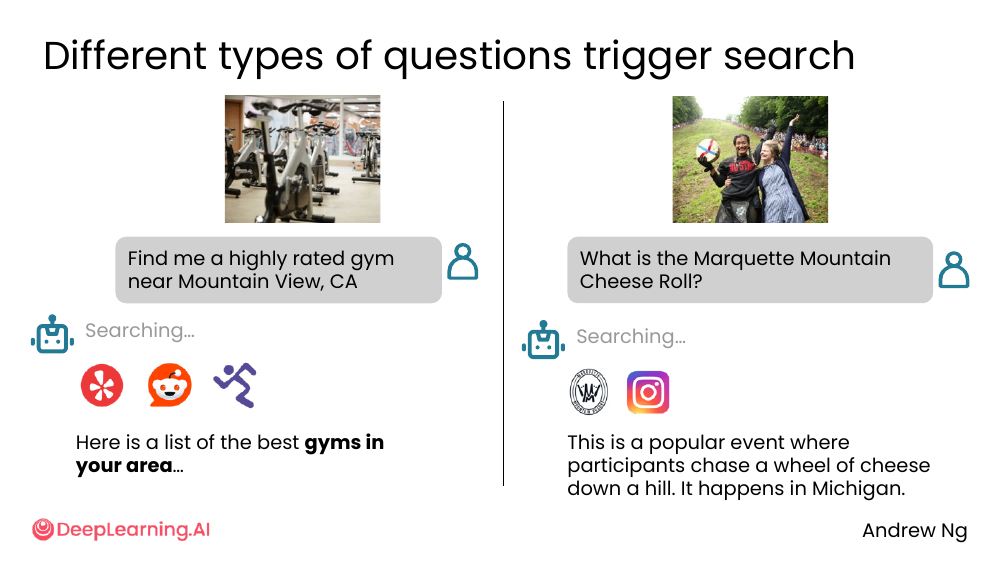
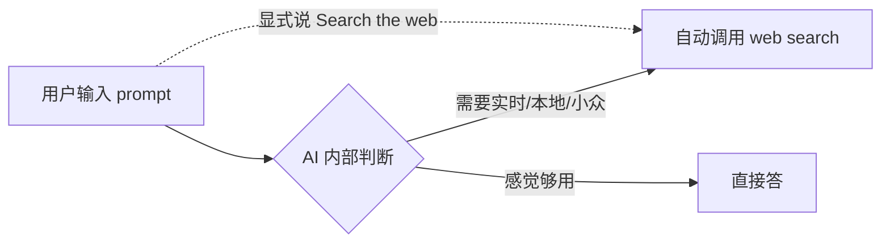

# 03. Web search

> **一句话核心**：预训练知识是**冻结的**——遇到"现在"或"我这里"的问题，让 AI 上网搜。

## 📌 关键概念

- **预训练知识有截止日期**（knowledge cutoff date），到那天之后发生的事它不知道。
- 当问题需要**实时信息、本地信息或小众冷门信息**时，AI 会触发 web search。
- Web search 触发方式有 2 种：AI **自己决定**搜，或者**你显式说**「Search the web」。
- Web search 的目的不是取代搜索引擎，而是**把多个搜索结果合成给你看**。

## 🖼 一个典型例子：6-7 meme



> "What is the 6 7 meme from 2025?"

「from 2025」这个时间提示让 AI 知道——这玩意诞生在它训练截止**之后**，于是触发搜索。

它扫了 Mental Floss、Wikipedia、Merriam-Webster、Forbes、Facebook 等来源，合成回答：

> The "6-7" meme is a viral internet slang trend widely shared on TikTok, Instagram Reels, and YouTube Shorts.

💡 **关键洞察**：在 prompt 里**显式带年份**或者"最新"是个非常有效的触发 web search 的技巧。

## 🕰 预训练知识 vs 互联网：时间维度



```
   训练数据中                                  训练截止后
   ────────────────────────────────────── │ ────────────────────────
                                            │
   6 x 7 = 42   Why was 6 afraid of 7?     │   6 7 meme
   (数学)       (老笑话)                     │   (新梗，AI 没见过)
                                            │
              Knowledge cutoff date
```

- AI 肚子里的「为什么 6 怕 7」这种老笑话它知道。
- 训练**之后**才诞生的 6-7 meme 它没学过。
- 当它"觉得"这个问题超出自己的知识，**自动选择**调用 web search。

> 课件旁注：「"I don't know about this... I should search"」—— 这就是 AI 内部的决策过程。

## 📊 哪些问题会触发 web search？

课件给了 6 个例子，整理成表格：



| 问题 | 走预训练 | 走搜索 | 触发原因 |
|---|---|---|---|
| Help, I dropped my phone in soup | ✅ |  | 互联网常识 |
| Why do cats stare at walls | ✅ |  | 互联网常识 |
| What was on the Voyager 1 record | ✅ |  | 互联网常识 |
| What is the 6 7 meme from 2025? |  | ✅ | 实时（real-time） |
| Find me a highly rated gym near Mountain View, CA |  | ✅ | 本地（location-specific） |
| What is the Marquette Mountain Cheese Roll? |  | ✅ | 小众（niche） |

**3 类需要 web search 的信号**：

1. **Real-time** — 问题涉及最近发生的事、流行趋势、新闻。
2. **Location-specific** — 问题需要本地/你附近的数据。
3. **Niche** — 问题很冷门，预训练数据里样本太少。

## 🖼 本地和小众的两个例子



- **Find me a highly rated gym near Mountain View, CA** —— 本地：AI 调 Yelp 类工具，吐出周边健身房列表。
- **What is the Marquette Mountain Cheese Roll?** —— 小众：一个密歇根州的活动，AI 自己也未必清楚，于是查了官方公告/Instagram 后告诉你「人们追着一个奶酪轮从山上滚下来」。

## ⚙️ 两种触发方式



- **自动触发**：AI 看 prompt 觉得"这个超出我的预训练"，自己决定搜。
- **显式触发**：你在 prompt 里直接说「Search the web」「查一下最新」「上网搜」。

## 🛠 我能马上用的 prompt 模板

```text
模板 1: 显式要求 web search 并标注来源
───────────────────
Search the web for [question]. Provide a synthesized answer with
inline citations (link + source name). If sources disagree, say so.

模板 2: 强制时间过滤
───────────────────
Search the web for [topic]. Only consider sources from the past
[3 / 6 / 12] months. Ignore older articles unless they're the only
authoritative source.

模板 3: 强制地域过滤
───────────────────
Find me [商品/服务/地点] in [城市, 国家]. Use local business
directories and recent reviews. Show me a ranked list with
ratings and last-review date.

模板 4: 小众话题的深挖
───────────────────
Search the web for [niche term]. I want to know:
  - the canonical definition
  - the top 3 most-cited sources
  - any controversies or competing views
```

## ⚠️ 常见误区

- ❌ **"我问 AI 任何问题它都会帮我搜"** — 不一定。**很多问题 AI 直接从预训练里答**（不搜索）。
- ❌ **"Web search 答案 = 正确答案"** — Web search 只是**拉网络上的内容**，拉到的可能不准确（详见下节）。
- ❌ **"实时问题只能用搜索引擎"** — 试试让 AI 用 web search 查再合成，往往比你自己翻 10 个网页快。

---

> 下一节 [04. Web search sources](./04-web-search-sources.md) — 但搜到的不一定可靠，怎么办？
