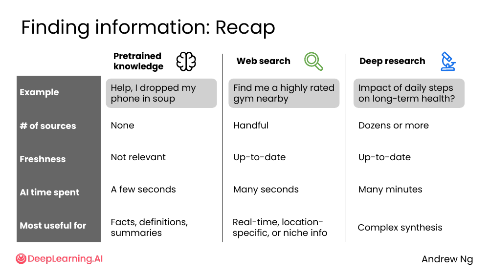
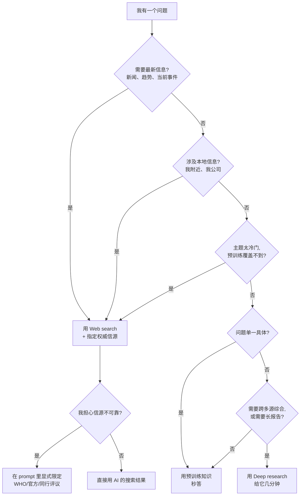

# Recap: Finding Information

> **一句话核心**：AI 有 3 种「找信息」的工具——**预训练、Web search、Deep research**——你该根据问题类型挑。

## 📊 三大工具对比（课件原表）



| | 🧠 Pretrained knowledge | 🔍 Web search | 🔬 Deep research |
|---|---|---|---|
| **例子** | Help, I dropped my phone in soup | Find me a highly rated gym nearby | Impact of daily steps on long-term health? |
| **信源数量** | 0（自给） | 几个 | 几十甚至更多 |
| **时效性** | 无关（截止前） | 最新 | 最新 |
| **AI 耗时** | 几秒 | 几十秒 | 几分钟 |
| **最适用** | 事实、定义、总结 | 实时、本地、小众 | 复杂综合 |

## 🧭 决策流程图

遇到问题时，按下面顺序问自己：



## 🎯 5 道 Quiz 风格自测题

> 试着不翻笔记直接答，答完再回去查。

### Q1. 简单事实 vs 复杂综合

> "What is the capital of Australia?"
> "Compare the long-term health impact of daily step counts (5k vs 10k vs 15k)."

第一个问题用 ___ ，第二个用 ___ 。

<details>
<summary>答案</summary>
预训练知识 / Deep research
</details>

### Q2. 触发 web search 的信号

列出 3 类会触发 web search 的问题类型，并各举 1 例。

<details>
<summary>答案</summary>

- **Real-time**：问"最近的 6-7 meme 是什么"
- **Location-specific**：问"我附近评分高的健身房"
- **Niche**：问"Marquette Mountain Cheese Roll 是什么"

</details>

### Q3. Web search 4 步流程

按顺序写出 web search 的 4 个步骤。

<details>
<summary>答案</summary>

1. **Search**（基于 prompt 生成搜索词）
2. **Scan results**（扫标题和正文关键词）
3. **Filter**（砍掉不相关结果）
4. **Summarize**（合成最终回答）

</details>

### Q4. Web search 的信源陷阱

为什么不能默认信任 web search 的结果？请说出 2 个原因。

<details>
<summary>答案</summary>

- 模型默认拉**最热门**的来源（社交媒体、博客、论坛、营销站），**不等于最可靠**
- web search 会拉到**过时**信息（如已关门的店、过时的研究结论）

</details>

### Q5. Deep research 何时值得用

「Find me a coffee shop near me」该用 deep research 吗？为什么？

<details>
<summary>答案</summary>

**不该**。这是一个单一、具体、本地的问题，几秒钟 web search 就能解决。Deep research 适合**多子问题、需要长期思考的报告型任务**，用它来查咖啡店是杀鸡用牛刀——浪费几分钟等它循环几十次搜索。

</details>

## 🧰 5 个「我以后一定会用」的 prompt 模板

### 模板 1：限定权威信源

```text
Search the web for [topic]. Prioritize:
  1. Official government / institutional sources
  2. Peer-reviewed research
  3. Established news outlets
Avoid: blogspam, SEO content farms, social media.
```

### 模板 2：要求带引用的综合

```text
Search the web and synthesize an answer. For each key claim,
provide an inline citation (URL + source name + date).
If sources disagree, list the disagreements explicitly.
```

### 模板 3：深度研究的边界

```text
Do a deep research on [topic]. Constraints:
  - Geographic focus: [国家/城市]
  - Time range: last [N] years
  - Length: 1500-2000 words
  - Output: report with sections + inline citations
```

### 模板 4：批判性反馈

```text
Critique the following idea objectively. Use this rubric:
  - Problem & market (0-20)
  - Solution & value prop (0-20)
  - Competitive advantage (0-20)
  - Business model (0-20)
  - Feasibility & execution (0-20)
Be specific. Don't hedge.
```

### 模板 5：写作协作 outline → expand

```text
Step 1: Outline a blog post about [topic] based on these notes:
        [paste notes]
Step 2: Skip section [X]. Add an anecdote about [Y].
Step 3: Expand the revised outline into bullet points.
Step 4: Turn bullets into prose.
```

## 🎬 Module 1 一句话总结

> **找对工具、写对 prompt。** 用预训练回答通用问题，用 web search 拿当前和本地信息（并显式指定信源），用 deep research 做需要多源综合的复杂报告。
