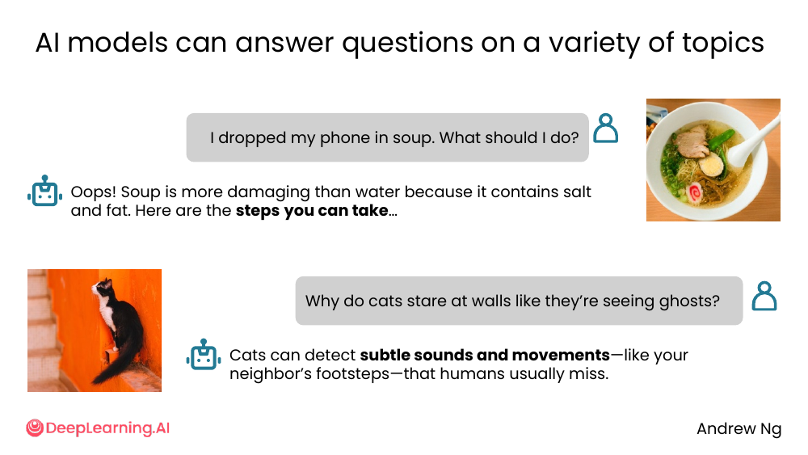
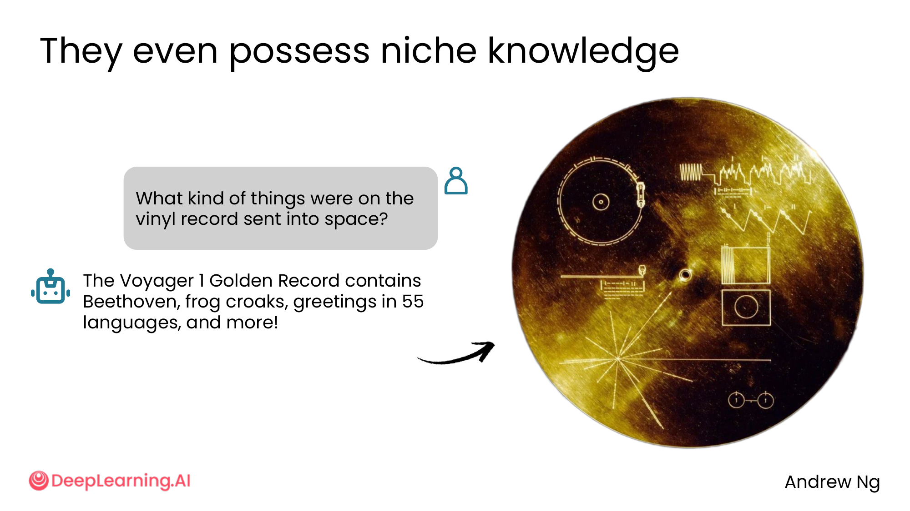
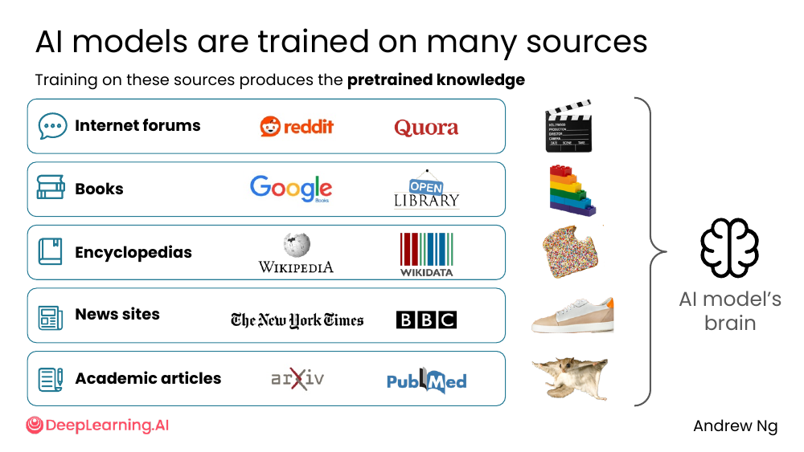
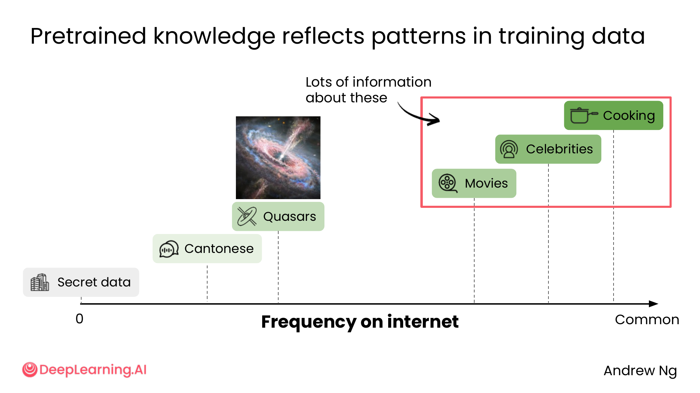
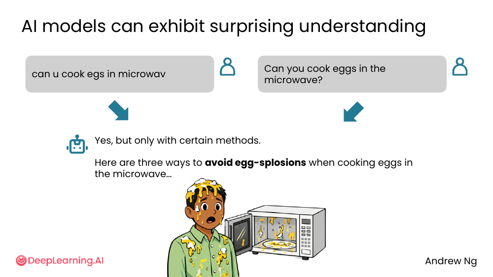
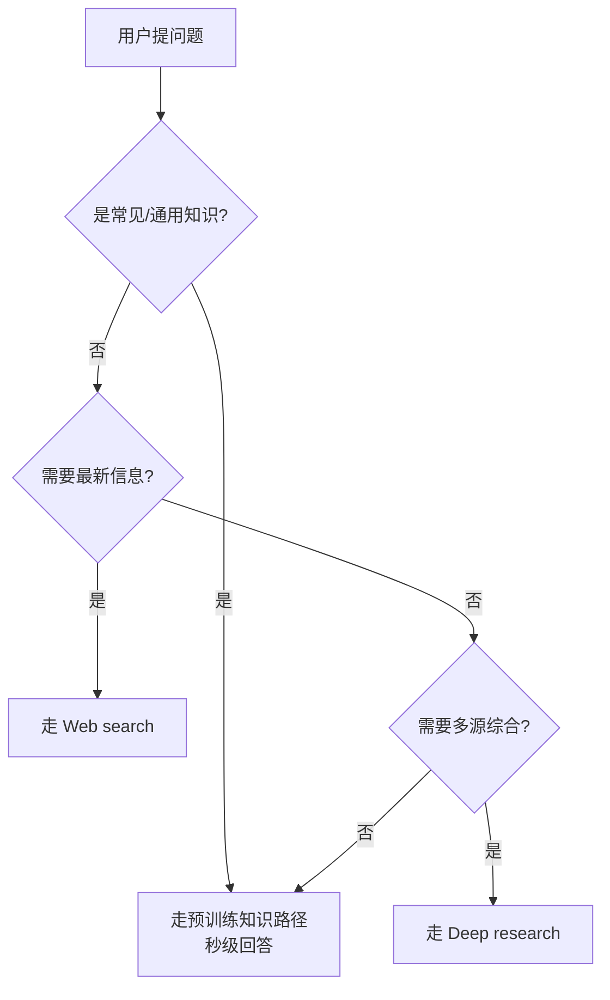

# 02. Pretrained knowledge

> **一句话核心**：AI 模型不是 Google，它**肚子里装的是训练时学到的东西**，有边界、有错误、有截止日期。

## 📌 关键概念
- **Pretrained knowledge（预训练知识）** = 模型在训练阶段从大量文本中学到的「内置知识」。
- 训练数据来源：网络论坛、书籍、百科、新闻网站、学术文章。
- 它**反映了互联网上信息的分布**——出现频率高的内容学得更多，罕见/私密的内容学得很差。
- 它**有截止日期**——训练完之后的事情它就不知道了。

## 🖼 AI 模型什么都能聊一点


随便问两个生活问题：

- 「I dropped my phone in soup. What should I do?」→ AI 会告诉你汤里有盐和脂肪比水更伤手机，并给出步骤。
- 「Why do cats stare at walls like they're seeing ghosts?」→ AI 说猫能听到人耳听不到的细微声音（邻居的脚步声之类）。

这些都属于**通用常识**——互联网上到处都有的内容。

## 🖼 它甚至懂很冷门的东西


> "What kind of things were on the vinyl record sent into space?"

AI 答：Voyager 1 的「Golden Record」里有贝多芬、青蛙叫声、55 种语言的问候语，等等。

这出乎意料——你以为 AI 不会知道一个 1977 年随探测器飞出去的铜质唱片里装了什么，但训练数据里关于 Voyager Golden Record 的资料足够多，模型就学到了。

## 🧠 训练数据从哪里来？


AI 模型的「大脑」是由这些来源共同训练出来的：

| 来源类型 | 代表例子 |
|---|---|
| 互联网论坛 | Reddit、Quora |
| 书籍 | Google Books、Open Library |
| 百科 | Wikipedia、Wikidata |
| 新闻网站 | The New York Times、BBC |
| 学术文章 | arXiv、PubMed |

所以**任何公开的、有大量文本的来源，都可能成为预训练语料的一部分**。

> 课件原话："Don't worry too much about this term!" —— 不用纠结每个术语，看到来源图标混个眼熟即可。

## 📊 关键规律：出现频率 = 知识深度


把"一个话题在互联网上出现的频率"作为横轴，你会发现：

```
低频（Secret data）                                    高频（Common）
       │                                                   │
       ▼                                                   ▼
   ── Secret data ─── Cantonese ── Quasars ── Movies ── Celebrities ── Cooking
        极差           较弱         还好      良好      很强         极强
```

**关键洞察**：

- 🎬 **Cooking、Movies、Celebrities**：互联网上到处都是 → AI 几乎像专家。
- 🪐 **Quasars（类星体）**：天文学资料多 → AI 答得不错但没那么深。
- 🗣 **Cantonese（粤语）**：网上语料少 → AI 可能讲得流利但不地道。
- 🏢 **Secret data（公司内部数据）**：从没在公开网络上出现过 → AI 完全不知道。

## ⚠️ 预训练知识有 3 个常见问题


1. **错别字**（typos）—— "cookin egs" / "wat r quaysers / what are quasars"
2. **错误观念**（misconceptions）—— "Daniel Craig is still James Bond"（一个过时的人事设定被当事实）
3. **过时的信息**（outdated information）—— 训练后更新的内容它不知道

**结论**：把 AI 当「懂很多但可能出错、会过时」的朋友，不要当百科全书。

## 🧭 Mermaid 流程：问题 → 是否走预训练知识？


> 🛠 本节的 prompt 模板已收录于 [`prompts/01-finding-information.md`](../../prompts/01-finding-information.md)。

## ⚠️ 常见误区
- ❌ **"AI 什么都知道"** — 它**不知道**训练截止之后的事，也**不知道**没在网上公开的私密信息。
- ❌ **"AI 偶尔答错就是它差"** — 训练数据本身就是人写的，**错误传播**是结构性问题，不是 bug。
- ❌ **"热门话题 AI 一定答得好"** — 热门也意味着**错误和过时信息**更密集（如医学新研究刚出来时）。

---

> 下一节 [03. Web search](./03-web-search.md) — 当预训练知识不够用时，让 AI 自己上网找。
