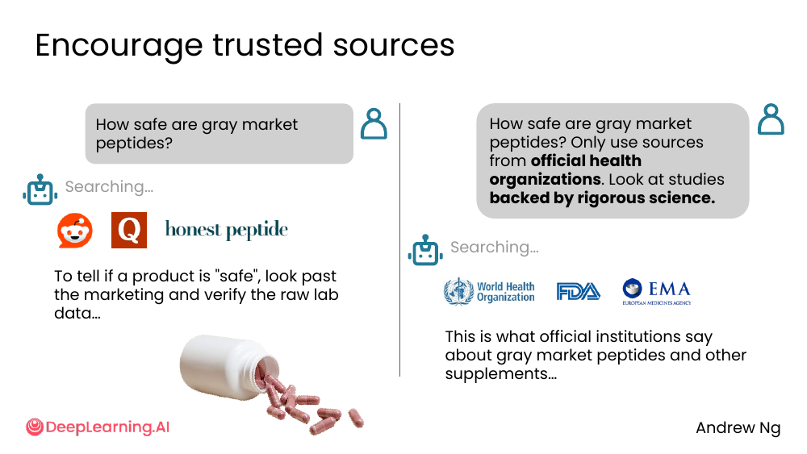
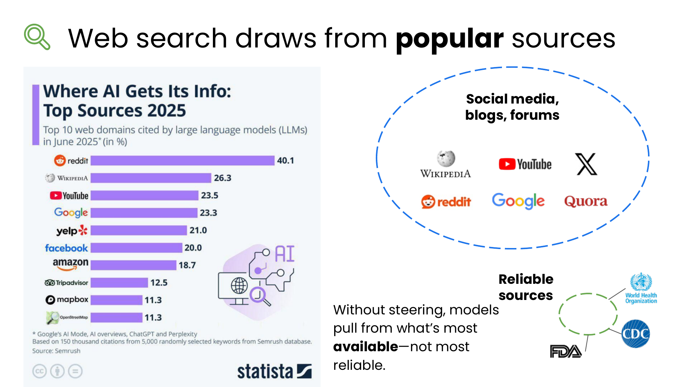
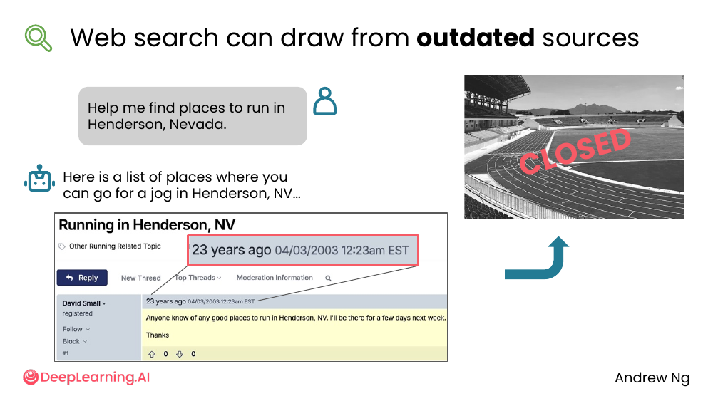
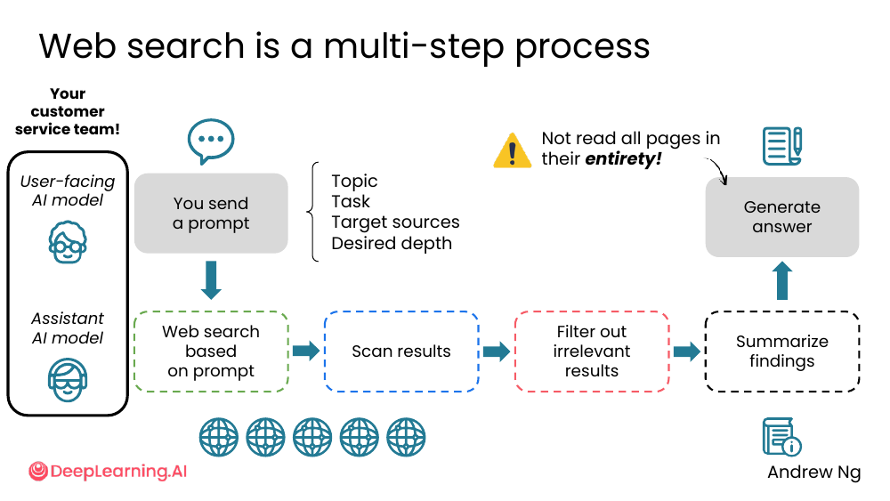
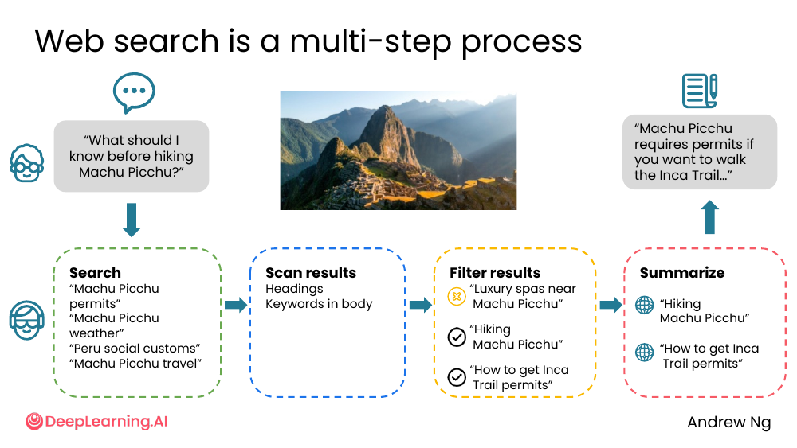
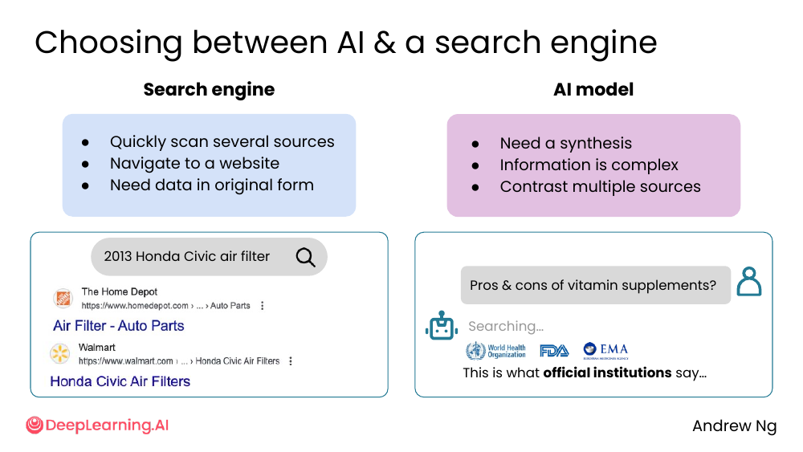

# 04. Web search sources

> **一句话核心**：搜得到 ≠ 搜得对。要让 AI web search 出**高质量**结果，你得在 prompt 里**显式引导信源**。

## 📌 关键概念
- Web search 默认从**最热门的来源**里拉（社交媒体、博客、论坛），**不等于最可靠的来源**。
- 你可以**显式限定**信源：让 AI 优先看官方机构、同行评议的研究、可信媒体。
- Web search 是个**多步流程**：搜索 → 扫读 → 过滤 → 总结，**不是**通读每个网页。
- AI 与搜索引擎是**互补关系**，各有所长。

## 🖼 同一个问题，差距有多大


> 问题：How safe are gray market peptides?

| 提问方式 | AI 看到的来源 | 回答 |
|---|---|---|
| 「How safe are gray market peptides?」 | Reddit、Quora、honest peptide 营销站 | "要判断产品是否安全，看 raw lab data…"（营销导向） |
| 「... Only use sources from **official health organizations**. Look at studies backed by **rigorous science**.」 | WHO、FDA、EMA | "以下是官方机构对灰色市场肽类和其他补充剂的说法…" |

💡 **关键洞察**：**仅仅在 prompt 里多 2 句话**，AI web search 行为就会从"看营销博客"切到"看 WHO/FDA/EMA"。

## 🖼 默认拉的是热门，不是可靠


课件的视觉化表达：

```
                    热门 ≠ 可靠
                         │
   ┌─────────────────────┼─────────────────────┐
   │                     │                     │
   ▼                     ▼                     ▼
社交媒体、博客、      中间地带              可靠来源
论坛                                     (WHO、FDA、PubMed、
   "Without steering, models pull               同行评议论文)
    from what's most available—
    not most reliable."
```

> 原文："Without steering, models pull from what's most available — not most reliable."

**这是 web search 最容易被忽视的坑**。模型默认拉 SEO 排名高的内容，而这些内容未必权威。

## ⏳ 还会拉到过时的信息


> "Help me find places to run in Henderson, Nevada."

AI 吐出一份"亨德森市跑步地点"列表 —— 但其中一家已经标了 **CLOSED**。

模型不会自动过滤停业的店铺，除非你明确要求。

## 🖼 Web search 是一个 4 步流程


```
              你的 prompt
                  │
   ┌──────────────▼──────────────┐
   │    User-facing AI model     │
   │   (解析: 主题/任务/信源/深度)│
   └──────────────┬──────────────┘
                  ▼
   ┌──────────────────────────────┐
   │ Assistant AI model           │
   │                              │
   │  Web search ─▶ Scan results  │
   │       │              │       │
   │       ▼              ▼       │
   │   Filter ─▶ Summarize        │
   │   irrelevant   findings      │
   │   results                    │
   └──────────────┬──────────────┘
                  ▼
             Generate answer
```

> 课件警告：「Not read all pages in their entirety!」—— AI **不会通读每个网页**，只扫标题和关键词。

### 一个具体例子：马丘比丘徒步



> 问题："What should I know before hiking Machu Picchu?"

| 步骤 | 动作 | 内容 |
|---|---|---|
| **Search** | 生成 4 个搜索词 | "Machu Picchu permits"、"Machu Picchu weather"、"Peru social customs"、"Machu Picchu travel" |
| **Scan results** | 看标题和正文关键词 | 扫每条搜索结果的标题与摘要 |
| **Filter** | 砍掉不相关 | 砍掉 "Luxury spas near Machu Picchu"（与徒步无关）<br>保留 "Hiking Machu Picchu"、"How to get Inca Trail permits" |
| **Summarize** | 合成最终回答 | "Machu Picchu requires permits if you want to walk the Inca Trail..." |

## 🤝 AI vs 搜索引擎：什么时候用哪个？


| 场景 | 选搜索引擎 | 选 AI |
|---|---|---|
| 快速浏览多个来源 | ✅ | |
| 直接进某个网站 | ✅ | |
| 要原始格式的数据（如 CSV、PDF 原文） | ✅ | |
| 需要综合（synthesis） | | ✅ |
| 信息复杂、跨多个来源 | | ✅ |
| 对比多个来源的不同观点 | | ✅ |

**举例**：
- 「2013 Honda Civic air filter 是什么」→ 搜索引擎，直接进 Amazon/零件网站。
- 「维生素补剂的利弊？」→ AI，跨多源综合。

> 🛠 本节的 prompt 模板已收录于 [`prompts/01-finding-information.md`](../../prompts/01-finding-information.md)。

## ⚠️ 常见误区
- ❌ **"Web search 拉到的就是事实"** — 默认信源可能是博客、论坛、过期信息。
- ❌ **"AI 通读所有网页"** — AI 只**扫**标题和关键词，需要时再点进去。
- ❌ **"AI 能取代 Google"** — 各有长处，**复杂综合找 AI**，**找原始资源/快速浏览找搜索引擎**。

---

> 下一节 [05. Using deep research](./05-deep-research.md) — 当问题需要几十到上百个信源时，让 AI 进入 agentic 模式。
