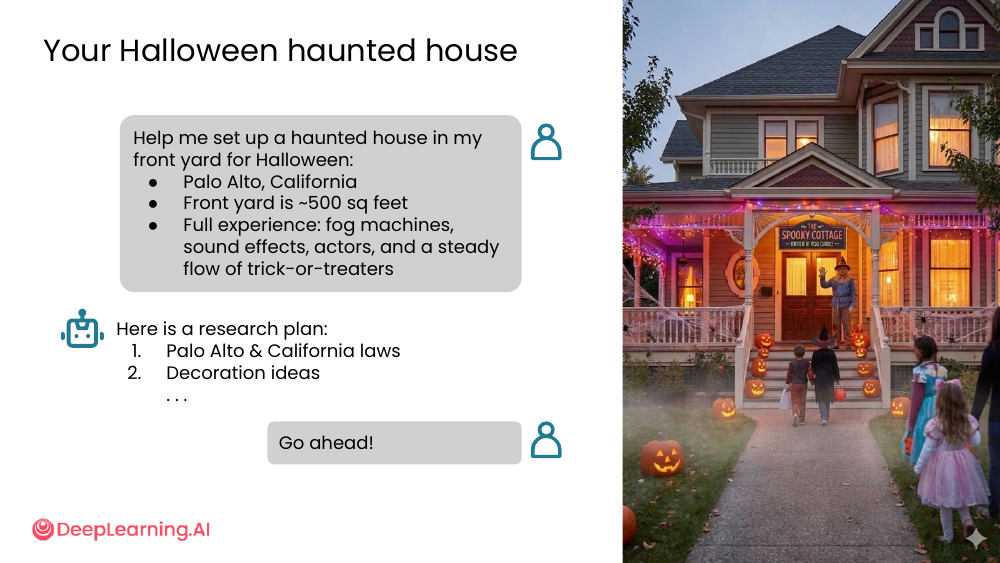
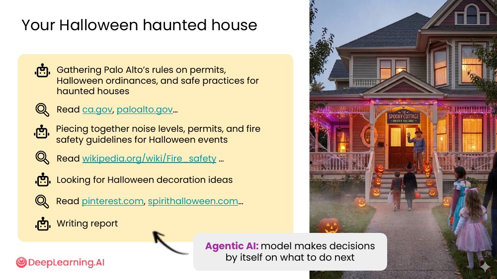
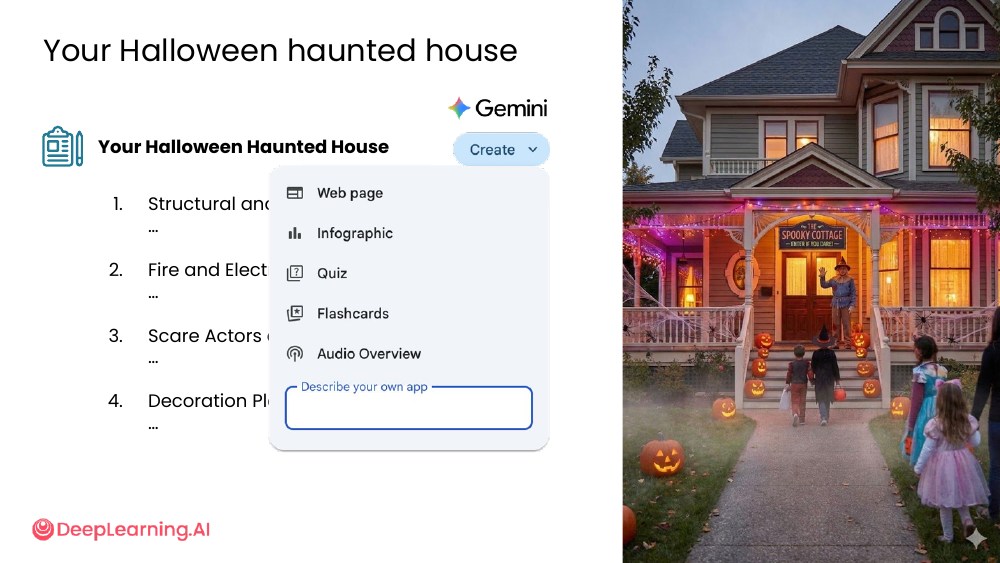
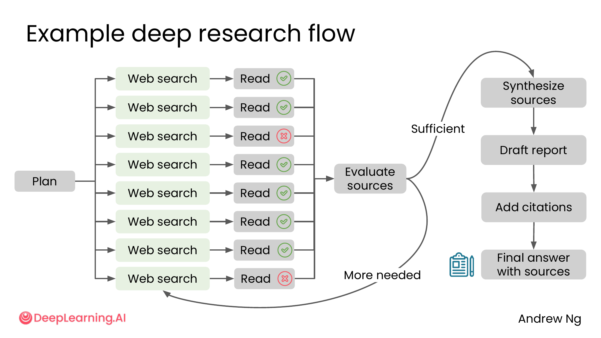
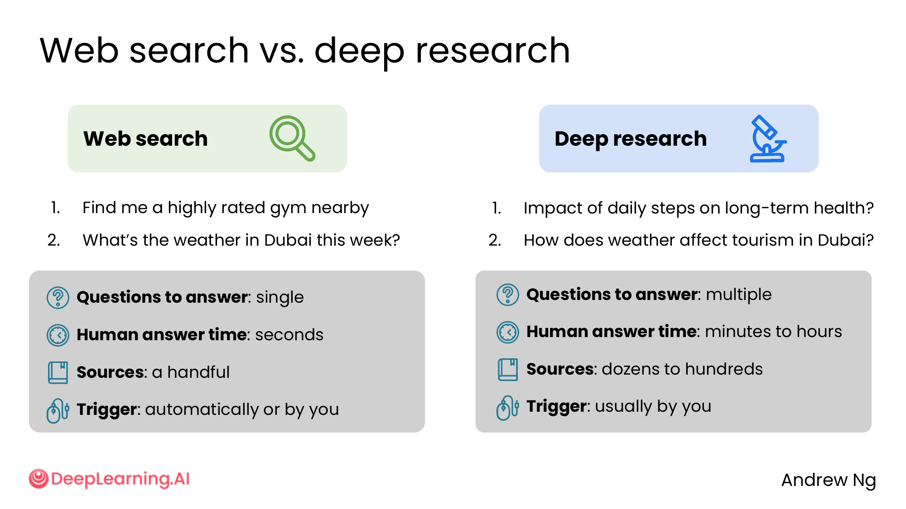

# 05. Using deep research

> **一句话核心**：当问题需要**多源综合 + 持续评估**时，让 AI 进入 **agentic** 模式——它会自己规划、自己搜、自己读、自己补，自己交。

## 📌 关键概念
- **Deep research** 是一种 **agentic（智能体式）AI 行为**：模型**自己决定下一步做什么**。
- 流程：计划 → 多轮 (web search + read) → 评估信源 → 合成 → 起草报告 → 加引用。
- 与普通 web search 的根本区别：**会循环**——信源不够时回去再搜再读。
- 输出通常是一份**带引用的长报告**（几百到上千字 + 几十条引用）。

## 🎃 案例：在前院搭万圣节鬼屋
### 用户的输入

> Help me set up a haunted house in my front yard for Halloween:
> - Palo Alto, California
> - Front yard is ~500 sq feet
> - Full experience: fog machines, sound effects, actors, and a steady flow of trick-or-treaters

### AI 的研究计划

> 1. Palo Alto & California laws
> 2. Decoration ideas
> 3. ...（更多）



用户回：「Go ahead!」—— AI 开始自主执行。

### Agentic 行为：自己决定做什么



AI 看到任务后**自动展开**：

```
[Gathering] Palo Alto 的许可证、万圣节条例、安全规范 ──▶ 读 ca.gov, paloalto.gov
[Piece together] 噪声限制 + 消防 + 许可                  ──▶ 读 wikipedia Fire safety
[Looking for] 装饰灵感                                 ──▶ 读 pinterest, spirithalloween.com
[Writing] 报告
```

> 课件原话：「Agentic AI: model makes decisions by itself on what to do next」

这就是 **deep research** 跟普通 chat 的本质区别：你在等它**自主推进**，而不是**你一步步指挥**。

### 最终产物：Project Poltergeist



AI 输出一个**完整应用**（在 Gemini 里展示）：

- 法规与合规（Regulatory Framework）
- 消防与电气安全
- 演员与人群管理
- 装饰方案
- 一个打分 Readiness Score

这是一份**能直接落地执行**的研究报告，而不只是几个段落。

## 🧬 Deep research 到底在循环什么


```
            ┌── Web search ── Read ✓ ──┐
            ├── Web search ── Read ✓ ──┤
            ├── Web search ── Read ✗ ──┤
Plan ───▶   ├── Web search ── Read ✓ ──┼──▶  Evaluate
            ├── Web search ── Read ✓ ──┤    sources
            ├── Web search ── Read ✓ ──┤
            ├── Web search ── Read ✓ ──┤
            └── Web search ── Read ✗ ──┘
                                          │
              ┌──── Sufficient ───────────┘
              │                            │
              ▼                            ▼
        Synthesize sources          More needed ──▶ 回到 Web search/Read
              │
              ▼
        Draft report
              │
              ▼
        Add citations
              │
              ▼
        Final answer with sources
```

**核心循环**：评估信源够不够 → 不够就回去再搜 → 够了就合成报告 → 加引用 → 输出。

## 📊 Web search vs Deep research


| 维度 | Web search | Deep research |
|---|---|---|
| 问题数量 | **单一** | **多个** |
| 人类本来花的时间 | 秒级 | 分钟到小时 |
| 引用源数量 | 几个 | 几十到几百 |
| 触发方式 | 自动 / 你显式 | 通常你显式 |
| 模型自主程度 | 较低 | 高（agentic） |

**举例**：

| 类型 | 例子 |
|---|---|
| Web search 适合 | "Find me a highly rated gym nearby"<br>"What's the weather in Dubai this week?" |
| Deep research 适合 | "Impact of daily steps on long-term health?"<br>"How does weather affect tourism in Dubai?" |

问题越长、越开放、子问题越多 → 越倾向 deep research。

> 🛠 本节的 prompt 模板已收录于 [`prompts/01-finding-information.md`](../../prompts/01-finding-information.md)。

## ⚠️ 常见误区
- ❌ **"Deep research = 答案更准确"** — 它只是**参考更多信源**，仍受训练截止、信源质量影响。
- ❌ **"简单问题也用 deep research"** — 杀鸡用牛刀。**找一家附近的咖啡店**用 deep research 会浪费 5 分钟。
- ❌ **"我看到报告就完事了"** — Deep research 的报告**仍需你批判性阅读**。AI 不能替你判断医学/法律/财务风险。

---

> 下一节 [06. Lab overview: AI model prompt comparison](./06-lab-overview.md) — 课程配套的编程实验怎么玩。
