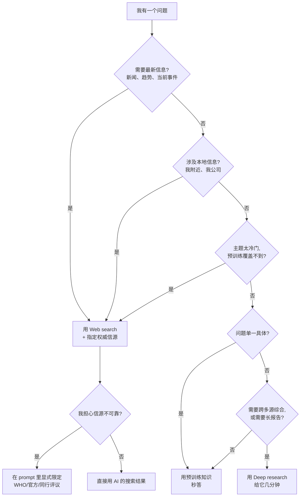

# Recap: Finding Information

> **一句话核心**：AI 有 3 种「找信息」的工具——**预训练、Web search、Deep research**——你该根据问题类型挑。

## 📊 三大工具对比（课件原表）

| | 🧠 Pretrained knowledge | 🔍 Web search | 🔬 Deep research |
|---|---|---|---|
| **例子** | Help, I dropped my phone in soup | Find me a highly rated gym nearby | Impact of daily steps on long-term health? |
| **信源数量** | 0（自给） | 几个 | 几十甚至更多 |
| **时效性** | 无关（截止前） | 最新 | 最新 |
| **AI 耗时** | 几秒 | 几十秒 | 几分钟 |
| **最适用** | 事实、定义、总结 | 实时、本地、小众 | 复杂综合 |

## 🧭 决策流程图
遇到问题时，按下面顺序问自己：

> 🎯 自测题已迁移至 [`practice/01-finding-information.md`](../../practice/01-finding-information.md)。
> 🧰 prompt 模板已迁移至 [`prompts/01-finding-information.md`](../../prompts/01-finding-information.md)。

## 🎬 Module 1 一句话总结
> **找对工具、写对 prompt。** 用预训练回答通用问题，用 web search 拿当前和本地信息（并显式指定信源），用 deep research 做需要多源综合的复杂报告。
