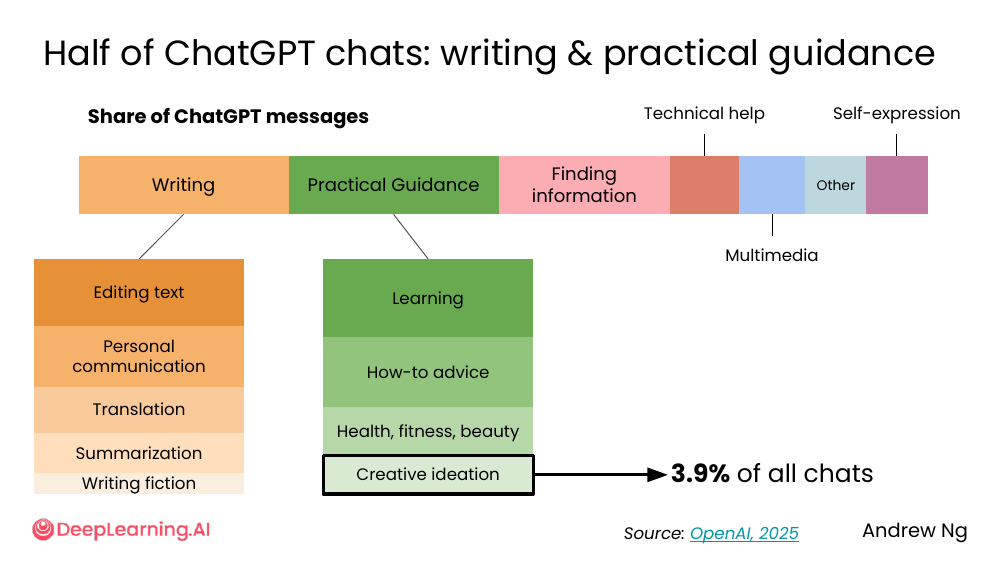
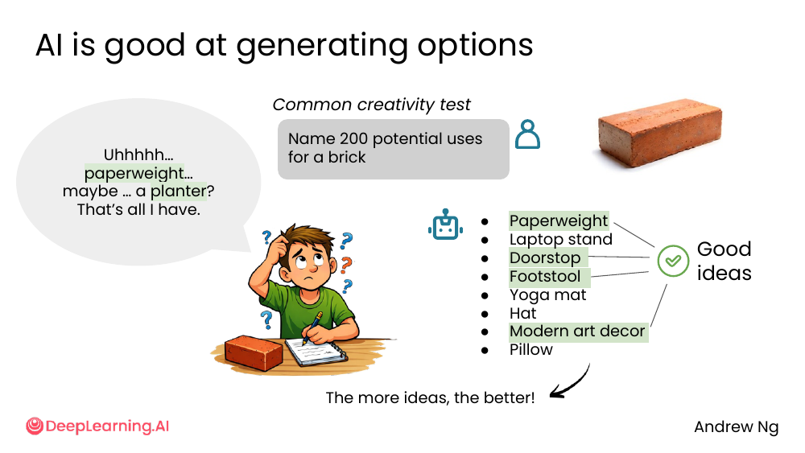
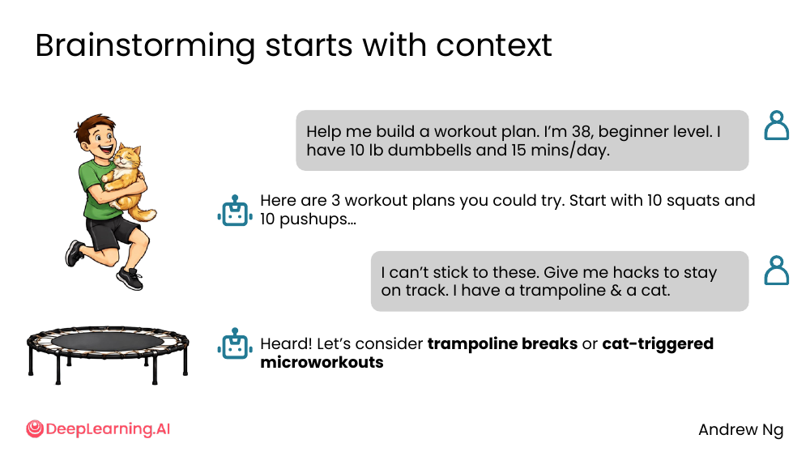
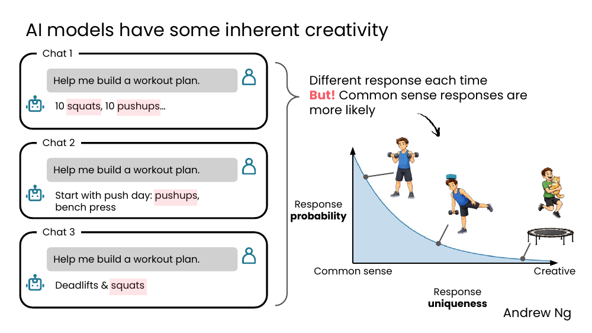
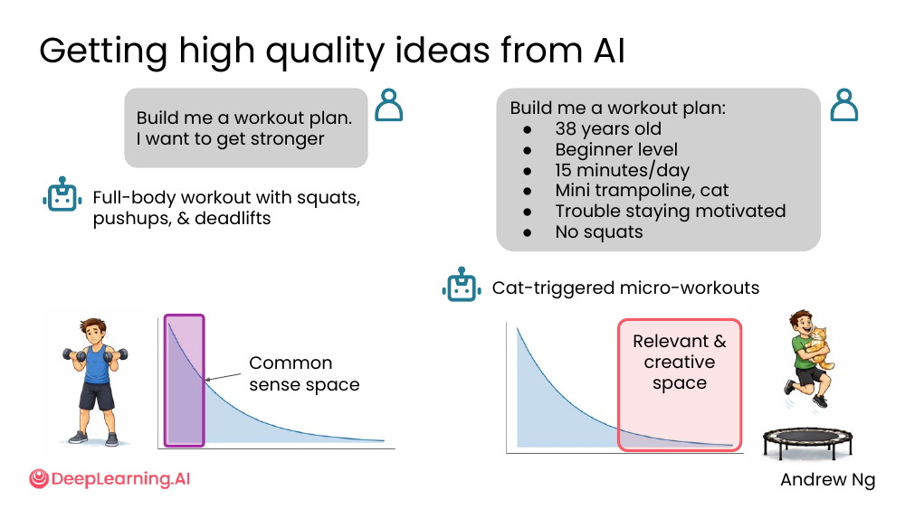
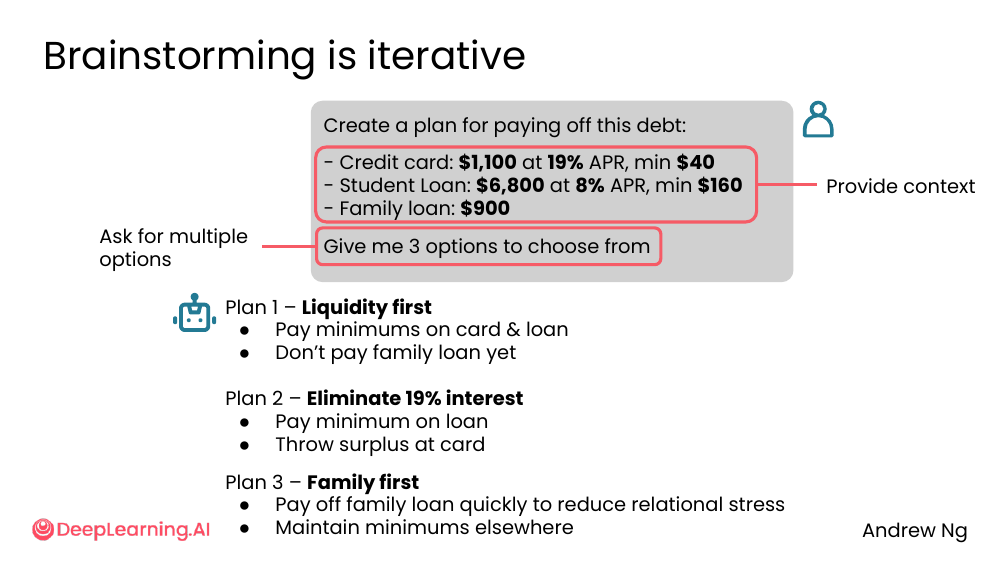
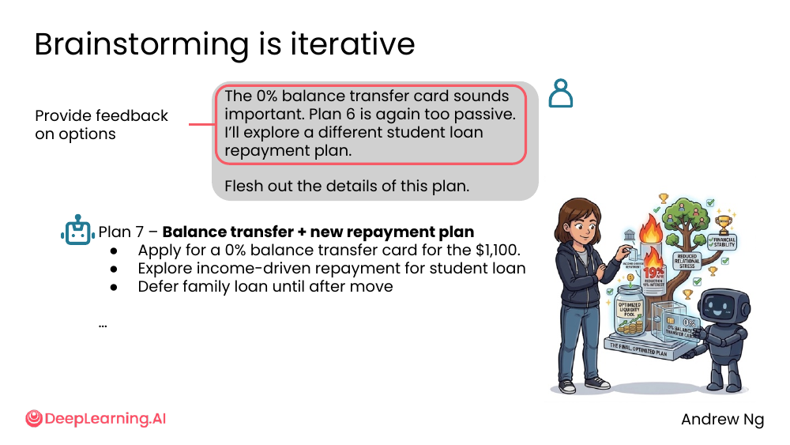
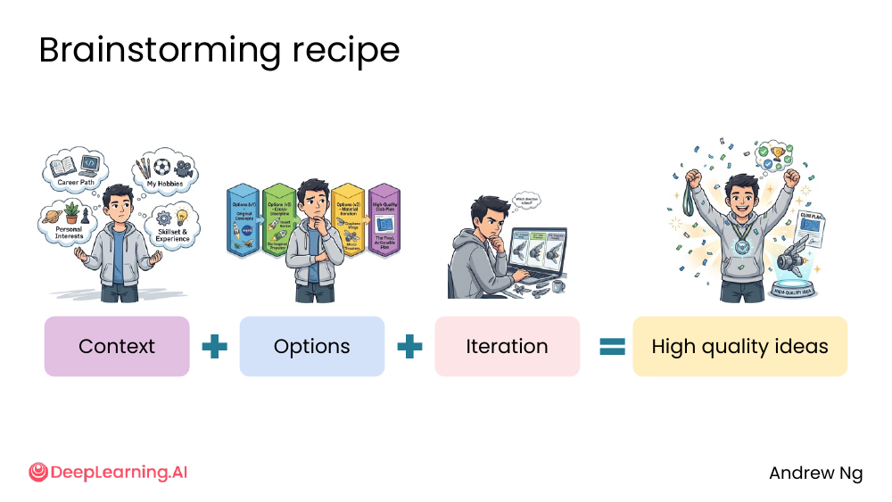
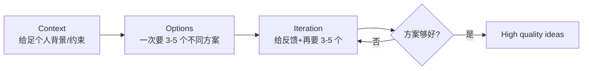

# 01. Brainstorming with AI

> **一句话核心**：头脑风暴不是一次问一次答，而是 **Context → Options → Iteration** 的循环，直到撞出好想法。

## 📌 关键概念
- **Half of ChatGPT 聊天 = 写作 + 实用指导**（OpenAI 2025 数据），其中只有 3.9% 明确是"creative ideation"。
- AI **擅长生成大量选项**——砖头 200 种用途测试显示它能轻松甩人几条街。
- AI **每次回答都不同**（temperature 带来内在创造性），但**更倾向"常识"回答**（频率分布）。
- 想要"高质量"创意 → 必须在**长尾的"相关 + 创意"空间**里搜——这需要**充分上下文**。
- **头脑风暴 = 迭代**。第一轮别期待完美答案。

## 🖼 现实里大多数人在拿 AI 做什么


OpenAI 2025 的统计：ChatGPT 用户的对话中，**写作** 和 **实用指导** 各占一大块，二者合计约 50%。

- 写作：编辑文本、私人沟通、翻译、摘要、写小说
- 实用指导：学习、how-to、健康/健身/美容、**创意构思（仅 3.9%）**
- 其他：找信息、技术帮助、多媒体、自我表达

💡 **关键洞察**：真正"创意构思"的对话其实**不到 4%**——意味着大多数用户没把 AI 当 brainstorm 伙伴。学会本节内容你就进入了 4%。

## 🖼 AI 给出大量选项：一个经典实验


> Common creativity test: "Name 200 potential uses for a brick."

- **人类**："Uhhhh… paperweight… maybe a planter? That's all I have." —— 5-10 个就卡住。
- **AI**：Paperweight, Laptop stand, Doorstop, Footstool, Yoga mat, Hat, Modern art decor, Pillow, …

**"The more ideas, the better!"** —— 头脑风暴的第一法则是**选项的数量**。AI 在这一步上碾压人类。

## 🖼 头脑风暴从上下文开始


> Round 1: "Help me build a workout plan. I'm 38, beginner level. I have 10 lb dumbbells and 15 mins/day."
> → AI: "3 plans, start with 10 squats and 10 pushups..." （**典型**的健身房入门建议）

> Round 2: "I can't stick to these. Give me hacks to stay on track. I have a trampoline & a cat."
> → AI: "trampoline breaks or cat-triggered microworkouts" （**很贴你**的建议）

💡 **关键洞察**：AI 第二轮回答质量好，**因为用户在第二轮补了上下文**（trampoline、cat、坚持不住）。**你越具体，AI 越能切中你的真实情况**。

## 🖼 AI 有内在创造性，但默认偏"常识"


同一个 prompt 「Help me build a workout plan」连发 3 次：

- Chat 1 → "10 squats, 10 pushups"
- Chat 2 → "push day: pushups, bench press"
- Chat 3 → "Deadlifts & squats"

**响应概率分布**（response probability × uniqueness）：

```
高 ──╮
      ╲
       ╲
        ╲___     ← 创意回答（cat 触发式训练）出现概率低
         ╲___
            ╲___ ← 常识回答（俯卧撑、深蹲）概率高
低            ───────────▶ Creative
       Common sense
```

> 课件原话："Different response each time. **But!** Common sense responses are more likely."

**结论**：AI 每次回答不同 = 它**确实有内在创造性**；但默认偏向**"网上最常见"**的答案。**"常识"不一定是为你**的常识。

## 🖼 怎么拿到"相关 + 创意"空间的答案


同一个问题，两个 prompt：

| Prompt | AI 答 | 落在哪个空间 |
|---|---|---|
| "Build me a workout plan. I want to get stronger" | Full-body workout with squats, pushups, deadlifts | 常识空间（高概率） |
| "Build me a workout plan: 38 yo, beginner, 15 mins/day, mini trampoline, cat, trouble staying motivated, **no squats**" | Cat-triggered micro-workouts | 相关 + 创意空间（红框） |

💡 **关键洞察**：把"通用 prompt"替换为"带 6 个具体上下文约束的 prompt"，答案从"和 Google 搜出来差不多"变成"只有你能用"。

## 🖼 头脑风暴 = 迭代（还债计划案例）
课件里 Andrew Ng 用一个完整的还债计划展示了 **3 轮迭代**：

### 第 1 轮：3 个选项

> 输入: 信用卡 $1,100 @ 19%, 学生贷款 $6,800 @ 8%, 家人借款 $900
> "Give me **3 options** to choose from"



- **Plan 1 – Liquidity first**: 只付 minimums
- **Plan 2 – Eliminate 19% interest**: 优先消灭 19% 利率
- **Plan 3 – Family first**: 先还家人款（情感优先级）

### 第 2 轮：用户反馈 → AI 重新生成 3 个

> "I don't like Option 1. Too passive. I like cutting 19% from Option 2. Also I've got $450 cash & am moving soon. **Create 3 new plans based on this.**"

AI 重新生成 Plan 4/5/6：保留 transfer、cash buffer、relocation-aware。

### 第 3 轮：进一步反馈 → Plan 7 收敛

> "The 0% balance transfer card sounds important. Plan 6 is again too passive. I'll explore a different student loan repayment plan. **Flesh out the details of this plan.**"



最终 **Plan 7** = 0% balance transfer + income-driven repayment + defer family loan after move。

💡 **关键洞察**：**不要期待第一轮就出好答案**。**迭代 3-5 轮**才能从"还行"变成"用得上"。

## 🧬 头脑风暴配方


```
Context  +  Options  +  Iteration  =  High quality ideas
```

### Mermaid 流程图



> 🛠 本节的 prompt 模板已收录于 [`prompts/02-ai-as-thought-partner.md`](../../prompts/02-ai-as-thought-partner.md)。

## ⚠️ 常见误区
- ❌ **"AI 第一次给的答案就是最终答案"** —— 头脑风暴是**迭代**，至少 3 轮。
- ❌ **"AI 没问我具体信息，所以它懂我"** —— 你不说 trampoline / cat，AI 永远不会提"cat-triggered micro-workouts"。
- ❌ **"创意 = 越多越怪"** —— 创意空间里的"好答案"必须**和你相关**，否则只是花哨的废话。
- ❌ **"AI 适合替代人脑风暴会议"** —— AI 没有现场的政治、人际、决策权。**人和人**对不齐的事，AI 没法替你定夺。

---

> 下一节 [02. Context](./02-context.md) — 头脑风暴离不开"上下文"，AI 的"上下文窗口"到底是什么？
