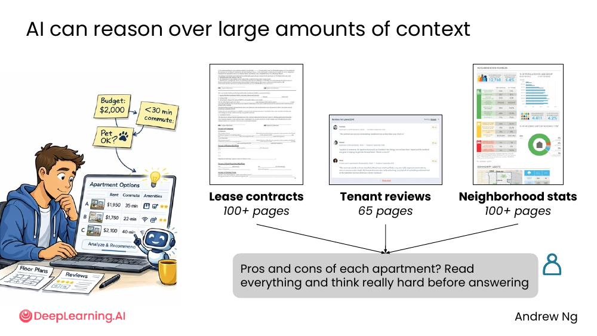
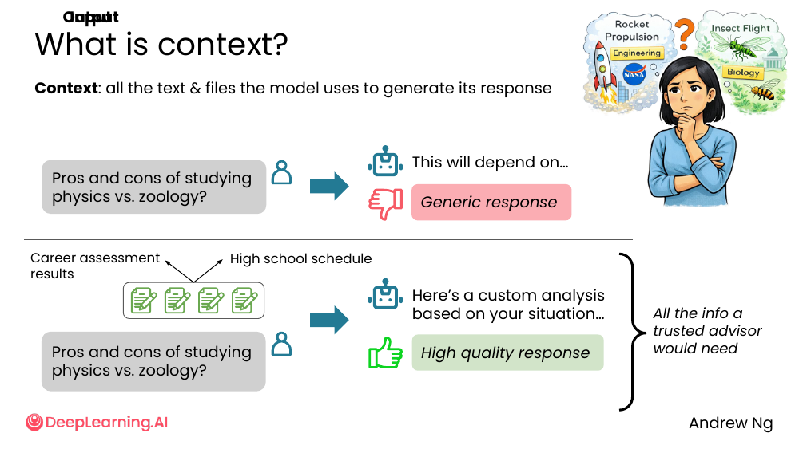
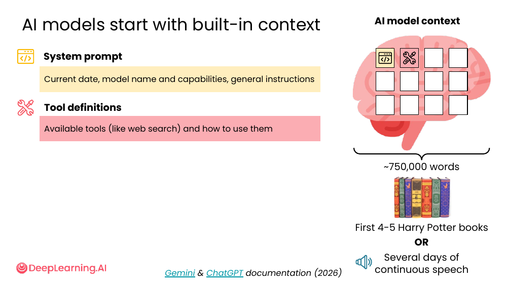
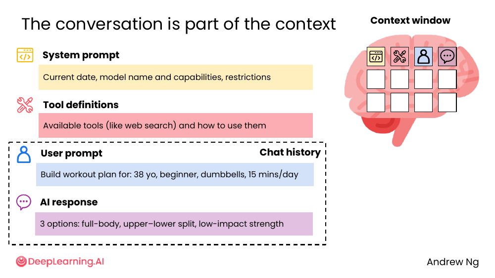
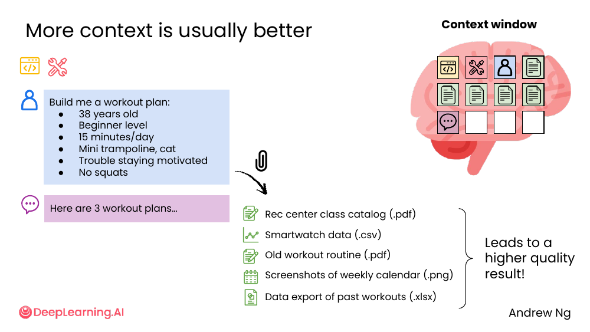
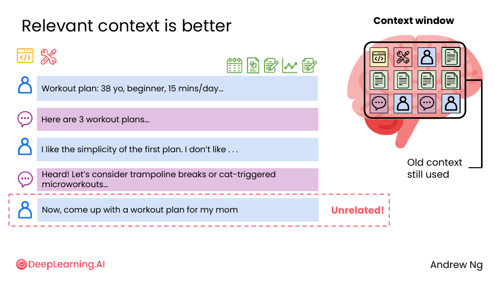

# 02. Context

> **一句话核心**：**Context = AI 当前能"看到"的全部信息**。context 越相关，答案质量越高。

## 📌 关键概念
- **Context（上下文）** = 模型用来生成回答的**所有**文本和文件。
- AI 一启动就有**内置 context**：system prompt + 工具定义，合计约 **~750,000 words**（≈ 4-5 本《哈利波特》）。
- **每次对话**都额外贡献 context：user prompt + AI response + chat history。
- 上下文**不是越多越好**——**相关**的才好。
- **新话题开新对话**——别让旧 context 污染新问题。

## 🖼 AI 能推理海量上下文


> "Pros and cons of each apartment? **Read everything and think really hard before answering.**"

- 100+ 页租赁合同
- 65 页租户评价
- 100+ 页社区统计

**一次性**塞进 context，AI 能"读完后"给一个综合 tradeoffs 报告。

💡 **关键洞察**：以前这种"读 300 页文档再综合"的任务，**人类需要几小时**。现代 AI 几秒到几十秒能完成。**"读得完"是新模型的关键能力**。

## 🖼 什么是 context？


> **Context: all the text & files the model uses to generate its response.**

同一道题「学物理 vs 动物学的利弊」：

- **没 context** → AI 给"通用答案"（"这要看个人兴趣…"）
- **有 context**（职业评估结果 + 高中课表）→ AI 给"针对你的答案"（"你的物理强但你生物也强，根据你高中的课表…推荐动物学"）

课件把后者称为 "**All the info a trusted advisor would need**"。

## 🖼 AI 模型有"内置 context"


每个 AI 模型启动时就已经**携带**：

| 内置 context | 内容 | 大小量级 |
|---|---|---|
| **System prompt** | 当前日期、模型名和能力、通用指令 | 几千到几万字 |
| **Tool definitions** | 可用工具（如 web search）的描述和使用方式 | 几千字 |
| **合计** | — | **~750,000 words**（≈ 4-5 本《哈利波特》or 几天的连续语音） |

> 数据来源：Gemini & ChatGPT 文档 (2026)

**意义**：你看不到这部分，**但它一直在影响 AI 的行为**（如"我无法浏览网页"这种自我描述就是 system prompt 的）。

## 🖼 对话本身就是 context


每次用户-AI 交换都加入 context window：

```
┌──────────────────────── Context window ────────────────────────┐
│                                                                │
│  System prompt (built-in)                                      │
│                                                                │
│  Tool definitions (built-in)                                   │
│                                                                │
│  User: Build workout plan for: 38 yo, beginner, dumbbells…     │
│  ──────────── chat history ────────────                        │
│  AI:   3 options: full-body, upper-lower split, low-impact…    │
│                                                                │
└────────────────────────────────────────────────────────────────┘
```

💡 **关键洞察**：你的**整个对话历史**都还在。AI 在回答第 10 轮时**仍然记得**第 1 轮说过什么。

## 🖼 上下文"越多越好"——但要相关


> "Build me a workout plan: 38 yo, beginner, 15 mins/day, mini trampoline, cat, trouble staying motivated, no squats"

光这一条 prompt 就含 6 个细节。课件在这基础上**还加**了 5 个文件：

- Rec center class catalog (.pdf)
- Smartwatch data (.csv)
- Old workout routine (.pdf)
- Screenshots of weekly calendar (.png)
- Data export of past workouts (.xlsx)

**结果**：质量显著提升。

## ⚠️ 但"多≠好"，**相关才好**


```
对话 A:
  "Workout plan: 38 yo, beginner, 15 mins/day…"
  → "Here are 3 workout plans…"
  → "I like the simplicity of the first plan. I don't like…"
  → "Heard! Let's consider trampoline breaks or cat-triggered microworkouts…"
  ✓ 上下文一致

对话 B（在 A 之后）:
  → "Now, come up with a workout plan for my mom"
  ✗ 旧 context (your preferences, no squats, cat) 还在
  ✗ 但和你妈的需求无关
  → AI 答得别扭
```

课件原话："**Old context still used. Unrelated!**"

## 🧭 关键原则
1. **多 context 通常更好**——别让 AI 凭空猜。
2. **相关 context 更好**——别塞无关的旧文件。
3. **新话题开新对话**——别让旧聊天污染新问题。

> 🛠 本节的 prompt 模板已收录于 [`prompts/02-ai-as-thought-partner.md`](../../prompts/02-ai-as-thought-partner.md)。

## ⚠️ 常见误区
- ❌ **"Context 越多越好，所以把历史对话都贴回去"** —— **不相关**的 context 反而干扰 AI。
- ❌ **"AI 怎么知道我喜欢什么？我又没说过"** —— **AI 默认不记得你**。你**得在每次对话里**给 context。
- ❌ **"我的工作对话和私人聊天可以混在一个 chat 里"** —— **新话题 = 新对话**。不然 AI 会把你的私人偏好套到工作上。

---

> 下一节 [03. AI desktop apps](./03-ai-desktop-apps.md) —— 当 AI 主动管理 context、读取你的本地文件时，会发生什么？
