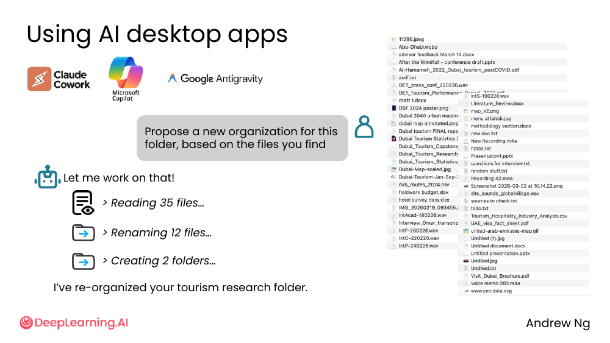
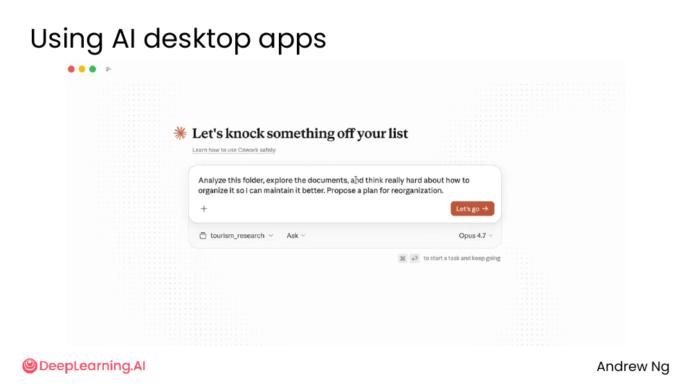
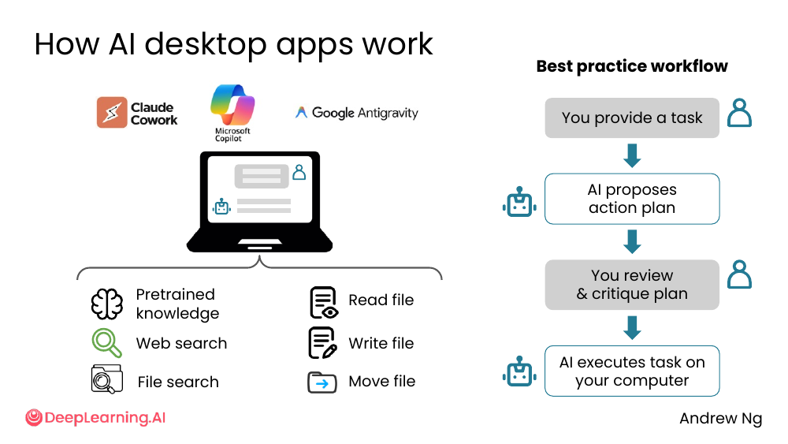
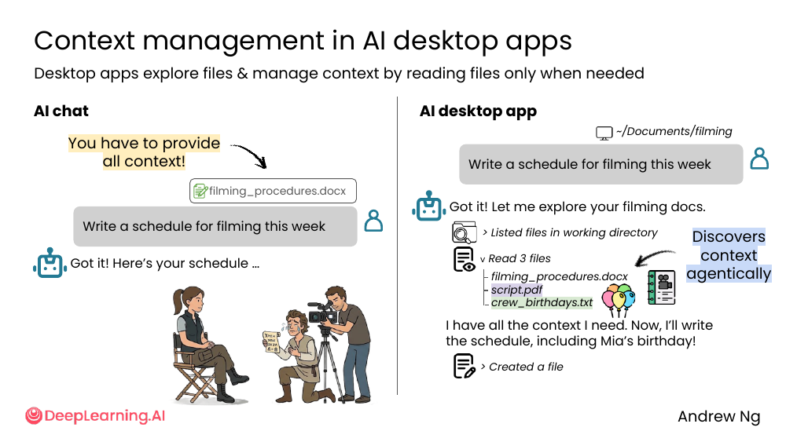
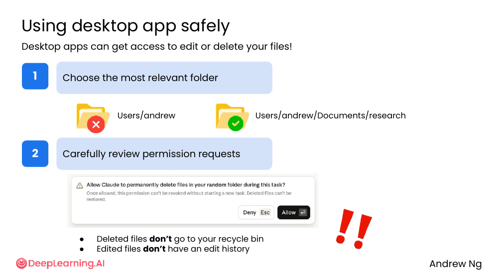
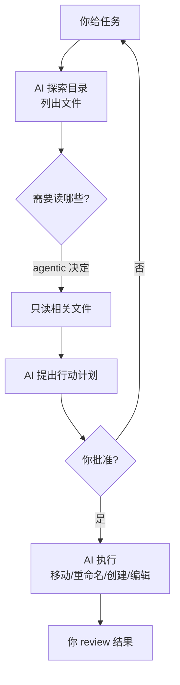

# 03. AI desktop apps

> **一句话核心**：AI desktop apps（如 Claude Cowork、Microsoft Copilot、Google Antigravity）让 AI **能自己读、写、移动你电脑上的文件**——你定任务，AI 自己规划、自己执行。

## 📌 关键概念
- **AI desktop apps** = 有「文件操作」权限的 AI 工具。代表：**Claude Cowork**、**Microsoft Copilot**、**Google Antigravity**。
- 它们背后调用和 chat 一样的模型能力（预训练、web search），**外加**：**file search**、**read file**、**write file**、**move file**。
- 工作流是 agentic：用户给任务 → AI **自己提出行动计划** → 用户审阅 → AI 执行。
- 上下文管理是 **agentic** 的：AI 探索目录，**只在需要时读文件**，不是一口气全读。
- **安全警告**：删除的文件**不进回收站**，编辑的文件**没有 edit history**。

## 🖼 一个典型场景


> "Propose a new organization for this folder, based on the files you find."

AI 回："Let me work on that!"

```
> Reading 35 files…
> Renaming 12 files…
> Creating 2 folders…

I've re-organized your tourism research folder.
```

💡 **关键洞察**：这不是聊天机器人——**它直接动你的文件**。

## 🖼 Claude Cowork 的产品形态


- 一句 prompt：「Analyze this folder, explore the documents, and think really hard about how to organize it so I can maintain it better. Propose a plan for reorganization.」
- 模型选 Opus 4.7
- 旁边是文件树（`tourism_research/`）
- 按 ⌘⏎ 启动一个 task

## 🖼 AI desktop app 怎么工作


底层能力（左侧）和最佳实践工作流（右侧）：

### 底层能力

| 能力 | 来源 |
|---|---|
| Pretrained knowledge | 模型本身 |
| Web search | 工具调用 |
| **File search** | desktop app 专属 |
| **Read file** | desktop app 专属 |
| **Write file** | desktop app 专属 |
| **Move file** | desktop app 专属 |

### 最佳实践工作流

```
[用户] You provide a task
         │
         ▼
[AI  ] AI proposes action plan
         │
         ▼
[用户] You review & critique plan
         │
         ▼
[AI  ] AI executes task on your computer
```

💡 **关键洞察**：**用户必须审阅计划**再让 AI 执行——这是 desktop app 安全模型的核心。

## 🖼 上下文管理：AI 自己探索文件


| | AI chat | AI desktop app |
|---|---|---|
| 谁提供 context？ | **你**（手动粘贴/上传） | **AI 自己**（agentic 探索） |
| 怎么找 context？ | 你自己查 | AI 列目录、读相关文件 |

### 一个具体例子

> "Write a schedule for filming this week."

**AI chat** 的情况：
> 「You have to provide all context!」
> 用户得手动贴上 `filming_procedures.docx`
> → AI 给一个通用 schedule

**AI desktop app** 的情况：
> 「Got it! Let me explore your filming docs.」
> ```
> > Listed files in working directory
> ✓ Read 3 files
>   filming_procedures.docx
>   script.pdf
>   crew_birthdays.txt
> ```
> 「I have all the context I need. Now, I'll write the schedule, including Mia's birthday!」

注意最后一句 —— AI **自己发现了** crew_birthdays.txt，并自动把 Mia 的生日**纳入了 schedule**。这种"我从来没让你看这个文件"的能力，是 desktop app 的核心价值。

## 🖼 安全使用：两条铁律


> "Desktop apps can get access to edit or delete your files!"

### 1. 选择最相关的文件夹

| ❌ 不好 | ✅ 好 |
|---|---|
| `Users/andrew`（整个 home 目录） | `Users/andrew/Documents/research`（具体子目录） |

**只给 AI 它**真正需要**的目录**。权限越小越好。

### 2. 仔细审查权限请求

> ⚠️ "Allow Claude to permanently delete files in your random folder during this task?
> Once allowed, this permission can't be revoked without starting a new task. **Deleted files can't be restored.**"

### 两条硬警告

- **Deleted files don't go to your recycle bin** —— 删了就是删了。
- **Edited files don't have an edit history** —— 没有撤销按钮。

## 🧭 Mermaid 流程


> 🛠 本节的 prompt 模板已收录于 [`prompts/02-ai-as-thought-partner.md`](../../prompts/02-ai-as-thought-partner.md)。

## ⚠️ 常见误区
- ❌ **"AI 不会误删，反正它能恢复"** —— 它**不能**。删了不进回收站。
- ❌ **"给它整个 home 目录方便"** —— 权限越大事故越大。先给子目录。
- ❌ **"计划 OK，直接干"** —— **必须 review**。AI 的"行动计划"可能包含你没料到的删除/重命名。
- ❌ **"desktop app = chat 升级版"** —— desktop app 有**写权限**。错误的代价不一样。

---

> 下一节 [04. Reasoning with AI](./04-reasoning.md) —— 当 AI 思考几分钟甚至几十分钟，它在想什么？
