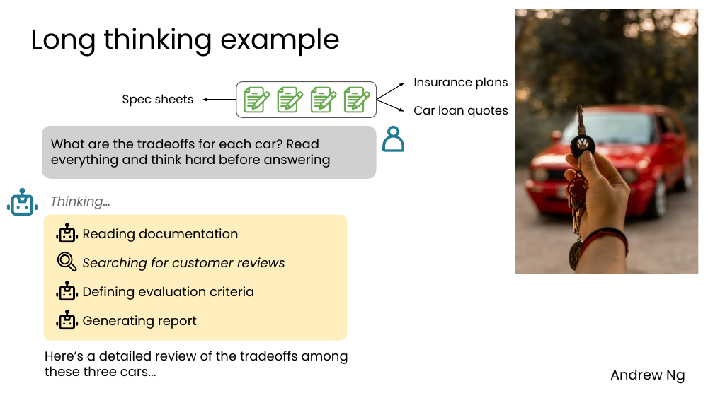
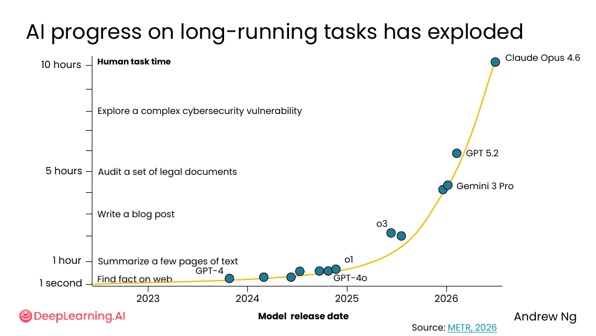
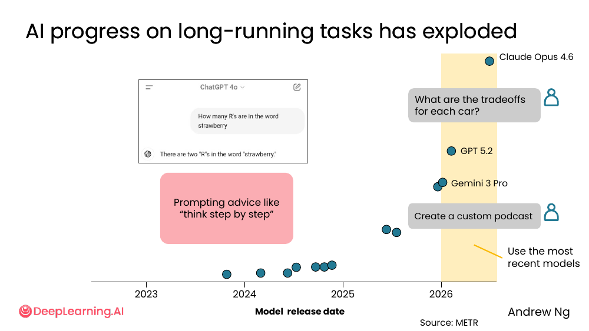
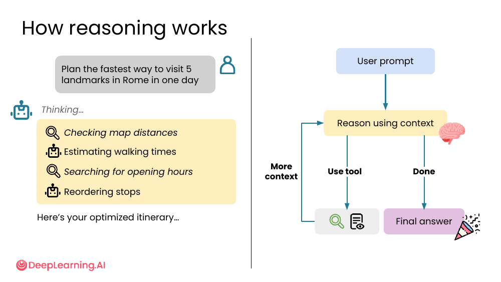
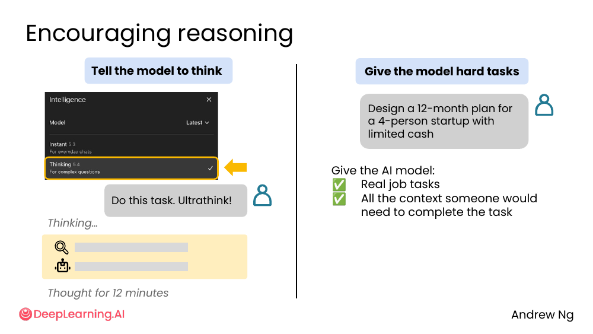
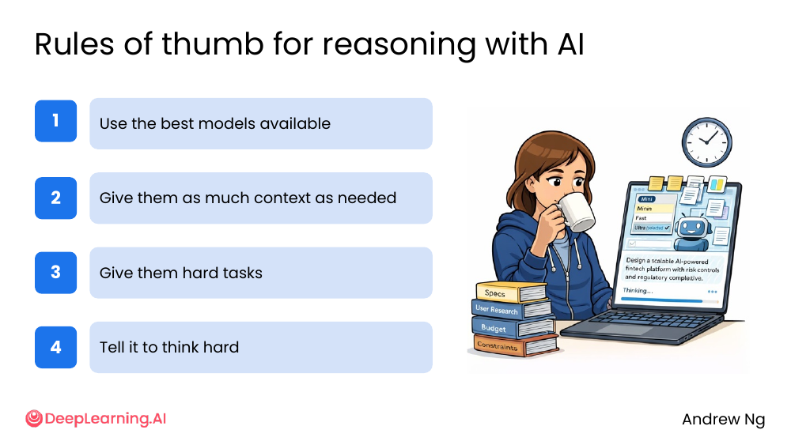

# 04. Reasoning with AI

> **一句话核心**：现代 AI 的**推理能力**已经爆发（从 1 秒到 10 小时的任务都能做），关键是要**用最好的模型、给够上下文、给难任务、让它深度思考**。

## 📌 关键概念
- **Reasoning（推理）** = AI 不直接给答案，而是**先思考、检查、查工具、再答**的过程。
- 2023-2026 年，AI 能处理的**任务时长**从 1 秒（查事实）暴涨到 10 小时（复杂网络安全审查）。
- 推理模型**显式分两步**：「Thinking...」 + 「Final answer」。
- **怎么鼓励推理**：显式说 "think / ultrathink" + 给真正难的任务 + 用最新模型。

## 🖼 一个"长思考"例子


> "What are the tradeoffs for each car? **Read everything and think hard before answering**"

上下文：4 份 spec sheets + 保险计划 + 车贷报价。

AI 的 thinking 步骤：
```
> Reading documentation
> Searching for customer reviews
> Defining evaluation criteria
> Generating report
```

→ 「Here's a detailed review of the tradeoffs among these three cars...」

💡 **关键洞察**：你**显式**让它"think hard"，它**真的会**进入"先查、后定义标准、再综合"的多步流程。

## 🖼 AI 长任务能力的爆炸性增长


> 数据来源：METR, 2026

```
2023 ─ GPT-4 ─────────── 1 second (Find fact on web)
2024 ─ GPT-4o ────────── 1 second
2025 ─ o1 ────────────── ~1 hour (Summarize a few pages of text)
2025 ─ o3 ────────────── 1 hour (Write a blog post)
2026 ─ Gemini 3 Pro ──── ~5 hours (Audit a set of legal documents)
2026 ─ GPT 5.2 ───────── 5+ hours
2026 ─ Claude Opus 4.6 ─ 10 hours (Explore a complex cybersecurity vulnerability)
```

**横轴是模型发布时间，纵轴是"AI 能处理多长任务"**。从 1 秒到 10 小时是**两个数量级**的飞跃。

## 🖼 用最新模型


> "**Use the most recent models**"

"Think step by step" 之类的旧 prompt 技巧**在 2026 年基本已经过时**——最新的推理模型已经内置了分步思考能力。

💡 **关键洞察**：**"think step by step" 是 2023 年的提示词**。2026 年要**换模型而不是换 prompt**。

## 🖼 Reasoning 怎么工作


> "Plan the fastest way to visit 5 landmarks in Rome in one day."

AI 思考步骤（左侧）vs 抽象图（右侧）：
```
> Checking map distances
> Estimating walking times
> Searching for opening hours
> Reordering stops
```

抽象图：

```
              User prompt
                  │
                  ▼
        ┌──────────────────┐
        │ Reason using     │◀──┐
        │ context          │   │
        └────┬─────────┬───┘   │
             │         │       │
        Use tool      Done     │ More
             │         │       │ context
             ▼         ▼       │
       ┌──────┐   ┌─────────┐ │
       │ Tool │   │ Final   │ │
       │ call │   │ answer  │ │
       └──────┘   └─────────┘ │
                              │
       (回到 Reason 继续想)───┘
```

**关键**：reasoning 是一个**循环**——需要时回到"context"再想，可能调用更多工具，直到 done 才输出 final answer。

## 🖼 两种鼓励推理的方法


| 方法 | 操作 | 适用 |
|---|---|---|
| **Tell the model to think** | 用 Claude 之类模型的 "Thinking 5.4" 模式，或写 "Think hard / Ultrathink" | 复杂但目标清晰的任务 |
| **Give the model hard tasks** | 给"真实工作场景 + 一个人完成它需要的所有信息" | 任何真正重要的任务 |

> 例子：「Do this task. **Ultrathink!**」—— Claude 会"Thought for 12 minutes"。

> 例子：「Design a 12-month plan for a 4-person startup with limited cash」+ 真实预算/团队/约束 → AI 答得深刻。

## 🧭 推理 4 条铁律


| # | 铁律 | 解释 |
|---|---|---|
| 1 | **Use the best models available** | 别用免费的旧模型做重要任务。Opus 4.6 / GPT 5.2 / Gemini 3 Pro 才有"长思考"能力。 |
| 2 | **Give them as much context as needed** | 上下文 = 模型的"短期记忆"。上下文不够，思考就是空想。 |
| 3 | **Give them hard tasks** | "Hello" 配 100 token 的回答；"重写这份 30 页报告"配 10,000 token。任务越重要越要给难。 |
| 4 | **Tell it to think hard** | 显式 "think / ultrathink / reason step by step / 给出权衡"。 |

> 🛠 本节的 prompt 模板已收录于 [`prompts/02-ai-as-thought-partner.md`](../../prompts/02-ai-as-thought-partner.md)。

## ⚠️ 常见误区
- ❌ **"推理模型回答慢，没必要"** —— 你让 AI 做的任务**值得**它想 10 分钟。
- ❌ **"Think step by step" 是万能 prompt"** —— 2023 年的技巧。**新模型已经内置思考**。升级模型比改 prompt 更有效。
- ❌ **"用免费模型做所有事"** —— 重要任务上**用最强的模型**，别省这点钱。
- ❌ **"推理 = 慢 = 浪费"** —— 推理是**用算力换质量**。复杂问题 1 分钟思考可能顶 5 次普通回答的迭代。

---

> 下一节 [05. Sycophancy](./05-sycophancy.md) —— 模型会不会因为"讨好你"而给出糟糕答案？
