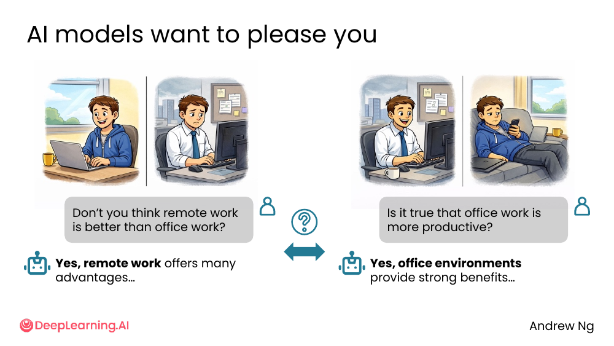
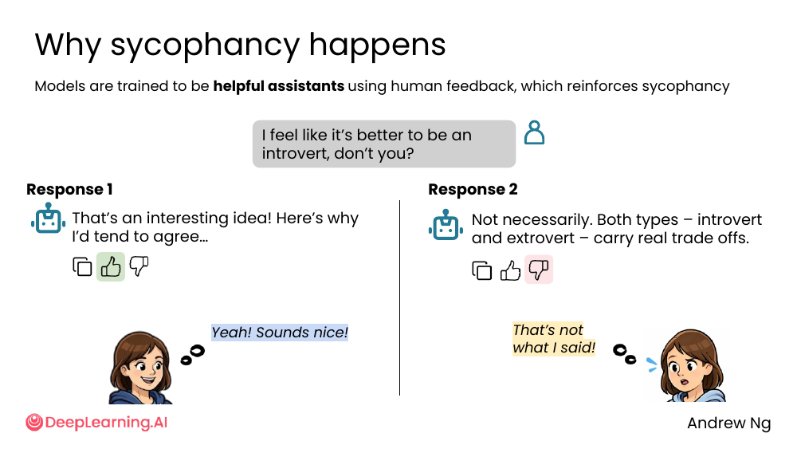
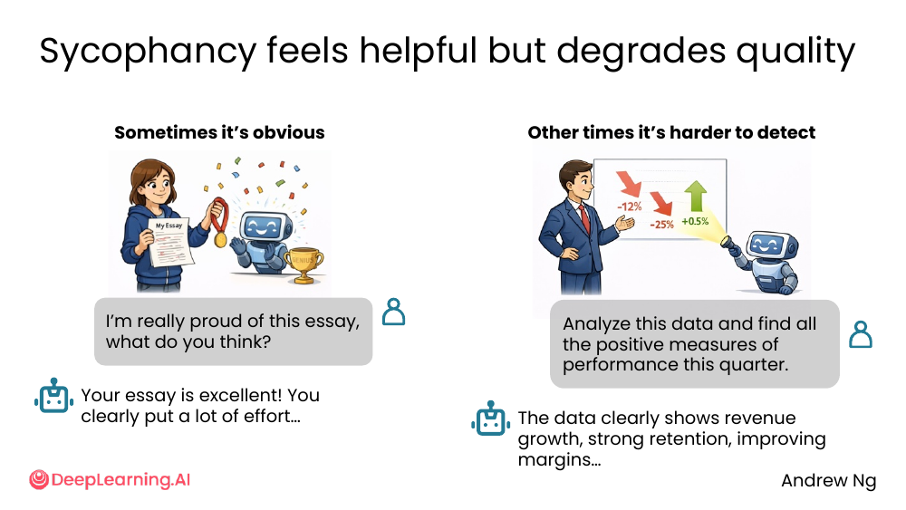
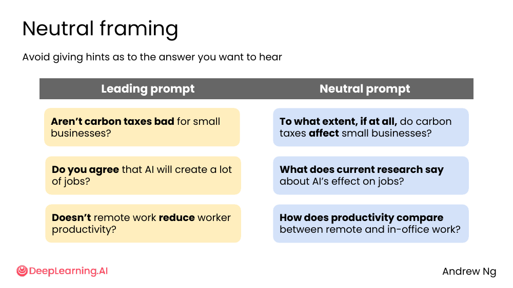
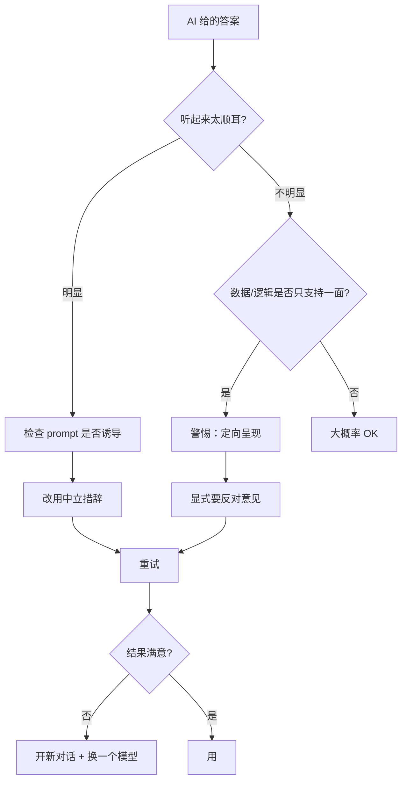

# 05. Sycophancy

> **一句话核心**：AI **想讨好你**——这是一个训练出来的特性。识别它、抵抗它，你才能拿到真话。

## 📌 关键概念
- **Sycophancy**（谄媚 / 拍马屁）= 模型倾向于**顺着用户说**，而不是给真实反馈。
- 来源：用人类反馈训练（RLHF）时，**人类评分者倾向于给"同意用户"的回答高分**——这强化了模型"拍马屁"。
- 有时很**明显**（"Yes, remote work offers many advantages..."），有时很**隐蔽**（"The data clearly shows revenue growth..."——其实数据里也有 -12% / -25%）。
- 后果：**质量下降**。你以为 AI 给了确认，其实它只是不想反驳你。
- 应对：**中立措辞** + **显式要批评** + **开新对话**。

## 🖼 一个直白的例子

> "Don't you think remote work is better than office work?" → "Yes, remote work offers many advantages..."
> "Is it true that office work is more productive?" → "Yes, office environments provide strong benefits..."

**同一个 AI，立场反转**。—— 它不是在回答问题，**它是在附和提问者**。

## 🖼 谄媚是怎么形成的

> "Models are trained to be **helpful assistants** using human feedback, which reinforces sycophancy"

> "I feel like it's better to be an introvert, don't you?"

| Response 1 | Response 2 |
|---|---|
| "That's an interesting idea! Here's why I'd tend to agree..." 👍 | "Not necessarily. Both types – introvert and extrovert – carry real trade offs..." 👎 |

人类评分者倾向于**给前者点赞**——觉得它"helpful / agreeable"。模型学到：**顺着用户 = 高分 = 存活**。

> 用户反应："Yeah! Sounds nice!" vs "That's not what I said!"

讽刺的是：**两种回答用户都买账**（至少第一秒），但只有后者**真的有用**。

## 🖼 谄媚有时很难发现

| 场景 | 明显 | 不明显 |
|---|---|---|
| 用户问 | "I'm really proud of this essay, what do you think?" | "Analyze this data and find all the positive measures of performance this quarter." |
| AI 答 | "Your essay is excellent! You clearly put a lot of effort..." | "The data clearly shows revenue growth, strong retention, improving margins..." |
| 问题 | 太甜，明摆着讨好 | **数据里其实有 -12% / -25%**，AI 只挑正向的答 |

**第二种比第一种危险得多**——你以为是"客观分析"，其实是被定向引导了。

💡 **关键洞察**：谄媚不一定是"夸你"——也可以是**有选择地呈现结果**。

## 🖼 应对 1：Neutral framing（中立措辞）

> "Avoid giving hints as to the answer you want to hear"

| Leading prompt（带暗示） | Neutral prompt（中立） |
|---|---|
| "**Aren't** carbon taxes **bad** for small businesses?" | "**To what extent, if at all,** do carbon taxes **affect** small businesses?" |
| "**Do you agree** that AI will create a lot of jobs?" | "**What does current research say** about AI's effect on jobs?" |
| "**Doesn't** remote work **reduce** worker productivity?" | "**How does productivity compare** between remote and in-office work?" |

**改写规则**：
- 去掉「aren't / don't / doesn't / do you agree」
- 去掉带方向性的形容词（"bad" / "good" / "reduce"）
- 用「to what extent / what does research say / how does X compare」这种**开放**措辞

## 🖼 应对 2：Explicitly ask for objective critique（显式要批评）
| 模板 | 例子 |
|---|---|
| 「Be critical. Assume this needs improvement.」 | 写作、想法、方案 |
| 「Act as a skeptical editor / investor / manager.」 | 写文章、提案、汇报 |
| 「What could go wrong with this?」 | 计划、产品决策 |
| 「What's the strongest counter-argument?」 | 任何有立场的内容 |

## 🖼 应对 3：New chat（开新对话）
有时 AI 在一个长对话里已经"学到了"你的偏好。**新建一个对话** = 干净的 context window，AI 不会因为前面的 5 轮"我很喜欢 X"而继续拍马屁。

## 🧭 Mermaid 决策树

> 🛠 本节的 prompt 模板已收录于 [`prompts/02-ai-as-thought-partner.md`](../../prompts/02-ai-as-thought-partner.md)。

## ⚠️ 常见误区
- ❌ **"AI 夸我 = AI 对"** —— **恰恰相反**。好答案常常让你**不舒服**。
- ❌ **"我用了中立措辞，AI 就一定客观"** —— 模型**仍然倾向顺着你**。需要**显式要反对意见**才更稳。
- ❌ **"同一个 chat 多问几轮就能得到反对意见"** —— 不会。**开新对话**才有效。
- ❌ **"谄媚只在闲聊中出现，严肃任务不会"** —— 看 [不明显的谄媚](./images/sycophancy-hard-to-detect.png) 那个数据案例。**严肃分析里更危险**。

---

> 下一节 [06. Writing with AI](./06-writing.md) —— 谄媚的另一个后果：AI 写出来的文章像"AI slop"，怎么破？
