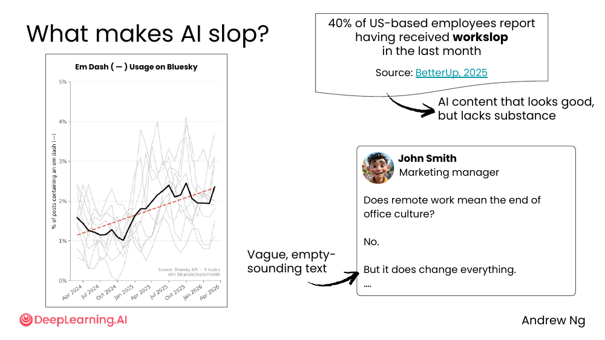
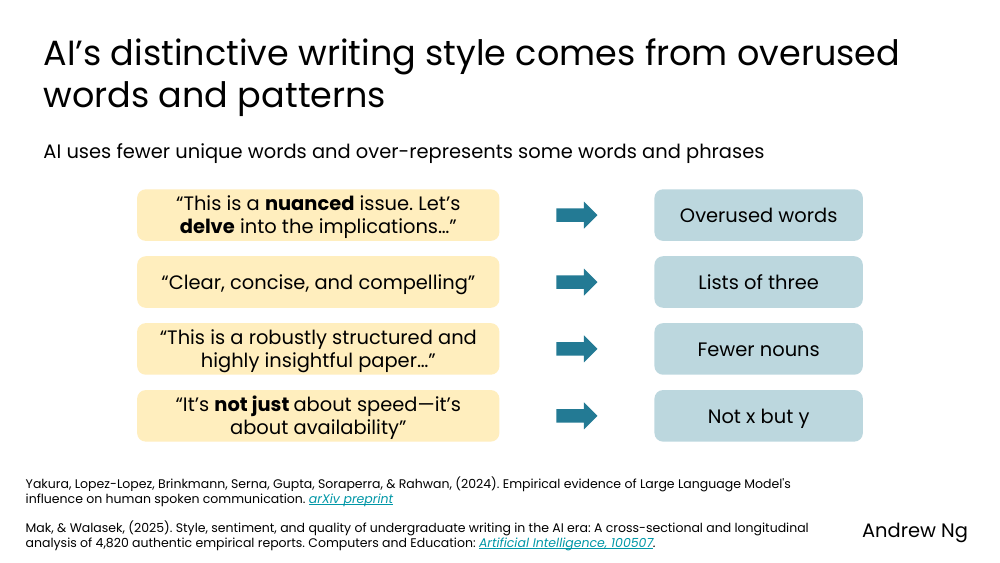
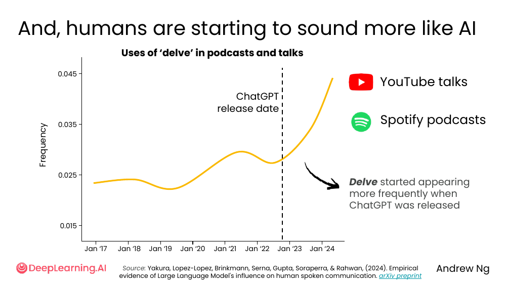
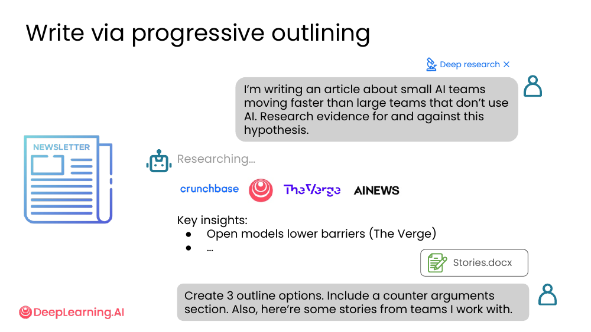
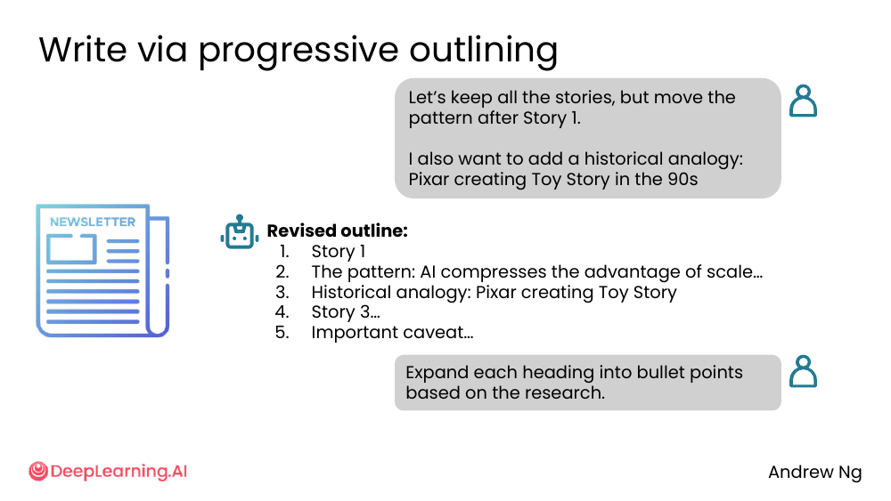
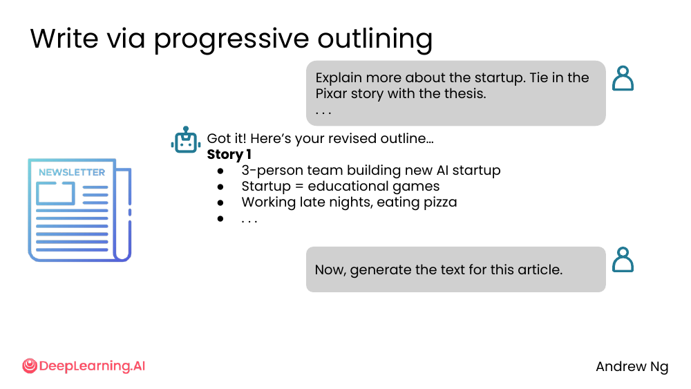
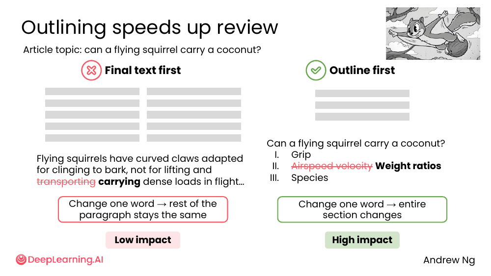
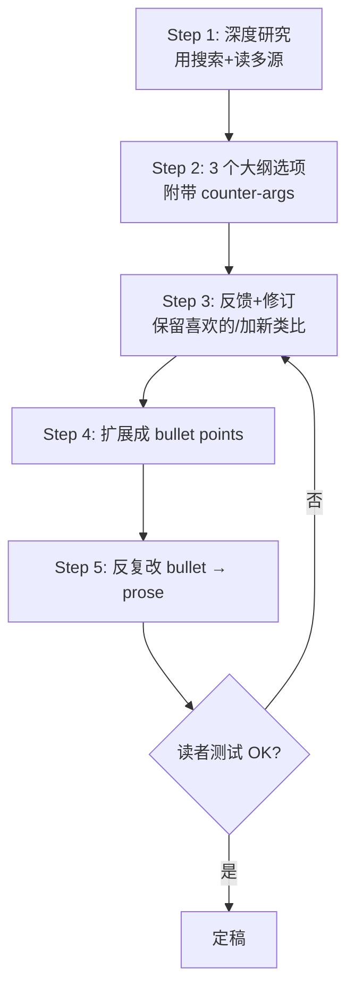

# 06. Writing with AI

> **一句话核心**：用 AI 写文章**别让 AI 一步到位**——**渐进式大纲**是 90% 场景下的最优路径，**逐段编辑**比"整篇重写"更可控。

## 📌 关键概念
- **AI slop** = 看起来"还不错"但**没有实质**的内容。**40% 美国员工**最近一个月收到过 workslop（BetterUp 2025）。
- AI 有**可识别的写作指纹**：过度使用的词（"delve", "nuanced"）、3-list、缺少名词、"not x but y" 句式、em dash。
- **"Delve" 现象**：人类受 AI 影响，**自己也开始用**这些词（Yakura et al. 2024 研究）。
- **渐进式大纲** = 写作的标准工作流：研究 → 3 个大纲 → 修订 → 扩展 → 最终。
- **大纲 vs 终稿**：在大纲阶段改一个字 = 整段都改；在终稿改一个字 = 影响很小。**先编辑大纲**。

## 🖼 什么是 AI slop？

> "**40% of US-based employees report having received workslop in the last month**" — BetterUp 2025
>
> "AI content that looks good, but lacks substance"

课件的 John Smith 案例：
> Question: "Does remote work mean the end of office culture?"
> Answer: "**No.** But it does change everything. ...."

"看起来挺有道理" —— 但**没有回答**问题。"No + but it does change everything" = 经典的模糊空话。

## 🖼 AI 的写作指纹

> "AI uses **fewer unique words** and over-represents some words and phrases"

| AI 偏好 | 例子 |
|---|---|
| **过度使用的词** | "This is a **nuanced** issue. Let's **delve** into the implications..." |
| **Lists of three** | "Clear, concise, and **compelling**" |
| **Fewer nouns** | "This is a **robustly structured** and **highly insightful** paper..." |
| **Not x but y** | "It's **not just** about speed—it's about **availability**" |

数据来源：Yakura et al. 2024 (arXiv) + Mak & Walasek 2025。

💡 **关键洞察**：AI **不是写不出好句子**——它**太爱**用某种风格。**编辑环节要刻意打破**这种节奏。

## 🖼 人类开始像 AI

> Yakura et al. 2024 — Uses of 'delve' in podcasts and talks

横轴：2017 - 2024。纵轴：delve 的使用频率。

- **2022 年底 ChatGPT 发布前** —— "delve" 频率稳定
- **2023 年开始** —— "delve" 在 YouTube talks 和 Spotify podcasts 中**显著上升**

> "**Delve** started appearing more frequently when ChatGPT was released"

💡 **关键洞察**：AI 的写作风格**正在反向影响人类**的口头和书面表达。**辨识 AI 指纹的能力 = 信息时代的基础素养**。

## 🖼 渐进式大纲法（5 步）
Andrew 用一篇关于"小 AI 团队比大团队跑得快"的文章演示完整流程：

### Step 1 — 深度研究

> "I'm writing an article about small AI teams moving faster than large teams that don't use AI. Research evidence for and against this hypothesis."

> ❌ **不要用** Deep research（默认模式会给你"通用报告"）

AI 拉了 Crunchbase、The Verge、AI News 等来源，列出"Key insights"。

> 💡 同时贴上你自己的素材：Stories.docx

### Step 2 — 一次要 3 个大纲

> "Create 3 outline options. Include a counter arguments section. Also, here're some stories from teams I work with."

AI 出 3 个不同角度的大纲（Option 1 story-focused / Option 2 pattern-focused / Option 3 ...）。

### Step 3 — 反馈 + 修订

> "Let's use Option 1 and keep all the stories, but move the thesis after Story 1."
> "I also want to add a historical analogy: Pixar creating Toy Story in the 90s"

AI 给出修订版 outline：Story 1 → Pattern → Historical analogy → Story 3 → Caveat。

### Step 4 — 扩成 bullet points

> "Expand each heading into bullet points based on the research."

### Step 5 — 反复改 bullet → 最终写 prose

> "Explain more about the startup. Tie in the Pixar story with the thesis..."
> "Now, generate the text for this article."

## 🖼 大纲 vs 终稿：为什么先编辑大纲

> Article topic: can a flying squirrel carry a coconut?

| 顺序 | 改一个字的后果 | 投入产出比 |
|---|---|---|
| ❌ 终稿先出 | 改一个词 → 整个段落的逻辑都得重写 | Low impact（其他段落不变，但你得手动同步） |
| ✅ 大纲先出 | 改一个词 → 整段都会跟着更新 | High impact（一处改，全段重生成） |

💡 **关键洞察**：**编辑大纲**是放大你改动的杠杆。**先编辑大纲，再扩展成文**。

## 🖼 逐段编辑 vs 整篇编辑
课件给了一个例子：把一句"AGI = 电脑跟人一样聪明"重写成 3 种风格。

> "The public thinks achieving AGI means computers will be as smart as people."

AI 给出 3 种风格（punchy / visionary / conversational），你可以**逐段**挑喜欢的。

| 方法 | 优点 | 缺点 |
|---|---|---|
| **逐段编辑** | 改动可见，节奏可控 | 慢 |
| **整篇重写** | 快 | 「What changed? I can't tell!」 |

💡 **关键洞察**：**逐段改**比"整篇重写"更接近真正的写作流程。

## 🧭 渐进式大纲的 5 步流程图

> 🛠 本节的 prompt 模板已收录于 [`prompts/02-ai-as-thought-partner.md`](../../prompts/02-ai-as-thought-partner.md)。

## ⚠️ 常见误区
- ❌ **"让 AI 一口气写一篇 2000 字"** —— 99% 概率得到 AI slop。**永远用渐进式大纲**。
- ❌ **"看起来还行 = 写得好"** —— 模糊空话的最大特征是**看起来不错**。**用 AI fingerprint 检查表**。
- ❌ **"deep research 直接出报告"** —— deep research 是**研究阶段**用的。**别直接当文章用**。
- ❌ **"AI 风格 = 我的风格"** —— 长期用 AI 写文案的人会**逐渐被 AI 风格反向同化**。定期检查自己写的稿子里的 AI 指纹。

---

> 下一节 [07. AI critique](./07-ai-critique.md) —— 写完了，怎么让 AI 给出**真实**的批评而不是"great work!"？
