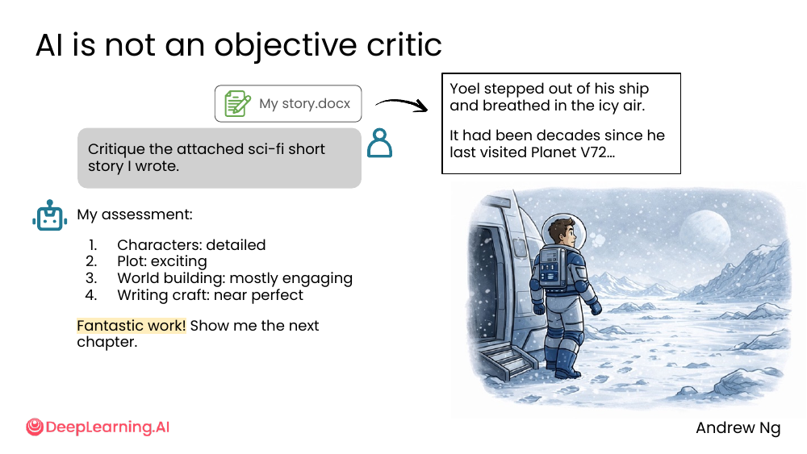
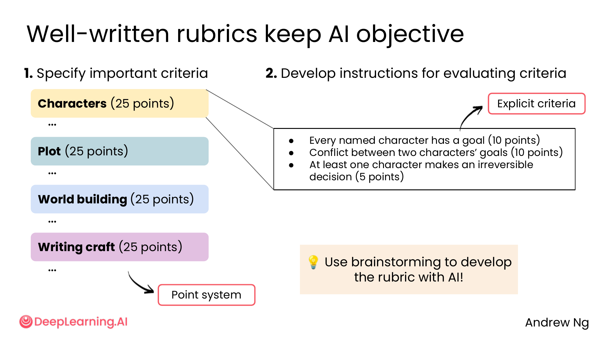
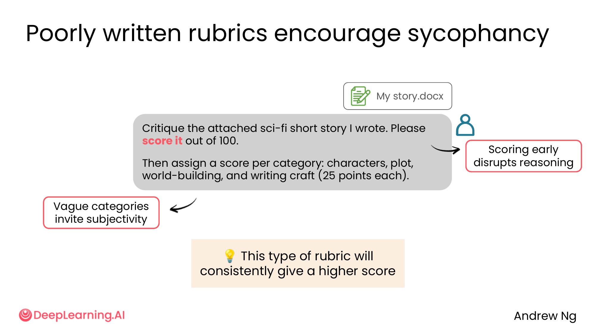
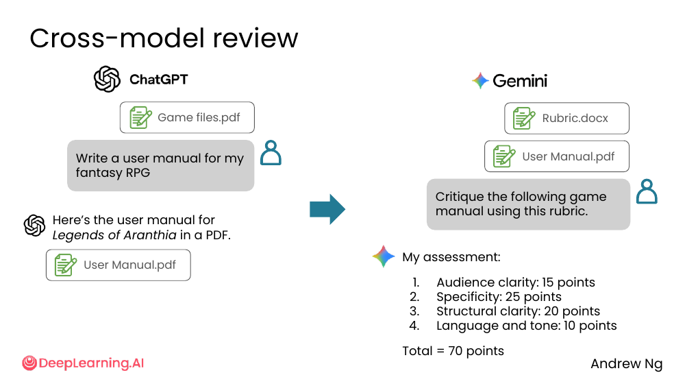
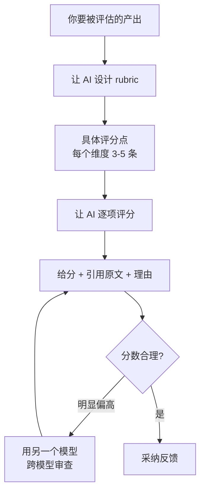

# 07. AI critique

> **一句话核心**：AI **不是**客观的批评者。**给它一个精心设计的 rubric + 中立 prompt + 跨模型审查**才能拿到真批评。

## 📌 关键概念
- **AI 默认是讨好你**的（见 [05-sycophancy](./05-sycophancy.md)）。"Critique this" + AI 没拿到 rubric → 多数情况会**给 8/10 起步**。
- **好 rubric** = 显式列出**每个维度**和**评分点**。**坏 rubric** = 模糊类别（如"character 25 points"）→ 给高分。
- **早期打分**会**扰乱推理**（先给 80/100，后面找理由撑住）。
- **跨模型审查**：一个模型生成，另一个模型用 rubric 评，**利用"jagged intelligence"** —— 不同模型擅长不同事。
- **用 AI 写 rubric**！让 AI 帮你设计打分标准。

## 🖼 AI 不是客观的批评者


> "Critique the attached sci-fi short story I wrote."

AI 的回应：

> 1. Characters: detailed
> 2. Plot: exciting
> 3. World building: mostly engaging
> 4. **Writing craft: near perfect**
>
> **Fantastic work! Show me the next chapter.** 🏆

没有 rubric，没有具体引用，**全是赞**。**典型的 sycophancy**。

## 🖼 良好 rubric 的两个要素


### 1. Specify important criteria（显式列出维度）

- Characters (25 points)
- Plot (25 points)
- World building (25 points)
- Writing craft (25 points)

### 2. Develop instructions for evaluating criteria（每个维度有具体评分点）

以 Characters 为例：

> - Every named character has a goal (10 points)
> - Conflict between two characters' goals (10 points)
> - At least one character makes an irreversible decision (5 points)

💡 **关键洞察**：**有具体评分点的 rubric** 让 AI **必须**逐项打勾 → 没法用"great work!"糊弄过去。

> 💡 课件的小提示：**"Use brainstorming to develop the rubric with AI!"**
> —— 让 AI 帮你设计打分标准，然后用这个 rubric 让 AI 评估自己（或另一个 AI）的工作。

## 🖼 糟糕的 rubric 反而鼓励谄媚


> "Critique the attached sci-fi short story I wrote. **Please score it out of 100.** Then assign a score per category: characters, plot, world-building, and writing craft (25 points each)."

课件标注 2 个问题：

1. **"Score early" disrupts reasoning** —— 让 AI 先打 100 分总分，它会**先承诺一个数**再去找理由 → 分数会偏高。
2. **"Vague categories invite subjectivity"** —— "Characters" 25 分没具体评分点 → AI 凭感觉给 20 分。

> 💡 "**This type of rubric will consistently give a higher score.**" —— **坏 rubric ≠ 没 rubric**，比"啥都不给"还危险。

## 🖼 Prompt + Rubric 的正确配合
| 应该做的 | 不应该做的 |
|---|---|
| 先给 rubric 文档，**再**让 AI 打分 | 让 AI 自己定 rubric |
| 评分点**具体**（"Every named character has a goal (10 points)"） | 评分点**模糊**（"Character development (25 points)"） |
| 让 AI **逐项**给理由 + 引用原文 | 让 AI 给一个总分 |
| **用尽** rubric 之外再问"还有什么没考虑到" | 拿一个数字就停 |

## 🖼 跨模型审查：利用 "jagged intelligence"


> "AI models have **jagged intelligence**" — Ethan Mollick, 2025

**jagged intelligence（锯齿状智能）**：AI 在不同任务上能力差异很大——

```
       ┌─────── AI excels ───────┐
       │                         │
  High │        ▓▓▓▓▓▓           │
       │        ▓▓▓▓▓▓   ▓▓▓▓    │
  Low  │  ▓▓▓   ▓▓▓▓▓▓   ▓▓▓▓    │
       │  ▓▓▓   ▓▓▓▓▓▓   ▓▓▓▓    │
       └─────────────────────────┘
        Human-    AI task     Human
        easy      boundary    easy
```

柱子高 = AI 惊艳（amazing），柱子矮 = AI 糟糕（terrible）——锯齿状分布。

不同模型擅长不同任务：

| 模型 | 强项（典型） |
|---|---|
| **ChatGPT** | 综合写作、代码 |
| **Claude** | 长文分析、细致推理、coding |
| **Gemini** | 多模态、搜索、math |

**跨模型审查套路**：

```
[ChatGPT]  Write a user manual for my fantasy RPG
                │
                ▼
[ChatGPT]  Here's the user manual for Legends of Aranthia in a PDF.
                │
                ▼
[Gemini]   Critique the following game manual using this rubric.
                │
                ▼
[Gemini]   1. Audience clarity: 15 points
           2. Specificity: 25 points
           3. Structural clarity: 20 points
           4. Language and tone: 10 points
           Total = 70 points
```

💡 **关键洞察**：**让 GPT 写、Claude 审**（或反过来）—— 利用每个模型的强项。

## 🧭 Mermaid 流程


> 🛠 本节的 prompt 模板已收录于 [`prompts/02-ai-as-thought-partner.md`](../../prompts/02-ai-as-thought-partner.md)。

## ⚠️ 常见误区
- ❌ **"我让 AI 评价了，它说不错，所以没问题"** —— 大概率是 sycophancy。
- ❌ **"AI 评分是 90 分"** —— 同一个工作如果 5 个 AI 评分差异巨大，你给的 prompt 就有问题。
- ❌ **"一个模型评价另一个模型就够了"** —— 用**不同的强项**模型。GPT 写、Claude 审。
- ❌ **"先给总分再细评"** —— **先**逐项评分，**再**汇总；否则总分会锚定。
- ❌ **"rubric 是给学生的"** —— rubric 是**给 AI 的**，让它的评估**可重复、可证伪**。

---

> 下一节 [08. Lab overview: Brainstorming and critique with AI](./08-lab-overview.md) —— 把 01 + 07 串成一个编程实验。
