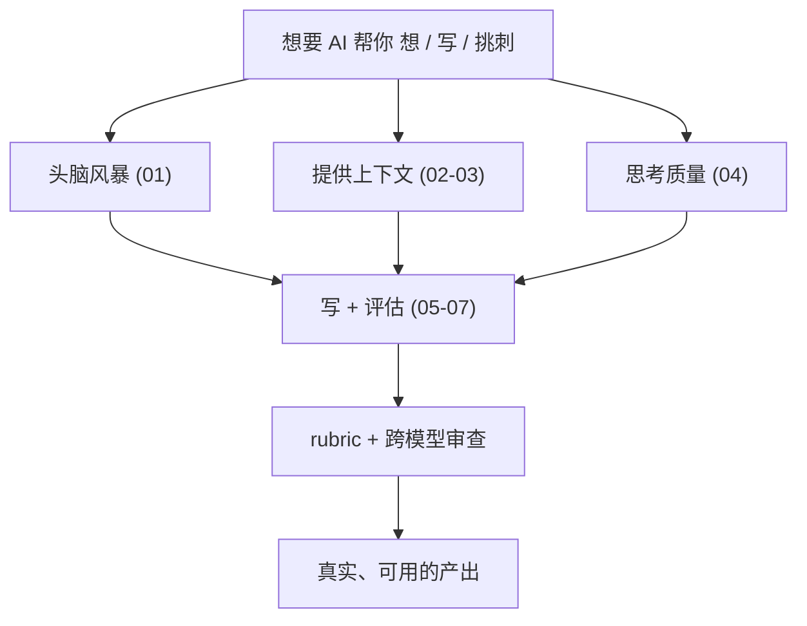

# Module 2: AI as a Thought Partner

> **本模块核心**：把 AI 从「问答工具」升级成「能一起想、一起写、互相挑毛病的合作者」。

## 🎯 学习目标

学完这一模块，你应该能：

1. 跟 AI 一起 **头脑风暴**——用"上下文 + 多个选项 + 迭代"配方拿到高质量想法。
2. 知道 AI 的 **context window** 是什么、由哪几部分组成、怎么用「相关上下文」提高质量。
3. 理解 **AI desktop apps**（如 Claude Cowork、Microsoft Copilot、Google Antigravity）的工作流和安全边界。
4. 懂得怎么**鼓励 AI 深度推理**（"Ultrathink"、给难任务、用最新模型）。
5. 识别和对抗 **sycophancy**（AI 拍马屁），用中立措辞 + rubric + 新对话拿真实反馈。
6. 掌握**渐进式大纲法**写文章，避免 AI slop。
7. 用**良好 rubric + 跨模型审查**让 AI 给出客观批评。

## 🗂 章节地图

| 章节 | 标题 | 对应视频 | 阅读时间 |
|---|---|---|---|
| [01](./01-brainstorming.md) | Brainstorming with AI | 视频 1 (9m) | ~14 min |
| [02](./02-context.md) | Context | 视频 2 (6m) | ~10 min |
| [03](./03-ai-desktop-apps.md) | AI desktop apps | 视频 3 (6m) | ~10 min |
| [04](./04-reasoning.md) | Reasoning with AI | 视频 4 (7m) | ~12 min |
| [05](./05-sycophancy.md) | Sycophancy | 视频 5 (5m) | ~10 min |
| [06](./06-writing.md) | Writing with AI | 视频 6 (7m) | ~12 min |
| [07](./07-ai-critique.md) | AI critique | 视频 7 (9m) | ~14 min |
| [08](./08-lab-overview.md) | Lab: Brainstorming and critique with AI | 视频 8 (4m) + Lab | ~15 min |
| [recap](./recap.md) | Thought partner 总览 + 7 大原则 | Recap | ~10 min |

**建议**：01→02→03→04→05→06→07→08→recap，配套的 [prompt 模板](../../prompts/02-ai-as-thought-partner.md)**立即在你常用的 AI 里跑一遍**，读完做 [自测题](../../practice/02-ai-as-thought-partner.md)。

## 📐 模块主线

## 🔗 与 Module 1 的连接

| M2 主题 | 与 M1 的呼应 |
|---|---|
| [01-brainstorming](./01-brainstorming.md) | 头脑风暴的"上下文"对应 M1 "Providing the right context" |
| [02-context](./02-context.md) | 上下文 vs [M1/02-pretrained-knowledge](../01-finding-information/02-pretrained-knowledge.md) 的预训练知识 |
| [05-sycophancy](./05-sycophancy.md) | rubric 法 = M1 [01-novice-vs-power-user](../01-finding-information/01-novice-vs-power-user.md) 中 "Getting honest feedback" 的延伸 |
| [06-writing](./06-writing.md) | 渐进式大纲法 = M1 "Writing" 章节的完整工作流版 |
| [07-ai-critique](./07-ai-critique.md) | rubric 设计 = M1 "neutral questions + rubrics" 的实操篇 |

## 📎 资源

- 课程官网：<https://www.deeplearning.ai/courses/ai-prompting-for-everyone>
- 课件 PDF：`slides/AP4E_M2.pdf`（与 M1 同样入仓）
- 图片来源：所有 `images/` 下截图均抽自上述课件
