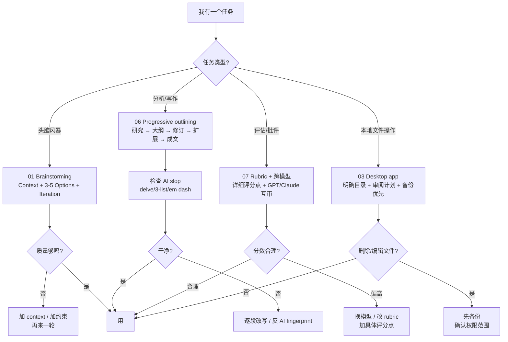

# Recap: AI as a Thought Partner

> **一句话核心**：把 AI 当**合作者**，不是问答机。给它 context、给难任务、要它深度思考、要它真批评。

## 📊 7 大核心原则一览
| # | 原则 | 一句话 |
|---|---|---|
| 1 | **Brainstorming = 迭代** | Context + 多个 Options + Iteration → 高质量想法 |
| 2 | **Context 相关才好** | 多≠好；不相关是噪音；新话题开新对话 |
| 3 | **Desktop app = 文件操作权** | 删除不进回收站；权限越小越安全 |
| 4 | **Reasoning 4 铁律** | 用最好模型 / 给够 context / 给难任务 / 显式要 think |
| 5 | **Sycophancy 三应对** | 中立措辞 / 显式要批评 / 开新对话 |
| 6 | **Progressive outlining** | 研究 → 3 大纲 → 修订 → bullet → prose，**别一步到位** |
| 7 | **Rubric + 跨模型审查** | 详细 rubric + GPT 写/Claude 审 = 客观评估 |

## 🧭 决策流程图

> 🎯 自测题已迁移至 [`practice/02-ai-as-thought-partner.md`](../../practice/02-ai-as-thought-partner.md)。
> 🧰 prompt 模板已迁移至 [`prompts/02-ai-as-thought-partner.md`](../../prompts/02-ai-as-thought-partner.md)。

## 🎬 Module 2 一句话总结
> **AI 是合作者，不是答案机器。给它 context、给难任务、要 think hard、要真批评，再用 rubric 验证。**

下一站 → [Module 3: Working with Multimedia & Code](../03-working-with-multimedia-code/README.md) — 让 AI 看图、画图、写代码。
