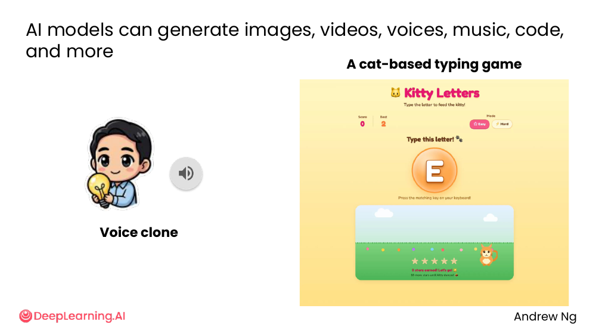
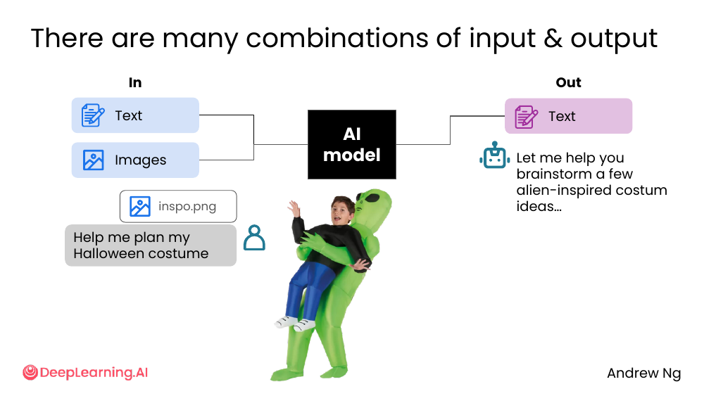
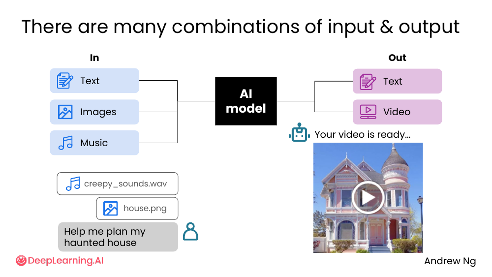
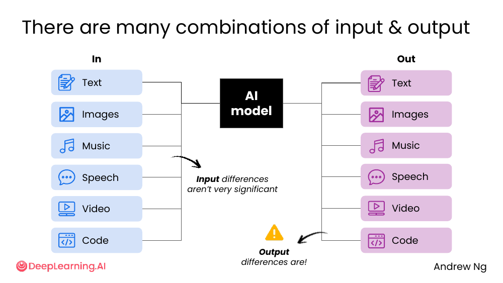
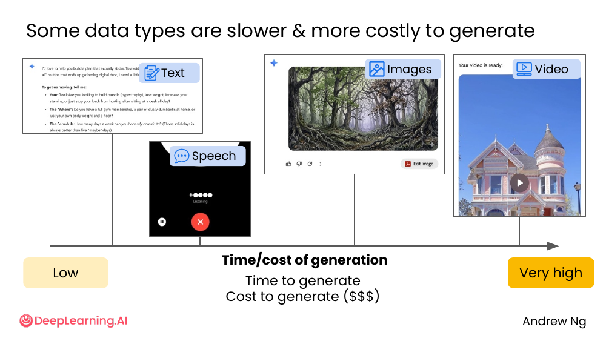
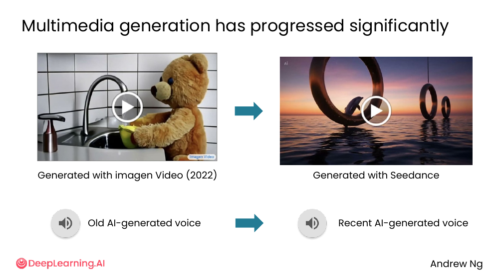
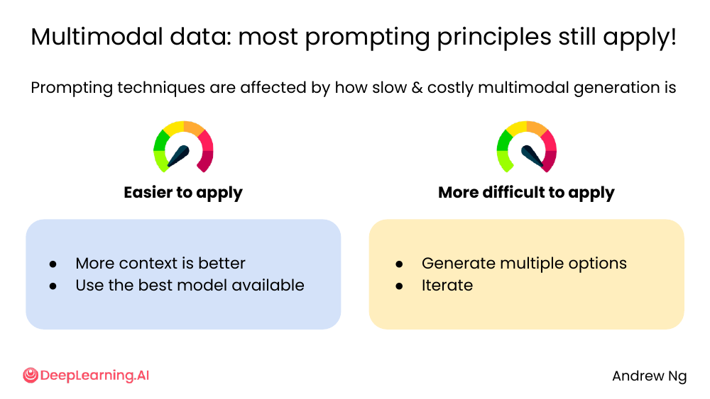
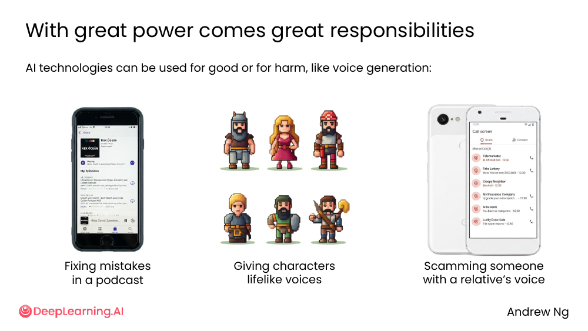

# 01. Working with multimedia data

> **一句话核心**：现代 AI **不只处理文字**——你能给图、音频、视频、AI 也能吐这些。**多模态 ≠ 零成本**，生成越复杂越慢越贵。

## 📌 关键概念
- **Multimodal AI** = 能同时处理/生成**多种模态**（text / image / music / speech / video / code）的 AI。
- **6×6 in/out 矩阵** = 6 种输入 × 6 种输出 = 36 种组合，**课件的"地图"**。
- **速度/成本谱**：text 几秒几美分 → video 几十秒几十美分。**关键差异：text 可以 stop early，image/video 一次性全部生成**。
- **多模态的 prompt 原则部分延伸自 M1/M2**：
  - ✅ **仍然适用**：给够 context、用最好的模型。
  - ⚠️ **更难适用**：多生成几个选项、迭代（因为贵 + 不能中途停）。
- **"With great power comes great responsibilities"**——语音克隆既能修播客漏洞，也能骗家人。

## 🖼 AI 能生成/处理哪些东西？


- 🍰 **Image**：Nano Banana 生成"会动的蛋糕"、小人缩小到虫子的尺寸
- 🎮 **Interactive app**：Cat-based typing game（Kitty Letters）
- 🎤 **Voice clone**：克隆人的声音

只要你能想到的模态，**现代 AI 基本都有能力**。

## 🖼 6×6 In/Out 矩阵（组合 1：图像参考 + 文字 prompt）


> 用户上传参考图 `inspo.png` + 文字「Help me plan my Halloween costume」→ AI 用文字 + 图片理解 → 返回"alien-inspired costume ideas"。

**Input** 可以是 1 种或多种模态。**Output** 也是。

## 🖼 组合 2：多模态输入（声音 + 图像 + 文字）


> "Help me plan my haunted house"
> + `creepy_sounds.wav`（声音）
> + `house.png`（图片）
> → AI 综合分析，输出**视频**作为可视化。

**关键洞察**：**多模态组合**能拿到更立体的回答——尤其适合"创作 + 规划"任务。

## 🖼 完整 in/out 矩阵


```
        INPUT                  AI model              OUTPUT
        ─────                  ────────              ──────
        Text                   ┌────────┐            Text
        Images                 │        │            Images
        Music                  │  AI    │            Music
        Speech                 │ model  │            Speech
        Video                  │        │            Video
        Code                   └────────┘            Code
```

课件原话：

> "**Input differences aren't very significant. Output differences are!**"

💡 **关键洞察**：**输入端**无论你给哪种模态，AI 都能消化（背后都是 token）。**但输出端**模态差异巨大——决定了成本/速度。

## 🖼 输出端的成本/速度谱


```
低                                                            非常高
├──── Text ──── Speech ──── Images ──── Video ────┤
       秒         几秒         几十秒        分钟级
       < $0.01    < $0.05      几美分         几十美分
```

**真正常见的对比**（用 DALL·E 3 数据）：

| 类型 | 速度 | 成本 | 交付方式 |
|---|---|---|---|
| **Text response** | 秒级 | < $0.01 | Piece by piece, **can stop early** |
| **One image** | 10s 秒 | 几美分 | All at once, **can't stop early** |
| **One video** | 分钟级 | 几十美分 | All at once, can't stop early |

💡 **关键洞察**：**"can stop early"是 text 的王牌**。M1/M2 的"迭代"原则在 text 上成本几乎为 0，但在 image/video 上**真要花钱**。

## 🖼 多模态生成已经大幅进步


> Imagen Video (2022) → Seedance (近期)：质量飞跃
> Old AI voice → Recent AI voice：自然度飞跃

**启示**：今天觉得"AI 生成的图/视频很怪"，半年后可能就**以假乱真**。要用就用**最新模型**（M2/04-reasoning 讲过的"用最新模型"原则在这里更关键）。

## 🖼 M1/M2 的 prompt 原则在多模态下"打折"


> "Prompting techniques are **affected** by how slow & costly multimodal generation is"

| 原则 | 在多模态下 |
|---|---|
| ✅ More context is better | **仍然适用**——给图 + 文字 context 不会增加成本 |
| ✅ Use the best model available | **仍然适用**——而且更重要（差距大） |
| ⚠️ Generate multiple options | **成本变高**——每张图都花钱 |
| ⚠️ Iterate | **成本变高**——不能 stop early，每轮都是新生成 |

💡 **关键洞察**：**"多生成几个选项"和"迭代"** 在 text 是零成本（stop early），在 image/video 是真金白银。**多模态下，这两条原则要"省着用"**。

## 🖼 责任：语音克隆的正反面


> "AI technologies can be used for good or for harm, like voice generation:"

| 正用 | 误用 |
|---|---|
| 修播客里说错的话 | 用亲属的声音**诈骗** |
| 给游戏/动画角色配声音 | 政治深度伪造 |

**课件没给具体对策**，但结合 M2 的 sycophancy 主题，你应该意识到：**任何能生成真人声音/视频的工具都需要谨慎使用**。

> 🛠 本节的 prompt 模板已收录于 [`prompts/03-working-with-multimedia-code.md`](../../prompts/03-working-with-multimedia-code.md)。

## ⚠️ 常见误区
- ❌ **"多模态 = 文字 prompt 加图片"** —— 声音/视频也能当输入。**多模态组合越丰富，AI 理解越立体**。
- ❌ **"图/视频可以反复迭代到满意"** —— **不能 stop early**，每次都是新生成。**先想清楚再让 AI 生成**。
- ❌ **"AI 生成图/视频 = 真实"** —— 风险是**深度伪造**。**生成涉及真人的内容时务必加标注**。
- ❌ **"所有 M1/M2 原则都适用"** —— "多生成几个选项"和"迭代"在多模态下**成本高**，要"省着用"。

---

> 下一节 [02. Image understanding](./02-image-understanding.md) — 让 AI **看图**回答问题。
