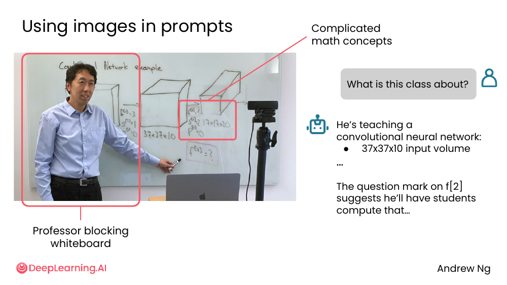
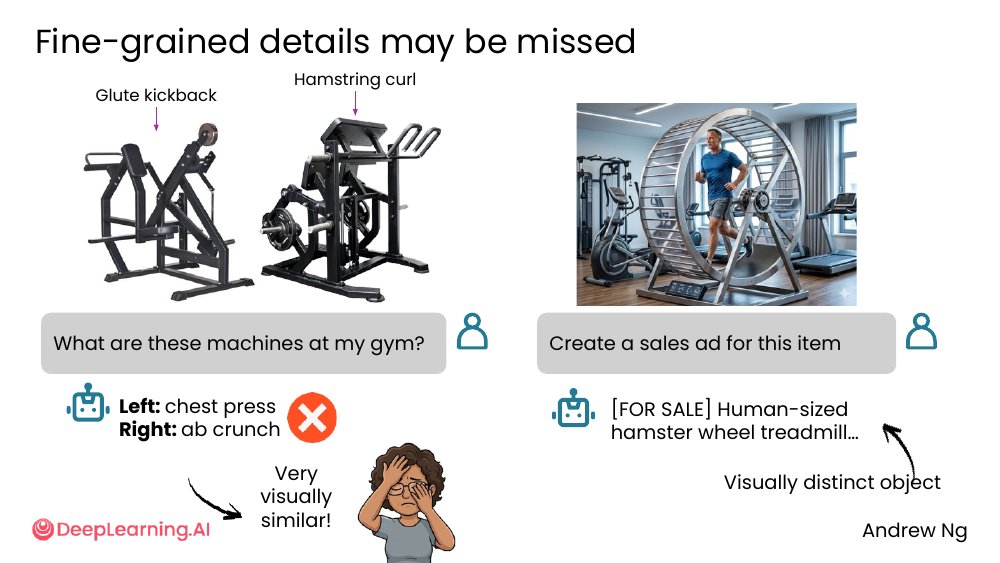
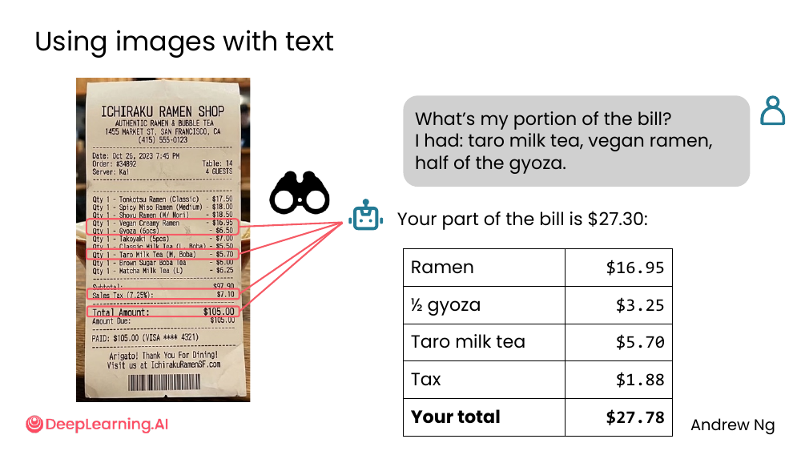
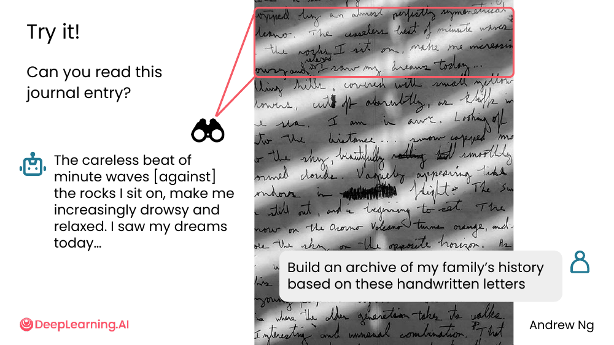
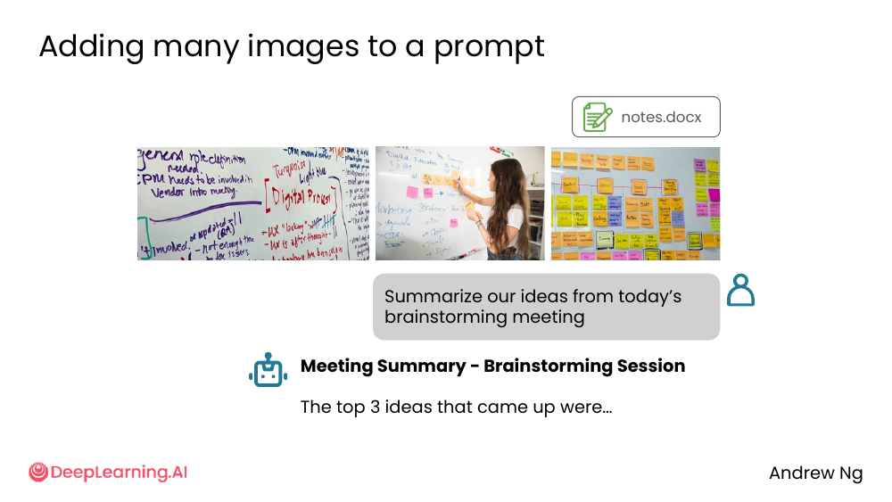
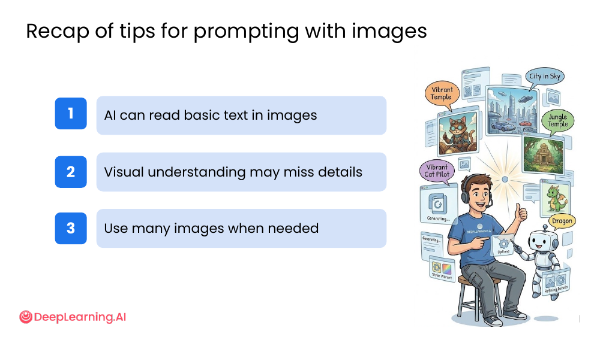

# 02. Image understanding

> **一句话核心**：让 AI **看图**回答问题——很强大，但**细粒度细节常被错过**。**图 + 文字** 配合比单图效果更好。

## 📌 关键概念
- 现代 AI 几乎都能 **"看图"** —— 识别内容、读文字、回答问题。
- **"细粒度细节会错过"** —— 看起来很像的两个东西，AI 经常分不清。
- **图 + 文字** 组合提问 > 单独传图：给 AI 上下文。
- 需要时可以**传多张图**（10+ 张），但要权衡 context window。
- 3 条 recap tips：能读文字 / 漏细节 / 一次传多张。

## 🖼 案例 1：识别复杂场景 + 推断

> 用户传一张 Andrew 在教室讲 CNN 的照片 + 文字「What is this class about?」

AI 答：
> "He's teaching a convolutional neural network: 37x37x10 input volume ...
> The question mark on f[2] suggests he'll have students compute that..."

**关键洞察**：AI 不只识别"教室 + 教授 + 白板"，**还能**：
- 读懂白板上的数学公式
- 推断课堂主题（CNN）
- **预测下一步会讲什么**（从 f[2] 那个问号）

💡 这就是 [M2/02-context](../02-ai-as-thought-partner/02-context.md) 的"多 context"——**图本身就是 context**。

## 🖼 案例 2：细粒度细节会失败 ⚠️

> 用户问：「What are these machines at my gym?」

AI 答：「Left: chest press, **Right: ab crunch**」 ❌

**真相**：
- Left: **Glute kickback**（不是 chest press）
- Right: **Hamstring curl**（不是 ab crunch）

**为什么错？** 两种机器**视觉上非常相似**——AI 没看到"人坐在哪里、哪侧有配重"这些细节。

> 旁注：右边那张 hamster wheel 图 AI 反而**认对了**——因为**视觉上足够独特**。

💡 **关键洞察**：**越相似的两个东西，AI 越容易混**。需要**补充文字描述**（"left: machine where you sit and push your legs back, glute-focused"）来引导 AI。

## 🖼 案例 3：图 + 文字 — 算账场景

> 用户传一张 Ichiraku Ramen Shop 的账单照片 + 文字：
> "What's my portion of the bill? I had: taro milk tea, vegan ramen, half of the gyoza."

AI 答：
> "Your part of the bill is $27.30"
> Ramen $16.95 + ½ gyoza $3.25 + Taro milk tea $5.70 + Tax $1.88 = $27.78

AI 做了 3 件事：
1. **OCR 读账单**（读出每项的价格）
2. **理解文字 prompt**（哪几样是我点的）
3. **数学 + 税务**（$1.88 的税怎么分摊）

💡 **关键洞察**：**图 + 文字 = 完整任务**。光看账单，AI 不知道你点了啥；光文字，AI 不知道价格。**两者结合**才出活。

## 🖼 案例 4：手写字也能读（但有挑战）

> 用户传一张手写日记照片 + 文字：
> "Build an archive of my family's history based on these handwritten letters"

AI 至少识别出这段：
> "The careless beat of minute waves [against] the rocks I sit on, make me increasingly drowsy and relaxed. I saw my dreams today..."

> 课件标注 "Try it!" —— 你自己也能上传手写笔记试。

💡 **关键洞察**：**手写字** AI 能读，但**错误率比印刷字高**。**重要的内容**别只靠 OCR 截图。

## 🖼 案例 5：一次传多张图

> "Summarize our ideas from today's brainstorming meeting"
> + 一次传 N 张会议照片 + 你的 `notes.docx`

AI 出："Meeting Summary - Brainstorming Session, The top 3 ideas that came up were..."

💡 **关键洞察**：**多图 + 文档 = 完整会议记录**。AI 跨多模态整合能力比人类**强**（不会漏掉某张白板照片）。

**注意**：模型有 **context window 上限**。10-20 张图一般没问题，100 张会爆。

## 🧭 3 条 Recap Tips（课件总结）

| # | 提示 |
|---|---|
| 1 | **AI can read basic text in images** —— 印刷字账单 / 招牌 / 公式基本能读 |
| 2 | **Visual understanding may miss details** —— 视觉相似的东西 AI 容易混 |
| 3 | **Use many images when needed** —— 多图配合文字 context 更好 |

> 🛠 本节的 prompt 模板已收录于 [`prompts/03-working-with-multimedia-code.md`](../../prompts/03-working-with-multimedia-code.md)。

## ⚠️ 常见误区
- ❌ **"AI 看了图就什么都懂"** —— 视觉相似的两个东西 AI 会混。**重要信息要文字补充**。
- ❌ **"OCR 万无一失"** —— 印刷字好，手写字 / 模糊图错得多。**重要数据双源核对**。
- ❌ **"图越多越好"** —— context window 有限。**只传相关的图 + 必要的文字**。
- ❌ **"AI 看了图会自动理解意图"** —— 仍然要 **prompt 引导**。传图 + 写明你想知道什么。

---

> 下一节 [03. Image generation](./03-image-generation.md) — 让 AI **画图**。
