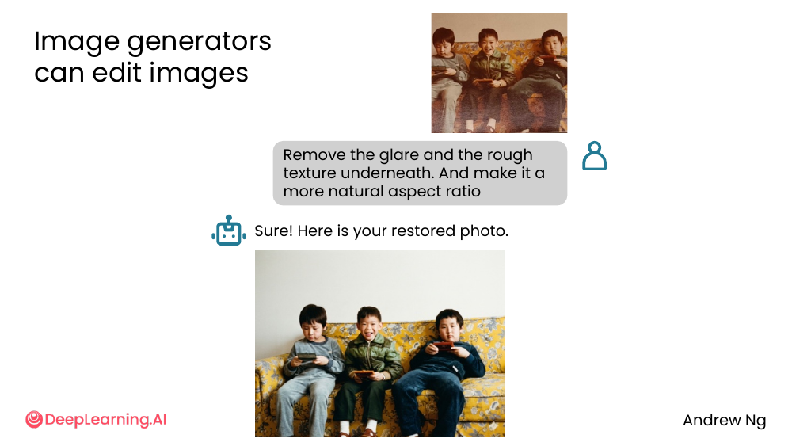
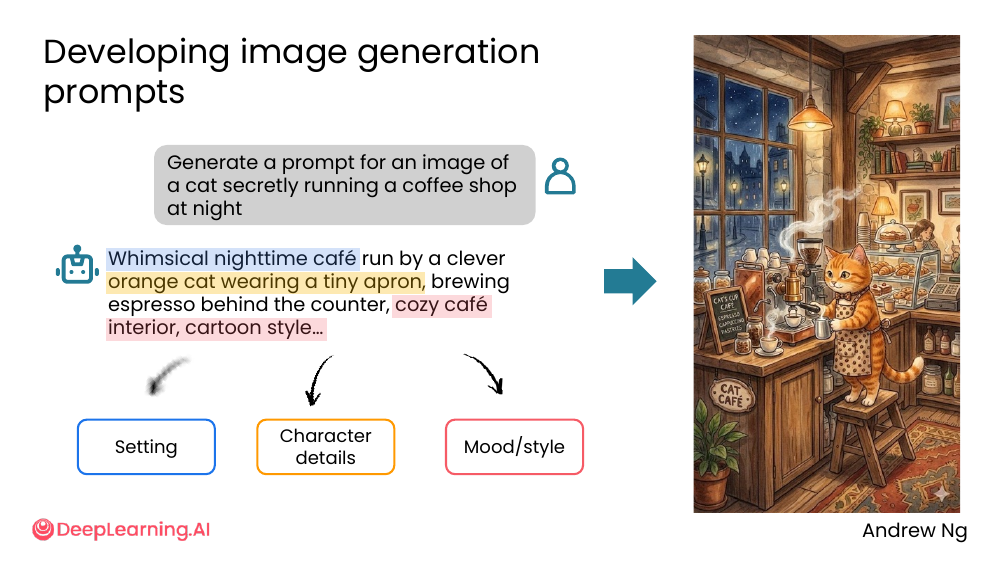
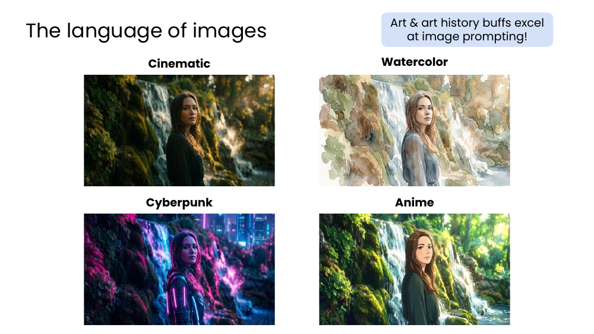
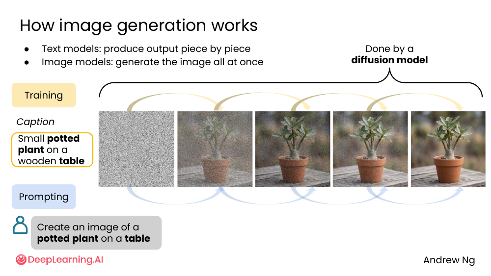
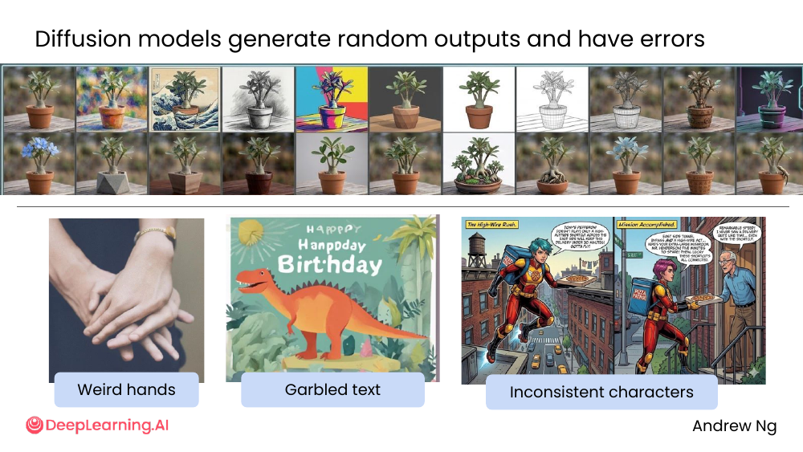
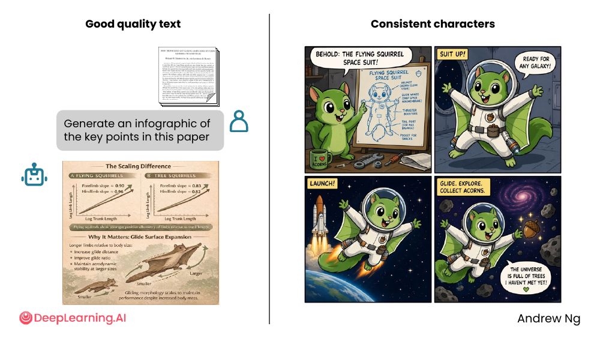
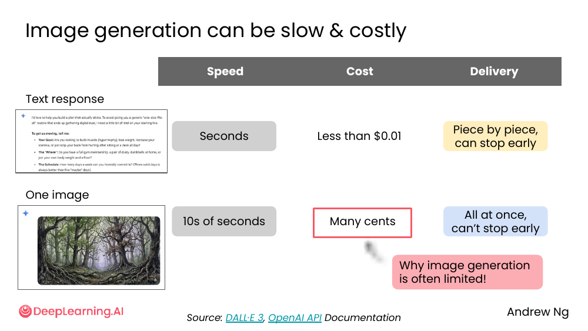

# 03. Image generation

> **一句话核心**：让 AI **画图**——关键是写出**结构化 prompt**（setting + character + mood/style），理解 **diffusion 模型的局限**（手/字/角色会出错），接受它**慢且贵**的事实。

## 📌 关键概念
- **Image generators** 不仅能"从零画图"，还能**编辑**已有图片。
- **好 prompt = 3 要素**：**Setting**（场景）、**Character details**（角色）、**Mood/style**（情绪/风格）。
- **图像 prompt 像写艺术描述**——**art & art history 背景的人特别擅长**。
- **Diffusion model** = 一次性生成整张图（不像 text 可以"piece by piece"），所以**有随机错误**。
- 常见错误：手画错、文字乱码、角色一致性差。
- 成本：**几美分一张图，10s 秒**；比 text 慢，比 text 贵，但比 video 便宜。

## 🖼 Image generators 还能**编辑**图片

> 用户传一张旧照片（Andrew 小时候和兄弟在沙发上的照片，有反光和粗糙质感）
> + 文字："Remove the glare and the rough texture underneath. And make it a more natural aspect ratio"

AI 答："Sure! Here is your restored photo."

→ 输出一张**修复后**的照片。

💡 **关键洞察**：Image generator 不只"画新图"，还能**改旧图**。常见用法：去反光、上色、扩展、修复。

## 🖼 好 prompt 的 3 要素

> 用户："Generate a prompt for an image of a cat secretly running a coffee shop at night"

AI 给出 3 段式 prompt：

> "**Whimsical nighttime café** run by a **clever orange cat wearing a tiny apron**, brewing espresso behind the counter, **cozy café interior**, **cartoon style**..."

分解：

| 要素 | 在 prompt 中的体现 |
|---|---|
| **Setting（场景）** | "nighttime café", "cozy café interior" |
| **Character details（角色）** | "clever orange cat", "wearing a tiny apron", "brewing espresso" |
| **Mood/style（情绪/风格）** | "whimsical", "cartoon style" |

→ 出图：猫穿围裙在咖啡店后厨煮咖啡，温馨卡通风。

## 🖼 4 种常用艺术语言

> "Art & art history buffs excel at image prompting!"

同一个人物 + 场景 = 4 种完全不同的图：

| 风格 | 关键词 | 感觉 |
|---|---|---|
| **Cinematic** | cinematic, dramatic lighting, film grain | 电影感、暗调、宽幅 |
| **Watercolor** | watercolor, soft brushstrokes | 水彩画、柔和 |
| **Cyberpunk** | cyberpunk, neon, futuristic | 赛博朋克、霓虹 |
| **Anime** | anime, studio ghibli, manga | 日式动画 |

💡 **关键洞察**：**风格词**比"画一个 XX"重要得多。**学会几个风格词 = 多出 10 倍可用图**。

## 🖼 Diffusion 怎么工作

> "Text models: produce output **piece by piece**"
> "Image models: generate the image **all at once**"

- **Text 模型** = 自回归：逐 token 生成，**可以 stop early**（写到一半用户取消）
- **Image 模型** = diffusion：从纯噪声开始，**反向去噪**几十/几百次，**最后整张图一起出**

**训练阶段**：用「图片 + caption」对（比如 "small potted plant on a wooden table" + 真实照片）训练。
**生成阶段**：给一个 prompt（比如 "Create an image of a potted plant on a table"），diffusion 从噪声去噪出图。

## 🖼 Diffusion 模型的 3 大典型错误

| 错误 | 表现 | 缓解 |
|---|---|---|
| **Weird hands** | 手指数量不对、扭曲 | 加 "anatomically correct hands"，或用专门的 inpainting |
| **Garbled text** | 生成的文字是乱码 | 避免 prompt 里要 AI 写字；或后期手动加文字 |
| **Inconsistent characters** | 同一个人物在多张图里长相不同 | 同一 prompt 多次生成，挑最像的；或用 reference image 功能 |

**好消息**：模型进步很快。**但今天仍然会出错**——**别假设"AI 画的图=真实"**。

## 🖼 但好的 prompt 也能拿到高质量

> "Generate an infographic of the key points in this paper"
> + 上传论文 PDF

AI 出了一张**信息图**：The Scaling Difference (Flying Squirrels vs Tree Squirrels)——文字清晰、布局合理。

另一组：4 张 flying squirrel 漫画，**同一角色**穿太空服出现 4 次——**角色一致性 OK**。

💡 **关键洞察**：**新模型 + 好 prompt** = 高质量 + 一致性。**好 prompt** 是把"角色描述"具体化（橙色、穿太空服、有大眼睛）+ 锁定"画风"。

## 🖼 慢且贵：为什么 image 不能"试错"

| 维度 | Text | One image |
|---|---|---|
| **Speed** | 秒级 | 10s 秒 |
| **Cost** | < $0.01 | 几美分 |
| **Delivery** | Piece by piece, **can stop early** | All at once, **can't stop early** |
| **影响** | 迭代成本 ≈ 0 | 每次迭代都花钱 |

课件原话：「**Why image generation is often limited!**」

💡 **关键洞察**：**M2 的"多生成几个选项"和"迭代"原则在 image 上成本高**。**先想清楚再让 AI 生成**——把每个 prompt 写好，少返工。

> 🛠 本节的 prompt 模板已收录于 [`prompts/03-working-with-multimedia-code.md`](../../prompts/03-working-with-multimedia-code.md)。

## ⚠️ 常见误区
- ❌ **"画图 = 写一句话"** —— **3 要素结构化**比"画一只猫"好得多。
- ❌ **"AI 画的图能直接用"** —— **手/字/角色一致性**常常出错。**重要场合仍然要 review**。
- ❌ **"多生成几次就完美"** —— **image 不能 stop early**。**先把 prompt 写好再生成**。
- ❌ **"AI 画的人物照片 = 真人"** —— **深度伪造风险**。**生成涉及真人的内容时务必加标注**（见 [01-multimedia-overview](./01-multimedia-overview.md)）。
- ❌ **"text prompt 写得好 = image prompt 写得好"** —— image prompt 更像**写艺术描述**，需要学风格词。

---

> 下一节 [04. Building apps](./04-building-apps.md) — 让 AI **建 app**。
