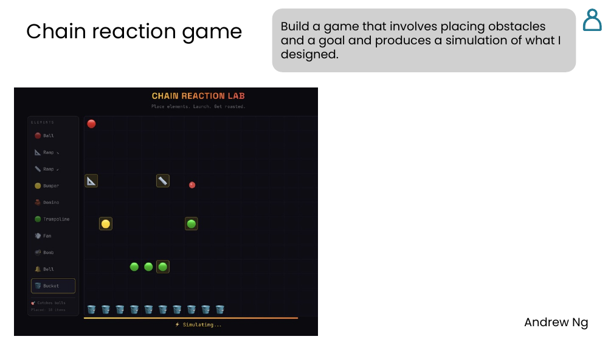
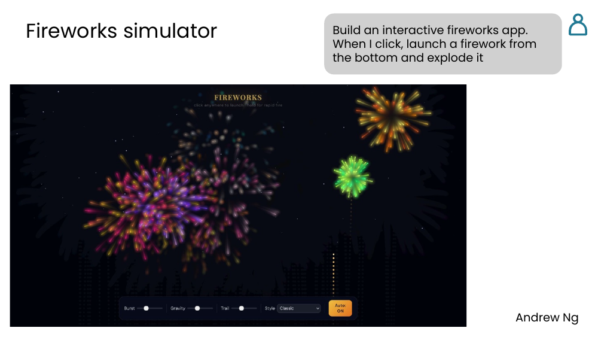
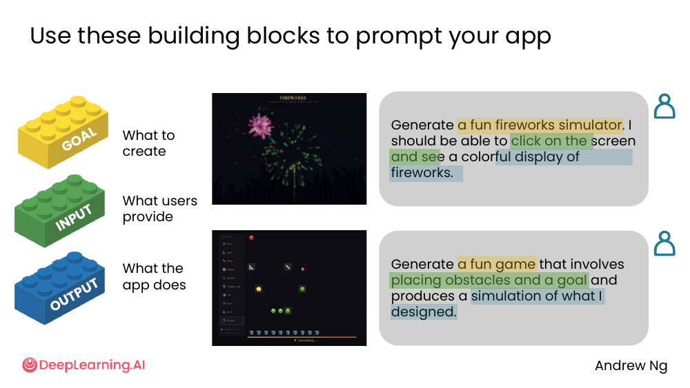
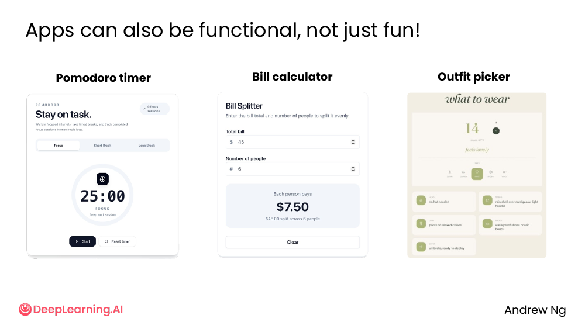
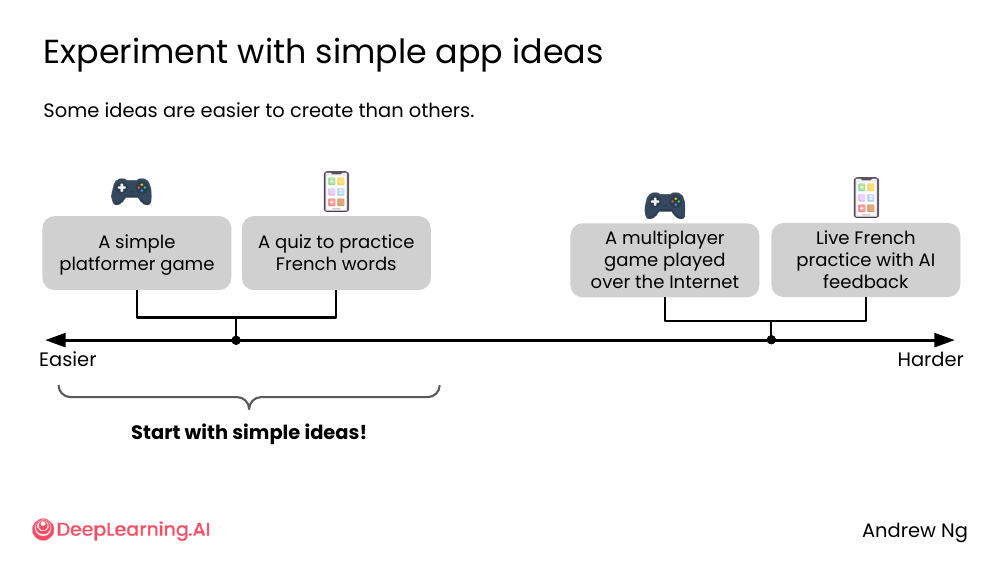
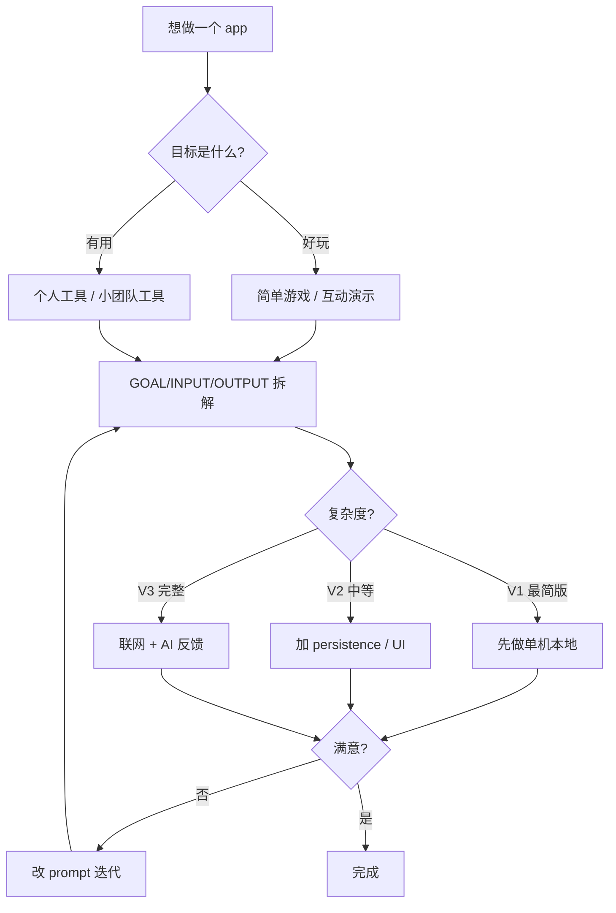

# 04. Building apps

> **一句话核心**：让 AI **建 app**——3 块积木（**GOAL / INPUT / OUTPUT**）拼出 prompt，**从简单想法开始**。

## 📌 关键概念
- App = 给人用的"会动的东西"。prompt 时回答 3 个问题：**做什么？用户给什么？app 输出什么？**
- 3 块积木：**GOAL**（目标）、**INPUT**（用户输入）、**OUTPUT**（app 输出/行为）。
- App **不只用来玩**——Pomodoro timer、bill calculator、outfit picker 都是实用工具。
- 简单 vs 难：**单机能跑 < 多用户联网 < 实时 AI 反馈**。**从简单的开始**。
- 提示词的颗粒度影响 app 复杂度。

## 🖼 两个 demo：chain reaction game + fireworks


> "Build a game that involves placing obstacles and a goal and produces a simulation of what I designed."

→ 一个 chain reaction 小游戏：放置障碍 + 目标 → AI 跑模拟



> "Build an interactive fireworks app. When I click, launch a firework from the bottom and explode it."

→ 一个 fireworks 模拟器：点击 → 烟花从底部发射 → 爆炸

💡 **关键洞察**：两个 app 用的就是 [M2/01-brainstorming](../02-ai-as-thought-partner/01-brainstorming.md) 的"上下文 + 多个选项"——只是输出形式从文字变成可交互的程序。

## 🖼 3 块积木：GOAL / INPUT / OUTPUT


每个 app prompt 都回答这 3 个问题：

| 积木 | 含义 | 例子 |
|---|---|---|
| 🟨 **GOAL** | What to create | "a fun fireworks simulator" |
| 🟩 **INPUT** | What users provide | "click on the screen" |
| 🟦 **OUTPUT** | What the app does | "launch from the bottom and explode it" |

套到两个 demo：

**Fireworks**:
```
GOAL: a fun fireworks simulator
INPUT: I should be able to click on the screen
OUTPUT: see a colorful display of fireworks
```

**Chain reaction game**:
```
GOAL: a fun game
INPUT: placing obstacles and a goal
OUTPUT: produces a simulation of what I designed
```

💡 **关键洞察**：把"我想要一个 app"拆成 3 块——**避免 prompt 模糊**（"做个 app 给我玩玩"→ AI 不知道做什么）。

## 🖼 不只是玩具！App 也能实用


| 类型 | 例子 | 价值 |
|---|---|---|
| 🕒 Pomodoro timer | 25 分钟工作 + 5 分钟休息 | 时间管理 |
| 💰 Bill calculator | 输入总账 + 人数 → 每人付多少 | 朋友 AA |
| 👕 Outfit picker | 天气 + 心情 → 建议穿什么 | 日常决策 |

课件原话：「**Apps can also be functional, not just fun!**」

💡 **关键洞察**：**你日常的小痛点**（算账、计时、决定穿什么）**都可以让 AI 写个 app**。不需要"创意爆款"，能解决自己/小团队的问题就够了。

## 🖼 难度谱：从简单到复杂


```
简单                                                                  复杂
├──── 单机游戏 ────┤──── 联网多用户 ────┤──── 实时 AI 反馈 ────┤
```

| 难度 | 例子 |
|---|---|
| 🟢 Easy | A simple platformer game<br>A quiz to practice French words |
| 🟡 Medium | （中段没列） |
| 🔴 Hard | A multiplayer game played over the Internet<br>Live French practice with AI feedback |

课件建议：「**Start with simple ideas!**」

💡 **关键洞察**：**联网 + 实时 AI 反馈 = 复杂度飙升**。先做单机版 → 验证 prompt → 再加联网 → 最后加 AI 实时反馈。**别一上来就做最复杂的**。

> 🛠 本节的 prompt 模板已收录于 [`prompts/03-working-with-multimedia-code.md`](../../prompts/03-working-with-multimedia-code.md)。

## 🧭 Mermaid 决策流程


## ⚠️ 常见误区
- ❌ **"我想做一个 app"** —— 太模糊。**先回答 GOAL/INPUT/OUTPUT 3 个问题**。
- ❌ **"上来就做最复杂的"** —— **先简单能跑** → 再加联网 → 最后加 AI 反馈。
- ❌ **"AI 写的代码不用 review"** —— 跟 [M2/07-ai-critique](../02-ai-as-thought-partner/07-ai-critique.md) 一样，**AI 代码也要 review**（安全、性能、边界 case）。
- ❌ **"App 必须创意爆款"** —— **Pomodoro timer、bill calculator 这种"日常工具"价值一样大**。

---

> 下一节 [05. Data analysis](./05-data-analysis.md) — 让 AI **写代码 + 跑代码**分析你的数据。
