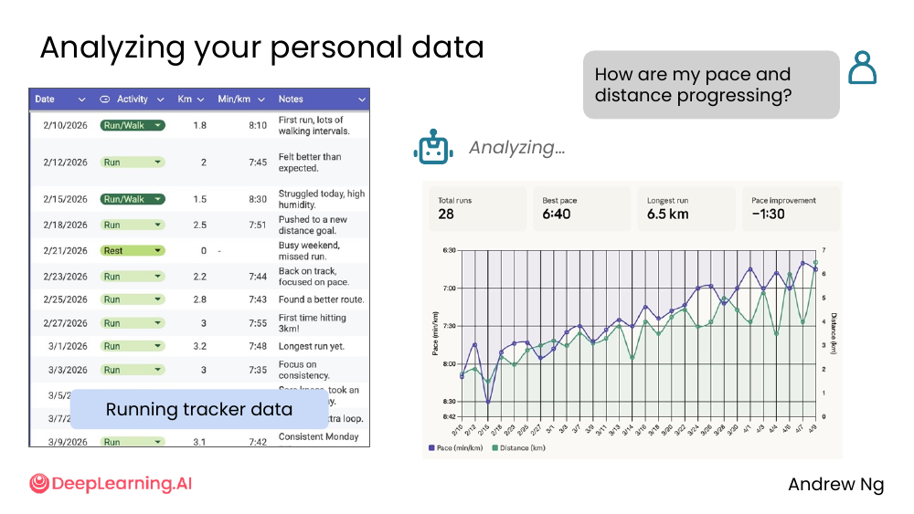
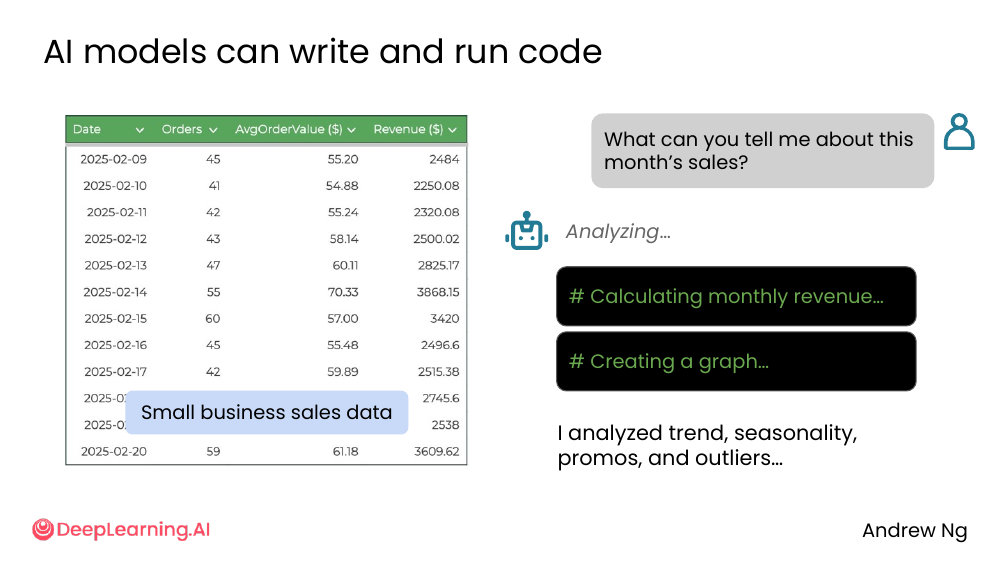
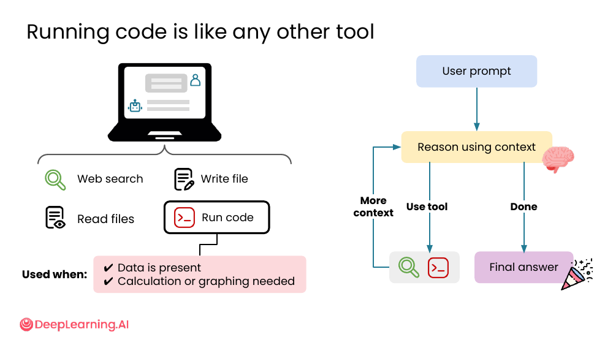
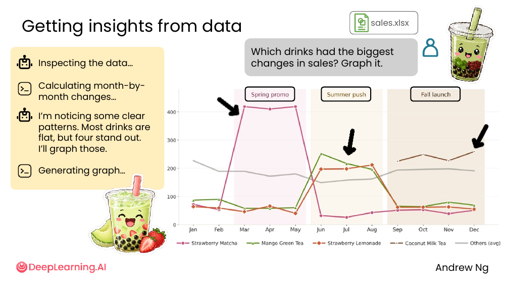
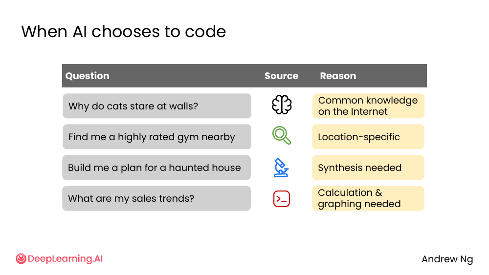

# 05. Data analysis

> **一句话核心**：AI **写代码 + 跑代码 = 数据分析的新工具**。你不用会 Python，把数据扔进去 + 一句话就能出洞察。

## 📌 关键概念
- 现代 AI 助手（ChatGPT、Claude、Gemini）内置 **code tool**，能**写 + 跑** Python 代码。
- 何时触发：
  - ✅ 数据是**结构化表格**（CSV、Excel、数据库）
  - ✅ 需要**计算或可视化**（不只是事实查证）
- AI 拿数据做分析的典型 4 步：inspect → compute → notice pattern → graph。
- **AI 何时自动选 code tool**（vs 预训练 / web search）：**数据 + 计算**类问题。

## 🖼 案例 1：分析个人跑步数据


> 用户传 `running tracker data`（2/10 ~ 3/9 的跑步记录：公里数、配速、备注）
> + 文字：「How are my pace and distance progressing?」

AI 的工作流：
```
Analyzing…
  ↓
[Total runs: 28 | Best pace: 6:40 | Longest run: 6.5 km | Improvement: -1:30]
  ↓
[折线图：Pace (min/km) 和 Distance (km) 随时间变化]
```

→ 总结：**28 次跑步，最佳配速 6:40，最长 6.5 km，配速进步了 1:30**。

💡 **关键洞察**：用户**没写一行代码**，AI 自己写 Python 算出了这些数字 + 画了图。

## 🖼 案例 2：分析小企业销售数据


> 用户传 `small business sales data`（日期、订单数、平均订单价、营收）
> + 文字：「What can you tell me about this month's sales?」

AI 工作流（你能看到 `#` 开头的 terminal 输出）：
```
Analyzing…
# Calculating monthly revenue…
# Creating a graph…
```

→ 总结：「I analyzed trend, seasonality, promos, and outliers…」

💡 **关键洞察**：AI **自己决定**做什么分析（trend / seasonality / promos / outliers）—— 你没说，但它知道商业数据分析的"标准检查项"。

## 🖼 Code tool 跟其他工具一样


AI 助手的"工具箱"现在有：

| 工具 | 干什么 |
|---|---|
| 🔍 Web search | 拉网络内容 |
| 📁 Read files | 读你上传的文件 |
| ✏️ Write file | 创建/修改文件 |
| 💻 **Run code** | **写 Python 代码并执行** |

**Code tool 的触发条件**：
- ✅ Data is present（你给了数据）
- ✅ Calculation or graphing needed（需要计算或画图）

在 AI 内部的 reasoning 循环里，code tool 跟 web search 一样是个分支——AI 决定"这题要算"就调它。

## 🖼 案例 3：奶茶店销售数据 → 4 个关键发现 + 图表


> 用户传 `sales.xlsx`（奶茶店月度销售数据）
> + 文字：「Which drinks had the biggest changes in sales? Graph it.」

AI 工作流：
```
1. Inspecting the data…
2. Calculating month-by-month changes…
3. I'm noticing some clear patterns. Most drinks are flat,
   but four stand out. I'll graph those.
4. Generating graph…
```

输出：**折线图**显示：
- **Strawberry Matcha**：春季促销 (Mar-May) 飙到 400+
- **Mango Green Tea**：夏季发力 (Jun-Aug) 上扬
- **Strawberry Lemonade**：秋季发布 (Sep) 起来
- **Coconut Milk Tea**：长期平稳

→ 4 款产品有"明显的销售模式"，其他 11 款**几乎平**。

💡 **关键洞察**：AI **自己选了"展示什么"**——不是全展示，而是挑了"变化最大"的 4 款。**这种判断 = 高级数据分析能力**。

## 🖼 何时 AI 自动选 code tool


> 把这一节和 [M1/03-web-search](../01-finding-information/03-web-search.md) 的 "何时需要 web search" 表格对照看——

| 问题 | 走预训练 | 走搜索 | 走 code |
|---|---|---|---|
| Why do cats stare at walls? | ✅ | | |
| Find me a highly rated gym nearby | | ✅ (location) | |
| Build me a plan for a haunted house | | | ✅ (synthesis) |
| **What are my sales trends?** | | | **✅ (calculation + graphing)** |

**触发 code tool 的两个信号**：
1. **数据存在**（你提供了文件 / 数据库）
2. **需要计算或画图**（不是事实查证，是聚合/对比/可视化）

## 🧭 5 大能力一览（与 M1/M2 衔接）
```
[M1/02]  预训练知识     → 回答通用问题
[M1/03]  Web search    → 实时/本地/小众信息
[M1/05]  Deep research → 多源综合报告
[M2/04]  Reasoning     → 深度思考
[M3/05]  Run code      → 数据计算 + 可视化
```

| 能力 | 适合 | 何时用 |
|---|---|---|
| **Pretrained** | 通用知识 | "Python 是什么？" |
| **Web search** | 实时/本地/小众 | "最近的 6-7 meme 是什么？" |
| **Deep research** | 多源综合 | "AI 对就业的影响" |
| **Reasoning** | 难任务、慢思考 | "12-month startup plan" |
| **Run code** | 数据 + 计算 | "我上个月销售趋势" |

> 🛠 本节的 prompt 模板已收录于 [`prompts/03-working-with-multimedia-code.md`](../../prompts/03-working-with-multimedia-code.md)。

## ⚠️ 常见误区
- ❌ **"我不会 Python，所以不能做数据分析"** —— 现代 AI 内置 code tool，**你只要会问对问题**。
- ❌ **"AI 算出来就一定对"** —— **仍然要 review**。数据可能有错、模型可能算错。**关键数据手动验算**。
- ❌ **"传数据 = 给 AI 完全权限"** —— **别传敏感数据**给不支持的企业版 / 公开服务。**敏感数据先脱敏**。
- ❌ **"AI 选了什么分析 = 全部要看的"** —— AI 会挑"重要"的，**但你可能要看"次重要"的**。**先看 AI 选的，再自己探索**。

---

> 下一节 [06. Lab overview: Building with AI and final project](./06-lab-overview.md) —— 把 M3 所有能力串成一个 lab + final project。
