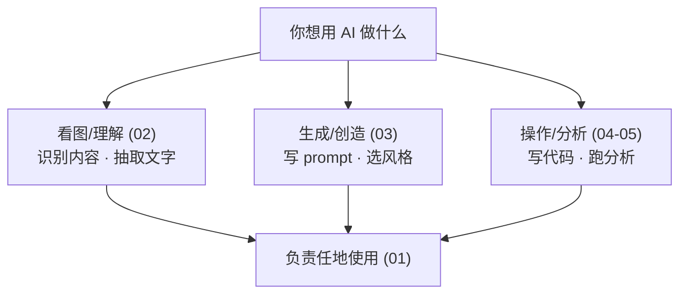

# Module 3: Working with Multimedia & Code

> **本模块核心**：让 AI 不只处理文字——**看图、画图、做 app、分析数据**——同时注意"强大能力 = 更大责任"。

## 🎯 学习目标

学完这一模块，你应该能：

1. 理解 **多模态 AI** 能处理哪些输入、生成哪些输出，以及**速度/成本**谱。
2. 用图片做 prompt 提问，**知道 AI 在哪些场景会漏细节**。
3. 写出**好的图像生成 prompt**（setting/character/mood/style 四要素 + 艺术语言）。
4. 用 **GOAL/INPUT/OUTPUT 三块积木** 拼出一个 app 的 prompt。
5. 让 AI **写代码+跑代码** 分析个人数据，知道何时让 AI 选 code tool。
6. 知道多模态 AI 的**滥用风险**（语音克隆、深度伪造）。

## 🗂 章节地图

| 章节 | 标题 | 对应视频 | 阅读时间 |
|---|---|---|---|
| [01](./01-multimedia-overview.md) | Working with multimedia data | 视频 1 (10m) | ~14 min |
| [02](./02-image-understanding.md) | Image understanding | 视频 2 (4m) | ~8 min |
| [03](./03-image-generation.md) | Image generation | 视频 3 (8m) | ~14 min |
| [04](./04-building-apps.md) | Building apps | 视频 4 (5m) | ~10 min |
| [05](./05-data-analysis.md) | Data analysis | 视频 5 (8m) | ~12 min |
| [06](./06-lab-overview.md) | Lab: Building with AI + final project | 视频 6 (9m) | ~15 min |
| [recap](./recap.md) | Multimedia & Code 总览 + 5 大能力 | Recap | ~10 min |

**建议**：01→02→03→04→05→06→recap，配套的 [prompt 模板](../../prompts/03-working-with-multimedia-code.md)**立即在你常用的 AI 里跑一遍**，读完做 [自测题](../../practice/03-working-with-multimedia-code.md)。

## 📐 模块主线

## 🔗 与 Module 1 / Module 2 的连接

| M3 主题 | 与 M1/M2 的呼应 |
|---|---|
| [01-multimedia-overview](./01-multimedia-overview.md) | 多模态下"iterate + 多选项"成本更高（对比 [M2/01-brainstorming](../02-ai-as-thought-partner/01-brainstorming.md) 的迭代配方） |
| [02-image-understanding](./02-image-understanding.md) | 视觉也有"信源质量"问题（对比 [M1/04-web-search-sources](../01-finding-information/04-web-search-sources.md)） |
| [03-image-generation](./03-image-generation.md) | 图像 prompt 也需要"上下文+具体"（对比 [M2/02-context](../02-ai-as-thought-partner/02-context.md)） |
| [04-building-apps](./04-building-apps.md) | App prompt 也遵循 [M2/01-brainstorming](../02-ai-as-thought-partner/01-brainstorming.md) 的"上下文+多选项" |
| [05-data-analysis](./05-data-analysis.md) | AI 写代码 = agentic 工具的延伸（对比 [M1/05-deep-research](../01-finding-information/05-deep-research.md) 的 agentic 流程） |

## 📎 资源

- 课程官网：<https://www.deeplearning.ai/courses/ai-prompting-for-everyone>
- 课件 PDF：`slides/AP4E_M3.pdf`（3 个 module 全部入仓）
- 图片来源：所有 `images/` 下截图均抽自上述课件
