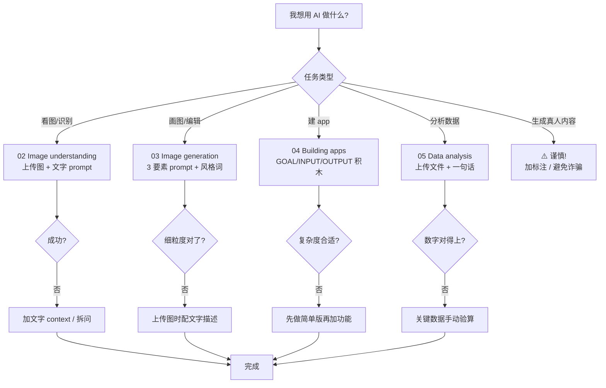

# Recap: Working with Multimedia & Code

> **一句话核心**：让 AI 不只处理文字——**看图、画图、建 app、分析数据**，配合 M1/M2 的工具，**任何任务都能找到 AI 助手**。

## 📊 5 大能力卡片
| 能力 | 关键词 | 何时用 | 对应章节 |
|---|---|---|---|
| 👁 **Image understanding** | OCR / 多图 / 细粒度失败 | 识别内容、读文字、推断 | [02](./02-image-understanding.md) |
| 🎨 **Image generation** | 3 要素 prompt / diffusion 错误 | 编辑图、画新图、风格切换 | [03](./03-image-generation.md) |
| 🛠 **Build apps** | GOAL/INPUT/OUTPUT / 难度谱 | 搭原型、自动化小工具 | [04](./04-building-apps.md) |
| 📊 **Data analysis** | 写+跑代码 / 触发条件 | 跑数据、画图、找模式 | [05](./05-data-analysis.md) |
| ⚖️ **Responsibility** | 深度伪造 / 误用风险 | 任何涉真人内容的生成 | [01](./01-multimedia-overview.md) |

## 🧭 决策流程图

## 🔗 整门课的能力全景（M1 + M2 + M3）
| 任务 | 走 | 章节 |
|---|---|---|
| "Python 是什么？" | 🧠 Pretrained knowledge | [M1/02](../01-finding-information/02-pretrained-knowledge.md) |
| "最近的 6-7 meme 是什么？" | 🔍 Web search | [M1/03](../01-finding-information/03-web-search.md) |
| "对比 3 个保险方案" | 🔬 Deep research | [M1/05](../01-finding-information/05-deep-research.md) |
| "想一个万圣节装扮（3 个方案）" | 💡 Brainstorming | [M2/01](../02-ai-as-thought-partner/01-brainstorming.md) |
| "让我妈也用我这份健身计划" | 🧠 New chat for fresh context | [M2/02](../02-ai-as-thought-partner/02-context.md) |
| "用最新模型设计 12 月创业计划" | ⚡ Reasoning 4 铁律 | [M2/04](../02-ai-as-thought-partner/04-reasoning.md) |
| "评估我的小说写得怎么样" | 🎯 Rubric + 跨模型 | [M2/07](../02-ai-as-thought-partner/07-ai-critique.md) |
| "识别截图里的文字" | 👁 Image understanding | [M3/02](./02-image-understanding.md) |
| "画一张猫开咖啡店的图" | 🎨 Image generation | [M3/03](./03-image-generation.md) |
| "做一个番茄钟" | 🛠 Building apps | [M3/04](./04-building-apps.md) |
| "我上个月花了多少" | 📊 Data analysis | [M3/05](./05-data-analysis.md) |

> 🎯 自测题已迁移至 [`practice/03-working-with-multimedia-code.md`](../../practice/03-working-with-multimedia-code.md)。
> 🧰 prompt 模板已迁移至 [`prompts/03-working-with-multimedia-code.md`](../../prompts/03-working-with-multimedia-code.md)。

## 🎬 M3 一句话总结
> **AI 不只处理文字**——把 prompt 写好（结构化 + 上下文 + 风格词），AI 帮你看图、画图、建 app、分析数据。**用得对、负起责**。

## 🏁 整门课结束
3 个模块学完，你已经会用 5 大类工具：
- **找信息**（预训练 / Web search / Deep research）
- **做思想伙伴**（Brainstorm / Context / Reasoning / Sycophancy / Writing / Critique）
- **多模态 + 代码**（Image understanding / Image generation / Building apps / Data analysis）

**下一步建议**：
1. 去做课程最后的 [Final project](https://www.deeplearning.ai/courses/ai-prompting-for-everyone/lesson/rm66gc/-final-project)
2. 把这个 repo 当 prompt 库，遇到新任务先查表
3. 半年后回来 review：哪些 prompt 模板还在用？哪些已经过时（"think step by step" 那种）？
